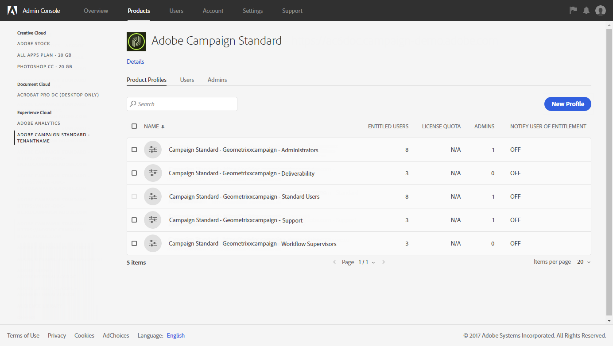

# Acerca de la administración de acceso{#about-access-management}

Adobe Campaign le permite definir y administrar los permisos asignados a distintos usuarios. Los permisos son un conjunto de derechos y restricciones que autorizan o deniegan el acceso a determinadas funcionalidades u objetos de la interfaz. Estos permisos se basan en dos conceptos:

* **Unidades organizativas**: le permiten definir una jerarquía de permisos en los distintos objetos de la plataforma (correos electrónicos, flujos de trabajo, plantillas, usuarios, perfiles, etc.). Consulte la sección [Unidades organizativas](../../administration/using/organizational-units.md).
* **Funciones**: conjunto de derechos unitarios que le permiten definir las autorizaciones asignadas a usuarios y grupos de usuarios. Consulte la sección [Lista de funciones](../../administration/using/list-of-roles.md) .

  Combinadas con las unidades organizativas, las funciones proporcionan a los usuarios una vista filtrada de la interfaz y definen su acceso a las diferentes funciones. Para obtener más información, consulte la [Tabla de autorizaciones](../../administration/using/list-of-roles.md).

>[!IMPORTANT]
>
>Tenga en cuenta que la capacidad de la unidad geográfica ha quedado obsoleta. Para obtener más información, consulte [esta página](../../rn/using/deprecated-features.md).

El administrador funcional de la plataforma puede administrar los roles, grupos y unidades organizativas en el menú **[!UICONTROL Administration > Users & Security]**.

Los usuarios se administran en el Admin Console. Obtenga más información en la [Administración de grupos y usuarios](../../administration/using/managing-groups-and-users.md) y en la sección [Documentación del Admin Console](https://helpx.adobe.com/es/enterprise/managing/user-guide.html).

>[!IMPORTANT]
>
>Solo los usuarios con derechos de administración tienen acceso a la administración de usuarios.

**Temas relacionados**

* [Unidades organizativas](../../administration/using/organizational-units.md)
* [Lista de funciones](../../administration/using/list-of-roles.md)
* [Administración de grupos y usuarios](../../administration/using/managing-groups-and-users.md)
