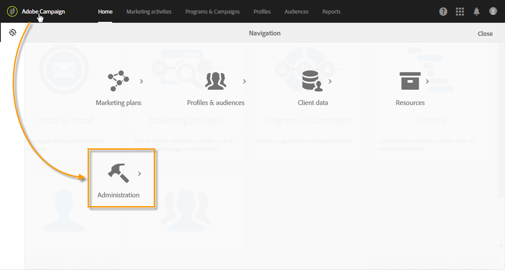

# About Administrating Adobe Campaign{#about-administrating-adobe-campaign}

Como solución basada en la nube, Adobe Campaign ofrece a los administradores diferentes métodos para configurar la aplicación. Aunque la configuración de la infraestructura es llevada a cabo por Adobe, los administradores funcionales pueden:

* Invite a los usuarios a acceder a la aplicación y administrar grupos de usuarios, así como sus derechos y funciones.
* Configure cuentas externas, que se utilizan para conectar Adobe Campaign a servidores externos.
* Ajustar y configurar parámetros de enrutamiento para todos los canales de comunicación.
* Monitorear la plataforma accediendo a flujos de trabajo técnicos.
* Importe y exporte paquetes, y amplíe el modelo de datos para agregar nuevos campos o recursos.

>[!NOTE]
>
>Si tiene preguntas o solicitudes acerca de la implementación y la configuración, póngase en contacto con su ejecutivo de cuentas de Adobe.

The different Adobe Campaign admin operations are carried out via the **[!UICONTROL Administration]** menu. Solo los administradores funcionales de la plataforma pueden acceder a esta parte de la interfaz.

To access this menu, click the **[!UICONTROL Adobe Campaign]** logo, in the top left-hand corner, then click **[!UICONTROL Administration]**.

Los distintos menús disponibles son:

* [Usuarios y seguridad](../../administration/using/about-access-management.md): Este menú permite administrar el acceso a la plataforma (usuarios, funciones, grupos de seguridad, unidades).
* [Canales](../../administration/using/about-channel-configuration.md): Este menú resume los parámetros técnicos vinculados a los distintos canales de plataforma (correo electrónico, SMS), así como a la tipología y a la administración de cuarentena.
* [Configuración de la aplicación](../../administration/using/external-accounts.md): Este menú le permite configurar diferentes elementos de aplicación (cuentas externas, opciones, flujos de trabajo técnicos).
* [Desarrollo](../../developing/using/data-model-concepts.md): Este menú le permite administrar sus recursos personalizados y las herramientas de diagnóstico de acceso.
* [Configuración de instancia](../../administration/using/branding.md): En este menú se definen las distintas marcas y se configuran sus configuraciones (logotipo, seguimiento, dominio URL para acceder a las páginas de aterrizaje, etc.).
* [Implementación](../../automating/using/managing-packages.md): Este menú resume las opciones de importación y exportación del paquete.
* [Métricas del cliente](../../audiences/using/active-profiles.md): Adobe Campaign proporciona un informe que muestra el número de perfiles activos. Este informe solo es informativo, no tiene un impacto directo en la facturación.
* [Herramientas de privacidad](https://docs.campaign.adobe.com/doc/standard/getting_started/en/ACS_GDPR.html): Este menú permite crear el acceso al RGPD y eliminar solicitudes y rastrear su evolución.

