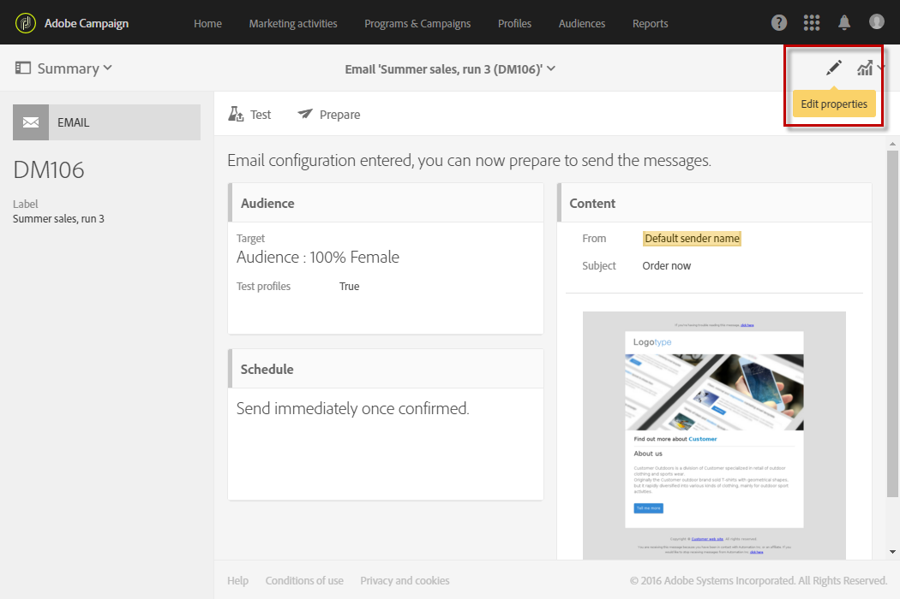

# Promoción de la marca{#branding}

## Acerca de la identidad de marca {#about-brand-identity}

Cada compañía tiene directrices técnicas y visuales de marca. Con Adobe Campaign, puede definir un conjunto de especificaciones para presentar una marca coherente a sus clientes, desde logotipos hasta aspectos técnicos, como el remitente de correos electrónicos, la dirección URL o los dominios.

Los administradores técnicos pueden definir una o varias marcas para introducir de forma centralizada los parámetros que afectan a la identidad de una marca. Esto incluye el logotipo de la marca, el dominio de la URL de acceso de la página de aterrizaje o la configuración del seguimiento de mensajes. Con Adobe Campaign, puede crear estas marcas y vincularlas a mensajes o páginas de aterrizaje. Esta configuración se administra en plantillas.

## Configuración y uso de marcas {#configuring-and-using-brands}

El principio primordial de la configuración y el uso de marcas es:

1. Crear y configurar la marca: esta operación requiere permisos específicos y la realiza el administrador técnico de Adobe Campaign. Los pasos para obtener una nueva marca en Campaign se detallan [en esta sección](#creating-a-brand).
1. Cree una o varias plantillas de envío y página de aterrizaje para esta marca. Consulte la sección [Creación de una plantilla](../../start/using/marketing-activity-templates.md).
1. Cree mensajes y páginas de aterrizaje basados en esta plantilla. Consulte las secciones [Creación de un correo electrónico](../../channels/using/creating-an-email.md) y [Creación de una página de aterrizaje](../../channels/using/designing-a-landing-page.md).

>[!IMPORTANT]
>
>Los usuarios finales no pueden crear ni modificar marcas: estas operaciones deben ser realizadas por el administrador técnico de Adobe Campaign. Para cualquier pregunta, póngase en contacto con el servicio de atención al cliente de Adobe.
>
>No se puede utilizar el concepto de multimarca en el contexto de la mensajería transaccional. Para obtener más información, consulte [Mensajes transaccionales y marca](../../channels/using/transactional-messaging-limitations.md#permissions-and-branding).

Las marcas se encuentran en el menú **[!UICONTROL Administration > Instance settings > Brand configuration]**.

De forma predeterminada, una marca recién creada solo es visible para los usuarios asignados con los derechos correspondientes por el administrador.

Una **marca** se define con las siguientes características:

* Una **identidad**, que define y personaliza su marca. Esta sección contiene los campos siguientes:

   

   * **Etiqueta** visible en la interfaz.
   * **Nombre de la marca**.
   * **Dirección URL** y **etiqueta del sitio web** de la marca.
   * **Logotipo de marca**.

* **[!UICONTROL Header parameters of sent emails]**, que personaliza lo que ven los destinatarios de sus campañas. Esta sección contiene los campos siguientes:

   

   * **Remitente (dirección de correo electrónico)** con la dirección de correo electrónico de la marca.
   * **Remitente (nombre)** con el nombre de la marca.
   * **Responder a (dirección de correo electrónico)** con la dirección de correo electrónico a la que el cliente puede responder.
   * **Responder a (nombre)** con el nombre de la marca.
   * **Error (dirección de correo electrónico)** con la dirección de correo electrónico que se utiliza en caso de error.

   >[!IMPORTANT]
   >
   >Después de haber actualizado los parámetros de encabezado de los correos electrónicos, si el nombre y la dirección de correo electrónico del remitente no han cambiado en el correo electrónico creado a partir de la plantilla, compruebe la configuración avanzada de esta.

* **Los servidores expuestos en Internet** definen los servidores utilizados para el seguimiento, pero también para el acceso de página de aterrizaje. Esta sección contiene los campos siguientes:

   

   * **Dirección URL externa del servidor de aplicaciones**, que se utiliza para alojar y acceder a las distintas páginas de aterrizaje que cree.
   * **Dirección URL externa del servidor de seguimiento**, que se utiliza como dirección URL rastreada durante los envíos.
   * **Dirección URL externa del servidor de página espejo**, que se utiliza como página espejo predeterminada en los envíos.

   >[!NOTE]
   >
   >Para mostrar la vista previa de la página de aterrizaje y el procesamiento de páginas espejo en la interfaz de usuario de Campaign, las URL del servidor de aplicaciones y del servidor de página espejo deben ser seguras. En ese caso, utilice https:// en lugar de http:// al configurar estas direcciones URL.

* **[!UICONTROL Tracking URL configuration (Web Analytics)]**, que define la configuración del seguimiento de direcciones URL de su marca.

   Aquí se definen los parámetros adicionales que permiten realizar el seguimiento de los vínculos en sistemas externos como herramientas de análisis web como Adobe Analytics o Google Analytics.

   

## Creación de una nueva marca {#creating-a-brand}

Puede añadir nuevas entidades de su organización en Campaign o crear un nuevo tipo de correo electrónico que debe enviar en un subdominio diferente. Para ello, siga los pasos a continuación:

1. **Configurar un nuevo subdominio** : para que el Adobe utilice cualquier nuevo subdominio, el primer paso es configurarlo. Puede hacerlo a través del [Panel de control de Campaign de Campaign](https://experienceleague.adobe.com/docs/control-panel/using/subdomains-and-certificates/subdomains-branding.html?lang=es) o ponerse en contacto con el contacto técnico de su Adobe. Obtenga más información sobre la configuración de subdominios [en este artículo](https://experienceleague.adobe.com/docs/deliverability-learn/deliverability-best-practice-guide/additional-resources/product-specific-resources/campaign/ac-domain-name-setup.html?lang=es).

   >[!NOTE]
   >
   >Todos los usuarios administradores pueden acceder al Panel de control de Campaign. Los pasos para otorgar acceso de administrador a un usuario se detallan en [esta página](https://experienceleague.adobe.com/docs/control-panel/using/discover-control-panel/managing-permissions.html?lang=es#discover-control-panel).

1. **Crear un ticket** : Una vez configurado el subdominio, Adobe lo configurará en el entorno de producción. Para solicitar esto, [cree un ticket para Client Care](https://helpx.adobe.com/es/enterprise/using/support-for-experience-cloud.html) con la siguiente información:

   * Asunto: ACS Nueva configuración de marca

   * Contenido: Se ha configurado un nuevo dominio y nos gustaría configurarlo en nuestra plataforma de Campaign

   * Dominio: XXX

   * URL de producción: XXX.campaign.adobe.com

1. **Crear una plantilla de envíos** : una vez que la nueva marca está disponible, se recomienda crear al menos una nueva plantilla de envíos en blanco que haga referencia a esta nueva marca. [Más información](#linking-a-brand-to-a-template).

1. **Comprobar las directrices de capacidad de entrega** : antes de empezar a usar el nuevo dominio, la estrategia debe discutirse con el equipo de entrega de Adobe. Ayudarán a definir las prácticas recomendadas si se debe crear una nueva afinidad para dividir las direcciones IP entre dominios, por ejemplo, o si se debe definir un plan de aceleración. Obtenga más información sobre las prácticas recomendadas de entrega [en esta sección](../../sending/using/about-deliverability.md).

## Asignación de una marca a un correo electrónico {#assigning-a-brand-to-an-email}

### Vinculación de una marca a una plantilla {#linking-a-brand-to-a-template}

Para utilizar los parámetros definidos para una marca, debe estar vinculada a una plantilla de envío o de página de aterrizaje. Para ello, debe crear o editar una plantilla.

>[!NOTE]
>
>Para obtener más información sobre la creación de una plantilla, consulte la sección [Creación de una plantilla](../../start/using/marketing-activity-templates.md).

Una vez creada la plantilla, puede vincularla a una marca. Para ello:

1. Haga clic en el botón **[!UICONTROL Edit properties]** para acceder a las propiedades de la plantilla.

   

1. Utilice la lista desplegable para seleccionar la marca que desea vincular a la plantilla.

   >[!NOTE]
   >
   >La **[!UICONTROL Default brand (branding)]** está seleccionada de forma predeterminada.

   

   Para ver la configuración de la marca seleccionada, haga clic en el icono **[!UICONTROL Navigate to the detail of the element selected]**.

   

1. Confirme la selección y guarde el flujo de trabajo.

La plantilla está vinculada a la marca. En el editor de correo electrónico, los elementos como la **dirección de correo electrónico del remitente predeterminado**, el **nombre del remitente predeterminado** o el **logotipo** utilizan los datos de marca configurados.

### Caso de uso de la marca {#branding-use-case}

En este ejemplo, vamos a crear una nueva marca relacionada con el turismo y utilizarla en un mensaje de correo electrónico.

#### Paso 1: Configurar una nueva marca {#configure-a-new-brand}

>[!IMPORTANT]
>
>La configuración de una marca solo la administra Adobe, ya que requiere permisos específicos y configuración técnica.

1. El administrador de Adobe Campaign crea primero la marca desde el menú **[!UICONTROL Administration > Instance settings > Brand configuration]** y agrega el elemento **Vacaciones en los trópicos** y configura el **[!UICONTROL ID]** y el **[!UICONTROL Header parameters of sent emails]** de la marca.

   

1. A continuación, el administrador configura la dirección URL de los **servidores expuestos en Internet** para que se puedan utilizar las páginas de aterrizaje y, a continuación, las direcciones URL de seguimiento.

   En este ejemplo, la herramienta **de análisis web** utilizada es **Google Analytics**. El administrador configura la URL de seguimiento de la siguiente manera:

   

La marca se crea y configura correctamente. Ahora puede usarse en los equipos de marketing.

#### Paso 2: Implementar una nueva marca {#implement-a-new-brand}

Como administrador de envíos, usted se encarga de crear las plantillas de envío para utilizar la nueva marca. Para conseguir esto, siga los pasos a continuación:

1. En el menú avanzado **[!UICONTROL Resources > Templates > Delivery templates]**, duplique una plantilla integrada para configurar una nueva plantilla de envío.

   

1. Para vincular esta plantilla a la marca **Vacaciones en los trópicos**, edite las propiedades de la plantilla y seleccione la marca en la lista desplegable.

   

1. Configure esta plantilla de correo electrónico para que refleje la identidad de la marca.
1. Una vez completada la plantilla, puede guardarla.

   

   La plantilla de envío ahora se puede utilizar para crear correos electrónicos que se pueden enviar a una audiencia.

#### Paso 3: Usar la nueva marca en un envío {#use-the-new-brand-in-a-delivery}

Para crear un correo electrónico vinculado a una marca, siga los pasos a continuación:

1. Haga clic en el botón **[!UICONTROL Create]** en el menú **[!UICONTROL Marketing activities]**.

   

1. Seleccione la actividad **[!UICONTROL Email]** y, a continuación, elija la plantilla vinculada a la nueva marca.

   

1. Su correo electrónico ya está configurado. Puede comprobar la información antes de probarla con los perfiles de prueba y luego enviarla a la audiencia.

   
