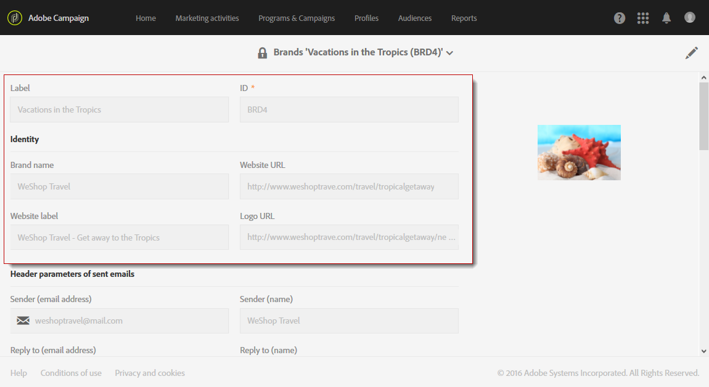

# Branding{#branding}

## About brand identity {#about-brand-identity}

Cada empresa dispone de directrices técnicas y visuales de marca. Con Adobe Campaign, puede definir un conjunto de especificaciones para presentar una marca coherente a sus clientes, desde logotipos a aspectos técnicos, como remitente de correo electrónico, URL o dominios.

Los administradores técnicos pueden definir una o varias marcas para introducir de forma centralizada los parámetros que afectan a la identidad de una marca. Esto incluye el logotipo de marca, el dominio de la URL de acceso de las páginas de aterrizaje o la configuración de seguimiento de mensajes. Con Adobe Campaign, puede crear estas marcas y vincularlas a mensajes o páginas de aterrizaje. Esta configuración se administra en plantillas.

## Configuring and using brands {#configuring-and-using-brands}

El principal principio de configurar y utilizar marcas es:

1. Cree y configure la marca: esta operación requiere permisos específicos y el administrador técnico de Adobe Campaign lo lleva a cabo.
1. Cree una o varias plantillas de página de aterrizaje y entrega para esta marca. Refer to the [Creating a template](../../start/using/about-templates.md) section.
1. Cree mensajes y páginas de aterrizaje en base a esta plantilla. Refer to the [Creating an email](../../channels/using/creating-an-email.md) and [Creating a landing page](../../channels/using/designing-a-landing-page.md) sections.

>[!CAUTION]
>
>Los usuarios finales no pueden crear ni modificar marcas: estas operaciones deben realizarlo el administrador técnico de Adobe Campaign. Para cualquier solicitud, póngase en contacto con el servicio de atención al cliente de Adobe. No se puede utilizar la promoción múltiple en el contexto de mensajes transaccionales. For more on this, see [Transactional messages and branding](../../channels/using/about-transactional-messaging.md#permissions-and-branding).

Brands can be found in the **[!UICONTROL Administration > Instance settings > Brand configuration]** menu.

De forma predeterminada, una marca recién creada solo es visible para los usuarios asignados con los derechos correspondientes por el administrador.

A **Brand** is defined by the following characteristics:

* **Identidad**, que define y personaliza su marca. Esta sección contiene los siguientes campos:

   

   * **Etiqueta** visible en la interfaz
   * **Nombre de marca**
   * **URL del sitio web** y **etiqueta de sitio web** de la marca
   * **Logotipo de marca**

* **[!UICONTROL Header parameters of sent emails]** que personaliza lo que verán los destinatarios de las campañas. Esta sección contiene los siguientes campos:

   

   * **Remitente (dirección de correo electrónico)** con la dirección de correo electrónico de la marca.
   * **Remitente (nombre)** con el nombre de la marca.
   * **Responda a (dirección de correo electrónico)** con la dirección de correo electrónico a la que puede responder el cliente.
   * **Responda (nombre)** con el nombre de la marca.
   * **Error (dirección de correo electrónico)** con la dirección de correo electrónico que se utilizará en caso de error.
   >[!CAUTION]
   >
   >Después de haber actualizado los parámetros de encabezado de los correos electrónicos, si el nombre y la dirección de correo electrónico del remitente no han cambiado en el correo electrónico creado a partir de la plantilla, compruebe la configuración avanzada de la plantilla.

* **Los servidores expuestos en Internet** definen los servidores utilizados para el seguimiento pero también para el acceso a la página de aterrizaje. Esta sección contiene los siguientes campos:

   

   * **URL externa del servidor de aplicaciones** que se utiliza para alojar y acceder a las diferentes páginas de aterrizaje creadas.
   * **URL externa del servidor de seguimiento** utilizado como URL rastreada durante las entregas.
   * **URL externa del servidor de páginas espejo** utilizado como página predeterminada de reflejo en sus envíos.

* **[!UICONTROL Tracking URL configuration (Web Analytics)]**, que define la configuración del seguimiento de direcciones URL para su marca.

   Aquí se definen los parámetros adicionales que permiten rastrear los vínculos en sistemas externos como herramientas de análisis web como Adobe Analytics o Google Analytics.

   

## Assigning a brand to an email {#assigning-a-brand-to-an-email}

### Linking a brand to a template {#linking-a-brand-to-a-template}

Para utilizar los parámetros definidos para una marca, debe estar vinculada a una plantilla de entrega o a una plantilla de página de aterrizaje. Para ello, debe crear o editar una plantilla.

>[!NOTE]
>
>For more information about creating a template, refer to the [Creating a template](../../start/using/about-templates.md) section.

Una vez creada la plantilla, puede vincularla a una marca. Para ello:

1. Click the **[!UICONTROL Edit properties]** button to access the template properties.

   

1. Utilice la lista desplegable para seleccionar la marca que desea vincular a la plantilla.

   >[!NOTE]
   >
   >By default, the **[!UICONTROL Default brand (branding)]** is selected.

   

   To view how the brand selected is configured, click the **[!UICONTROL Navigate to the detail of the element selected]** icon.

   

1. Confirme su selección y guarde la plantilla.

La plantilla está vinculada a la marca. In the email editor, the elements such as the **Email address of default sender**, the **Default sender name**, or the **Logo** will use the configured brand data.

### Branding use case {#branding-use-case}

En este ejemplo vamos a crear una nueva marca relacionada con el turismo y utilizarla en un mensaje de correo electrónico.

#### Configure a new brand {#configure-a-new-brand}

>[!CAUTION]
>
>Adobe administra la configuración de marca sólo porque requiere permisos y ajustes técnicos específicos.

1. The Adobe Campaign administrator creates the brand in **[!UICONTROL Administration > Instance settings > Brand configuration]**. He adds the **Vacations in the Tropics** element from the advanced menu and configures the **[!UICONTROL ID]** and the **[!UICONTROL Header parameters of sent emails]** of the brand.

   

1. The administrator then configures the URL of the **Server(s) exposed on the Internet** so that landing pages can be used, then the tracking URLs.

   In this example, the **Web Analytics** tool used is **Google Analytics**. El administrador configura la URL de seguimiento de la siguiente manera:

   

La marca se crea y configura correctamente. Ahora los equipos de mercadotecnia pueden usarla.

#### Implement a new brand {#implement-a-new-brand}

Como administrador de envíos, se encarga de crear las plantillas de envío para utilizar la nueva marca. Para conseguirlo, siga los pasos a continuación:

1. In the advanced menu **[!UICONTROL Resources > Templates > Delivery templates]**, duplicate a built-in template to configure a new delivery template.

   

1. To link this template to the **Vacations in the Tropics** brand, edit the template properties and select the brand from the drop-down list.

   

1. Configure esta plantilla de correo electrónico para reflejar la identidad de la marca.
1. Una vez completada la plantilla, puede guardarla.

   

   La plantilla de envío ahora se puede utilizar para crear correos electrónicos que se enviarán a una audiencia.

#### Use the new brand in a delivery {#use-the-new-brand-in-a-delivery}

Para crear un correo electrónico vinculado a una marca, siga los pasos a continuación:

1. Click the **[!UICONTROL Create]** button from the **[!UICONTROL Marketing activities]** menu.

   

1. Select the **[!UICONTROL Email]** activity, then choose the template linked to the new brand.

   

1. Su correo electrónico ya está configurado. Puede comprobar la información antes de probarla utilizando los perfiles de prueba y enviarla a la audiencia.

   

