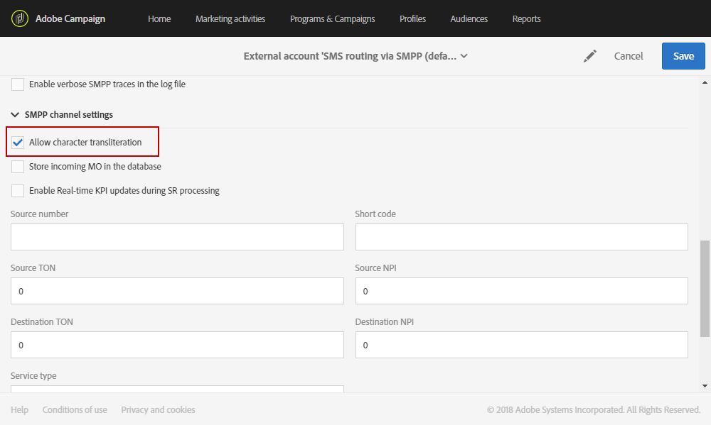
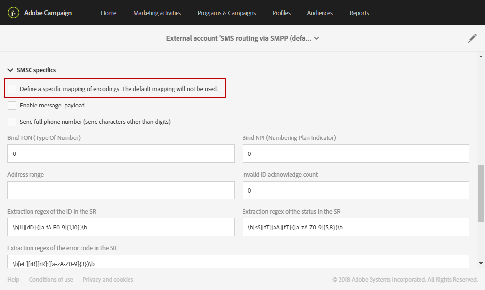
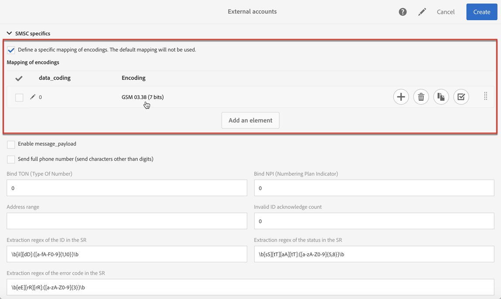
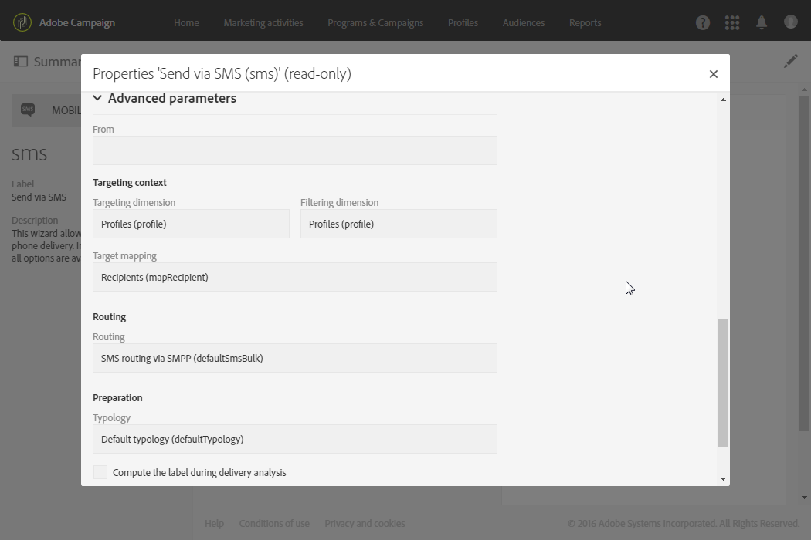

# Configuración de canales de SMS{#configuring-sms-channel}

Para enviar mensajes SMS, un administrador debe configurar una o varias cuentas externas en el menú **[!UICONTROL Administration]** > **[!UICONTROL Channels]** > **[!UICONTROL SMS]** > **[!UICONTROL SMS accounts]**.

Los pasos para crear y modificar una cuenta externa aparecen en la sección [Cuentas externas](../../administration/using/external-accounts.md). A continuación encontrará los parámetros específicos de cuentas externas para enviar mensajes SMS.

## Definición del enrutamiento de SMS {#defining-an-sms-routing}

>[!IMPORTANT]
>
>El uso de la misma cuenta y contraseña para varias cuentas externas de SMS puede provocar conflictos y superposición entre las cuentas. Consulte la [Página de solución de problemas de SMS](troubleshooting-sms.md#external-account-conflict).

La cuenta externa **[!UICONTROL SMS routing via SMPP]** se proporciona de forma predeterminada, pero puede resultar útil agregar otras cuentas.

Si desea utilizar el protocolo SMPP, también puede crear una nueva cuenta externa. Para obtener más información sobre el protocolo y la configuración SMS, consulte esta [nota técnica](../../administration/using/sms-protocol.md).

1. Cree una nueva cuenta externa desde **[!UICONTROL Administration > Application settings > External accounts]**.
1. Defina el tipo de cuenta como **[!UICONTROL Routing]**, el canal como **[!UICONTROL Mobile (SMS)]** y el modo de envío como **[!UICONTROL Bulk delivery]**.

   

1. Defina la configuración de conexión.

   Para especificar la configuración de conexión específica para enviar mensajes SMS, póngase en contacto con su proveedor de servicio de SMS, que le explicará cómo completar los diferentes campos de cuenta externa.

   

   La opción **[!UICONTROL Enable TLS over SMPP]** le permite cifrar el tráfico de SMPP.

   **[!UICONTROL Enable verbose SMPP traces in the log file]** le permite volcar todo el tráfico de SMPP en archivos de registro. Esta opción debe habilitarse para solucionar los problemas del conector y comparar el tráfico que ve el proveedor.

1. Póngase en contacto con Adobe para que le proporcione el valor que desea introducir en el campo **[!UICONTROL SMS-C implementation name]**, según el proveedor elegido.
1. Defina la configuración de canal de SMPP. Puede obtener más información en la sección de [codificación y formatos de SMS](#sms-encoding-and-formats).

   Habilite la opción **[!UICONTROL Store incoming MO in the database]** si desea que todos los SMS entrantes se almacenen en la tabla de SMS. Para obtener más información sobre cómo recuperar los SMS entrantes, consulte esta [sección](../../channels/using/managing-incoming-sms.md#storing-incoming-sms).

   La opción **[!UICONTROL Enable Real-time KPI updates during SR processing]** permite actualizar los KPI **[!UICONTROL Delivered]** o **[!UICONTROL Bounces + Errors]** en tiempo real después de realizar el envío. Estos KPI se pueden encontrar en la ventana **[!UICONTROL Deployment]** y se vuelven a calcular directamente desde el SR (Informe de estado) enviado por el proveedor.

   

1. Defina los parámetros **[!UICONTROL Throughput and timeouts]**.

   Puede especificar el rendimiento máximo de los mensajes salientes (“MT”, móvil finalizado) en MT por segundo. Si introduce &quot;0&quot; en el campo correspondiente, el rendimiento es ilimitado.

   Los valores de todos los campos correspondientes a las duraciones deben rellenarse en segundos.

1. Defina los parámetros específicos de SMS-C en caso de que deba definir una asignación de codificación específica. Para obtener más información, consulte la sección [Detalles de SMSC](#smsc-specifics).

   Active la opción **[!UICONTROL Send full phone number (send characters other than digits)]** si no desea respetar el protocolo SMPP y transferir el prefijo **[!UICONTROL +]** al servidor del proveedor de SMS (SMS-C).

   Sin embargo, dado que determinados proveedores requieren el uso del prefijo **[!UICONTROL +]**. se recomienda que se ponga en contacto con su proveedor y que este le recomiende si es necesario activar esta opción.

1. Si es necesario, defina respuestas automáticas para activar acciones en función del contenido de una respuesta. Para obtener más información, consulte [esta sección](../../channels/using/managing-incoming-sms.md#managing-stop-sms).
1. Guarde la configuración de la cuenta externa de enrutamiento SMS.

Ahora puede usar su nuevo enrutamiento para enviar mensajes SMS con Adobe Campaign.

## Codificación y formatos SMS {#sms-encoding-and-formats}

### Codificación, longitud y transliteración de SMS {#sms-encoding--length-and-transliteration}

De forma predeterminada, el número de caracteres de un SMS cumple con los estándares del GSM (Sistema Global de Comunicaciones Móviles).

Los mensajes SMS con codificación GSM están limitados a 160 caracteres, o a 153 caracteres por SMS en el caso de los mensajes enviados en varias partes.

>[!NOTE]
>
>Algunos caracteres cuentan como dos (llaves, corchetes, símbolo del euro, etc.). La lista de los caracteres GSM disponibles se incluye en la sección [Tabla de caracteres: Estándar GSM](#table-of-characters---gsm-standard).

Si lo desea, puede autorizar la transliteración de caracteres marcando el cuadro correspondiente.

La transliteración consiste en reemplazar un carácter de un SMS por otro cuando el estándar GSM no tiene en cuenta dicho carácter.

* Si la transliteración es **authorized**, cada carácter que no se tiene en cuenta se sustituye por un carácter GSM cuando se envía el mensaje. Por ejemplo, la letra “ë” se sustituye por “e”. Por lo tanto, el mensaje se altera ligeramente, pero el límite de caracteres se mantiene.
* Cuando la transliteración es **not authorized**, cada mensaje que contiene caracteres que no se tienen en cuenta se envía en formato binario (Unicode): todos los caracteres se envían tal cual. Sin embargo, los mensajes SMS con Unicode están limitados a 70 caracteres (o 67 caracteres por SMS en el caso de los mensajes enviados en varias partes). Si se supera el número máximo de caracteres, se envían varios mensajes, lo que puede suponer costes adicionales.

>[!IMPORTANT]
>
>La inserción de campos de personalización en el contenido del mensaje SMS puede introducir caracteres que no se tienen en cuenta con la codificación GSM. Se ofrece un ejemplo de contenido en la sección [Personalización de mensajes SMS](../../channels/using/personalizing-sms-messages.md).

De forma predeterminada, la transliteración de caracteres está desactivada. Si desea que todos los caracteres de los mensajes SMS se mantengan tal cual, para, por ejemplo, no modificar los nombres propios, es recomendable que no habilite esta opción.

Sin embargo, si los mensajes SMS contienen muchos caracteres que generan mensajes Unicode, puede optar por activar esta opción para limitar los costes de envío de mensajes.

### Tabla de caracteres: Estándar GSM {#table-of-characters---gsm-standard}

Esta sección incluye los caracteres que tiene cuenta el estándar GSM. Todos los caracteres insertados en el cuerpo del mensaje que no sean los mencionados abajo convierten todo el mensaje a formato binario (Unicode) y lo limitan a 70 caracteres. Para obtener más información sobre esto, consulte la sección [Codificación, longitud y transliteración de SMS](#sms-encoding--length-and-transliteration).

**Caracteres básicos**

<table> 
 <tbody> 
  <tr> 
   <td> @  </td> 
   <td>    </td> 
   <td> SP  </td> 
   <td> 0  </td> 
   <td> ¡  </td> 
   <td> P  </td> 
   <td> ¿  </td> 
   <td> P  </td> 
  </tr> 
  <tr> 
   <td> £  </td> 
   <td> _  </td> 
   <td> !  </td> 
   <td> 1  </td> 
   <td> A  </td> 
   <td> Q  </td> 
   <td> a  </td> 
   <td> q  </td> 
  </tr> 
  <tr> 
   <td> $  </td> 
   <td>    </td> 
   <td> "  </td> 
   <td> 2  </td> 
   <td> B  </td> 
   <td> R  </td> 
   <td> b  </td> 
   <td> r  </td> 
  </tr> 
  <tr> 
   <td> ¥  </td> 
   <td>    </td> 
   <td> #  </td> 
   <td> 3  </td> 
   <td> C  </td> 
   <td> S  </td> 
   <td> c  </td> 
   <td> s  </td> 
  </tr> 
  <tr> 
   <td> è  </td> 
   <td>    </td> 
   <td> ¤  </td> 
   <td> 4  </td> 
   <td> D  </td> 
   <td> T  </td> 
   <td> d  </td> 
   <td> t  </td> 
  </tr> 
  <tr> 
   <td> é  </td> 
   <td>    </td> 
   <td> %  </td> 
   <td> 5  </td> 
   <td> E  </td> 
   <td> U  </td> 
   <td> e  </td> 
   <td> u  </td> 
  </tr> 
  <tr> 
   <td> ù  </td> 
   <td>    </td> 
   <td> &amp;  </td> 
   <td> 6  </td> 
   <td> F  </td> 
   <td> V  </td> 
   <td> f  </td> 
   <td> v  </td> 
  </tr> 
  <tr> 
   <td> ì  </td> 
   <td>    </td> 
   <td> '  </td> 
   <td> 7  </td> 
   <td> G  </td> 
   <td> W  </td> 
   <td> g  </td> 
   <td> w  </td> 
  </tr> 
  <tr> 
   <td> ò  </td> 
   <td>    </td> 
   <td> (  </td> 
   <td> 8  </td> 
   <td> H  </td> 
   <td> X  </td> 
   <td> h  </td> 
   <td> x  </td> 
  </tr> 
  <tr> 
   <td> Ç  </td> 
   <td>    </td> 
   <td> )  </td> 
   <td> 9 </td> 
   <td> I  </td> 
   <td> Y  </td> 
   <td> i  </td> 
   <td> y  </td> 
  </tr> 
  <tr> 
   <td> LF  </td> 
   <td>    </td> 
   <td> *  </td> 
   <td> :  </td> 
   <td> J  </td> 
   <td> Z  </td> 
   <td> j  </td> 
   <td> z  </td> 
  </tr> 
  <tr> 
   <td> Ø  </td> 
   <td> ESC  </td> 
   <td> +  </td> 
   <td> ;  </td> 
   <td> K  </td> 
   <td> Ä  </td> 
   <td> k  </td> 
   <td> ä  </td> 
  </tr> 
  <tr> 
   <td> ø  </td> 
   <td> Æ  </td> 
   <td> ,  </td> 
   <td> &lt;  </td> 
   <td> L  </td> 
   <td> Ö  </td> 
   <td> l  </td> 
   <td> ö  </td> 
  </tr> 
  <tr> 
   <td> CR  </td> 
   <td> æ  </td> 
   <td> -  </td> 
   <td> = </td> 
   <td> M  </td> 
   <td> Ñ  </td> 
   <td> m  </td> 
   <td> ñ  </td> 
  </tr> 
  <tr> 
   <td> Å  </td> 
   <td> ß  </td> 
   <td> .  </td> 
   <td> &gt;  </td> 
   <td> N  </td> 
   <td> Ü  </td> 
   <td> n  </td> 
   <td> ü  </td> 
  </tr> 
  <tr> 
   <td> å  </td> 
   <td> É  </td> 
   <td> /  </td> 
   <td> ?  </td> 
   <td> O  </td> 
   <td> §  </td> 
   <td> o  </td> 
   <td> à  </td> 
  </tr> 
 </tbody> 
</table>

SP: Espacio

ESC: Escape

LF: Fuente de línea

CR: Retorno de carro

**Caracteres avanzados (se cuentan dos veces)**

^ { } [~] | €

### Detalles de SMSC {#smsc-specifics}

>[!NOTE]
>
>Estas opciones le permiten adaptar el conector para que funcione con SMSC no estándar (es decir, que no siga exactamente la especificación SMPP 3.4) o requisitos de codificación específicos y solo deben configurarlo los usuarios avanzados.

Al enviar un mensaje SMS, Adobe Campaign puede utilizar una o varias codificaciones de texto. Cada codificación tiene su propio conjunto de caracteres específico y determina el número de caracteres que caben en un mensaje SMS.

El campo **[!UICONTROL DATA_CODING]** permite que Adobe Campaign se comunique con el SMS-C que utiliza la codificación.

>[!NOTE]
>
>La asignación entre el valor **data_coding** y la codificación utilizada está estandarizada. Sin embargo, ciertos SMS-C tienen su propia asignación específica: en este caso, el administrador de **Adobe Campaign** debe declarar esta asignación. Consulte a su proveedor para obtener más información.

La funcionalidad **[!UICONTROL Define a specific mapping of encodings]** permite declarar **data_codings** y forzar la codificación si es necesario: para ello, especifique una sola codificación en la tabla.

**Configuración**

* Cuando la funcionalidad **[!UICONTROL Define a specific mapping of encodings]** no está marcada, el conector adopta un comportamiento genérico:

   * se intenta utilizar la codificación GSM para asignar el valor **data_coding = 0**.
   * Si la codificación GSM falla, se utiliza la codificación **UCS2** a la que asigna el valor **data_coding = 8**.

  

* Cuando se selecciona la funcionalidad **[!UICONTROL Define a specific mapping of encodings]**, puede definir las codificaciones que desea utilizar, así como los valores de los campos vinculados de **[!UICONTROL data_coding]**. Adobe Campaign intentará utilizar la primera codificación de la lista y, a continuación, la siguiente, si la primera codificación resulta imposible.

  El orden de la declaración es importante: se recomienda que coloque la lista en orden ascendente **según el coste** con el fin de priorizar las codificaciones que le permitan introducir tantos caracteres como sea posible en cada mensaje SMS.

  Solo declare las codificaciones que desee utilizar. Si algunas de las codificaciones proporcionadas por SMS-C no se corresponden con su propósito, no las declare en la lista.

  

### Respuesta automática enviada al MO {#automatic-reply-sent-to-the-mo}

Cuando un perfil responde a un mensaje SMS enviado por Campaign, puede configurar los mensajes que se les envían automáticamente, así como la acción que se va a realizar.

Para obtener más información, consulte [esta sección](../../channels/using/managing-incoming-sms.md).

## Configuración de propiedades de SMS {#configuring-sms-properties}

Esta sección detalla la lista de parámetros exclusivos de SMS en la pantalla de propiedades de un envío SMS o una plantilla de SMS.

Los parámetros específicos para enviar mensajes SMS se incluyen en las secciones **[!UICONTROL Send]** y **[!UICONTROL Advanced parameters]**.

Desde la sección **[!UICONTROL Advanced parameters]**:

* **[!UICONTROL Short code]** le permite agregar un código corto específico a su envío. Los destinatarios que se hayan excluido de este código corto específico se excluirán automáticamente durante la preparación del mensaje. Para obtener más información sobre cómo configurar el código corto, consulte [esta sección](../../channels/using/managing-incoming-sms.md).

  >[!NOTE]
  >
  >Si el campo **[!UICONTROL Short code]** se deja vacío, se utilizará el valor del campo **[!UICONTROL Short code]** establecido en la cuenta externa.

Desde la sección **[!UICONTROL Send]** de una plantilla SMS:

* La opción **[!UICONTROL Maximum number of SMS per message]** le permite definir el número de mensajes SMS que se utilizarán para enviar un mensaje. Si se supera este número, no se enviará el mensaje.

  >[!IMPORTANT]
  >
  >Si ha insertado campos de personalización o texto condicional en el contenido de su mensaje SMS, la longitud del mensaje y, como resultado, el número de mensajes SMS que se enviarán, pueden variar de un destinatario a otro. Para obtener más información, consulte la sección [Personalización de mensajes SMS](../../channels/using/personalizing-sms-messages.md).

  

* El campo **[!UICONTROL Transmission mode]** permite determinar el método de envío para los mensajes SMS:

   * **[!UICONTROL Saved on SIM card]**: el mensaje se almacena en la tarjeta SIM del destinatario.
   * **[!UICONTROL Saved on mobile]**: el mensaje se almacena en la memoria interna del teléfono.
   * **[!UICONTROL Flash]**: el mensaje se muestra en el teléfono móvil del destinatario como una notificación y desaparece sin que se guarde.
