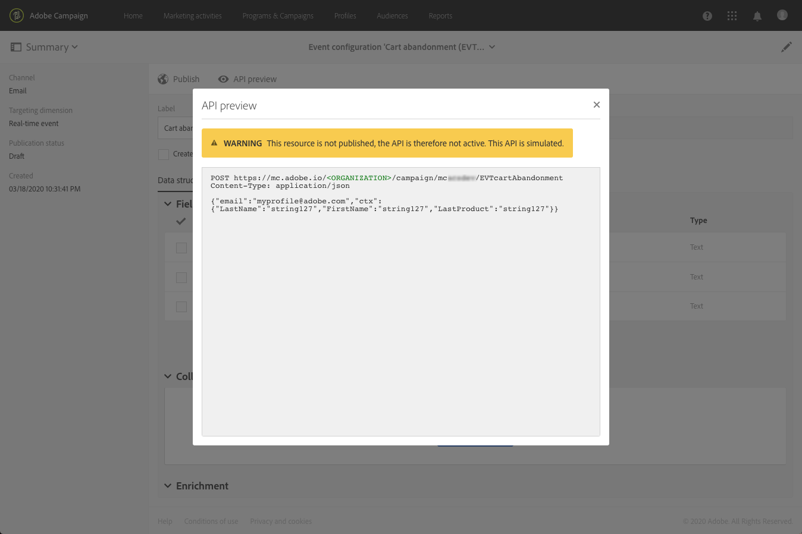
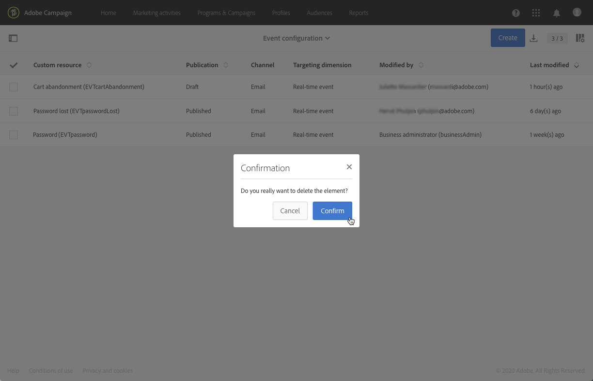

# Configuración de la mensajería transaccional{#configuring-transactional-messaging}

Para enviar un mensaje transaccional con Adobe Campaign, primero debe describir la estructura de los datos del evento.

La configuración de eventos debe realizarla un **administrador** siguiendo los pasos a continuación:

La configuración puede variar según el tipo de mensaje transaccional que desee enviar. Para obtener más información sobre esto, consulte Configuraciones específicas de eventos [transaccionales](#transactional-event-specific-configurations)

Una vez publicado el evento, se crea automáticamente el mensaje transaccional correspondiente. For more on transactional messaging, refer to [this page](../../channels/using/about-transactional-messaging.md).

## Creación de un evento {#creating-an-event}

Comience creando el evento que corresponda a sus necesidades.

1. Haga clic en el **[!UICONTROL Adobe Campaign]** logotipo, en la esquina superior izquierda, luego seleccione **[!UICONTROL Marketing plans]** > **[!UICONTROL Transactional messages]** > **[!UICONTROL Event configuration]**.
1. Haga clic en el botón **[!UICONTROL Create]**.
1. Dar un **[!UICONTROL Label]** y un **[!UICONTROL ID]** al evento. El **[!UICONTROL ID]** campo es obligatorio y debe comenzar con el prefijo &quot;EVT&quot;. Si no utiliza este prefijo, se agrega automáticamente una vez que haga clic en **[!UICONTROL Create]**.

   

   >[!IMPORTANT]
   >
   >El ID no debe superar los 64 caracteres, incluido el prefijo EVT.

1. Seleccione el canal que se utilizará para enviar los mensajes transaccionales **[!UICONTROL Email]** o **[!UICONTROL Mobile (SMS)]****[!UICONTROL Mobile application]** (notificación push).

   >[!NOTE]
   >
   >Solo se puede utilizar un canal para cada configuración de evento. Una vez creado el evento, no se puede cambiar el canal.

1. Seleccione la dimensión de objetivo correspondiente a la configuración de evento deseada y haga clic en **[!UICONTROL Create]**.

   Los mensajes transaccionales basados en eventos se dirigen a los datos contenidos en el propio evento, mientras que los mensajes transaccionales basados en perfiles se dirigen a los datos contenidos en la base de datos de Adobe Campaign. Para obtener más información sobre esto, consulte Configuraciones específicas de eventos de transacción.

## Definición de los atributos del evento {#defining-the-event-attributes}

En la **[!UICONTROL Fields]** sección , defina los atributos que se integrarán en el contenido del evento y que luego podrán utilizarse para personalizar el mensaje transaccional.

Los pasos para agregar y modificar campos son los mismos que para los recursos personalizados.

>[!NOTE]
>
>Si desea crear un mensaje transaccional multilingüe, defina un atributo de evento adicional con el **[!UICONTROL AC_language]** ID. Esto solo se aplica a los mensajes transaccionales de eventos. Una vez publicado el evento, los pasos para editar el contenido de un mensaje transaccional multilingüe son los mismos que para un correo electrónico estándar multilingüe. See [Creating a multilingual email](../../channels/using/creating-a-multilingual-email.md).

## Definición de colecciones de datos {#defining-data-collections}

Puede agregar al contenido del evento una colección de elementos, cada elemento en sí, incluidos varios atributos.

Esta colección se puede utilizar en un correo electrónico transaccional para agregar listados de productos al contenido del mensaje, por ejemplo una lista de productos con el precio, el número de referencia, la cantidad, etc. para cada producto de la lista.

1. En la **[!UICONTROL Collections]** sección, haga clic en el **[!UICONTROL Create element]** botón .

   

1. Agregue una etiqueta y un ID para la colección.
1. Agregue todos los campos que desee mostrar en el mensaje transaccional para cada producto de la lista.

   En este ejemplo, se han añadido los campos siguientes:

   

Una vez que se publiquen el evento y el mensaje, podrá utilizar esta colección en su mensaje transaccional.

Esta es la vista previa de API para este ejemplo:

**Temas relacionados:**

* [Vista previa y publicación del evento](#previewing-and-publishing-the-event)
* [Uso de listados de productos en un mensaje transaccional](../../channels/using/event-transactional-messages.md#using-product-listings-in-a-transactional-message)

## Enriquecimiento del contenido de mensajes transaccionales {#enriching-the-transactional-message-content}

El enriquecimiento del contenido de mensajes transaccionales con información de la base de datos de Adobe Campaign le permite personalizar sus mensajes. Por ejemplo, puede recuperar datos como la dirección, la fecha de nacimiento o cualquier otro campo personalizado agregado en la tabla Perfil con el fin de personalizar la información que se les envía.

Es posible enriquecer el contenido de mensajes transaccionales con información de recursos extendidos **[!UICONTROL Profile]** o **[!UICONTROL Service]** .

Esta información también se puede almacenar en nuevos recursos. En ese caso, el recurso debe estar vinculado al **[!UICONTROL Profile]** **[!UICONTROL Service]** o a los recursos directamente o a través de otra tabla. Por ejemplo: en la configuración siguiente, es posible enriquecer el contenido de mensajes transaccionales con información del **[!UICONTROL Product]** recurso como la categoría de productos o la ID, si el **[!UICONTROL Product]** recurso está vinculado al **[!UICONTROL Profile]** recurso.

Para obtener más información sobre la creación y publicación de recursos, consulte [esta página](../../developing/using/key-steps-to-add-a-resource.md).

1. En la **[!UICONTROL Enrichment]** sección, haga clic en el **[!UICONTROL Create element]** botón .

   

1. Seleccione el recurso con el que desea vincular el mensaje. In this case, choose the **[!UICONTROL Profile]** resource.

   

1. Utilice el **[!UICONTROL Create element]** botón para vincular un campo del recurso seleccionado a uno de los campos agregados anteriormente al evento (consulte [Definición de atributos](#defining-the-event-attributes)de evento).

   

1. En este ejemplo, reconciliamos los campos **[!UICONTROL Last name]** y los **[!UICONTROL First name]** con los campos correspondientes del **[!UICONTROL Profile]** recurso.

   

   También puede enriquecer el contenido de mensajes transaccionales mediante el **[!UICONTROL Service]** recurso. Para obtener más información sobre los servicios, consulte esta [sección](../../audiences/using/creating-a-service.md).

1. Si está creando o editando un evento basado en perfiles, en la **[!UICONTROL Targeting enrichment]** sección , seleccione el enriquecimiento que se utilizará como destino del mensaje durante la ejecución de la entrega.

   

   >[!NOTE]
   >
   >La selección de un enriquecimiento de objetivo en función del **[!UICONTROL Profile]** recurso es obligatoria para los eventos basados en perfiles.

Una vez publicados el evento y el mensaje, este vínculo le permitirá enriquecer el contenido del mensaje transaccional.

**Temas relacionados:**

* [Vista previa y publicación del evento](#previewing-and-publishing-the-event).
* [Personalización de un mensaje](../../channels/using/event-transactional-messages.md#personalizing-a-transactional-message)transaccional.

## Vista previa y publicación del evento {#previewing-and-publishing-the-event}

Antes de poder usar el evento, debe previsualizarlo y publicarlo.

1. Haga clic en el **[!UICONTROL API preview]** botón para ver una simulación de la API de REST que utilizará el desarrollador del sitio web antes de que se publique. Una vez publicado el evento, este botón también le permite ver una vista previa de la API en producción. Consulte [Integración del activador del evento en un sitio web](#integrating-the-triggering-of-the-event-in-a-website).

   

   >[!NOTE]
   >
   >La API de REST varía según el canal seleccionado y la dimensión de objetivo seleccionada. Para obtener más información sobre las distintas configuraciones, consulte Configuraciones [específicas de eventos de](#transactional-event-specific-configurations)transacción.

1. Haga clic **[!UICONTROL Publish]** para iniciar la publicación.

   

1. Puede ver los registros de publicación en la ficha correspondiente.

   

>[!NOTE]
>
>Cada vez que modifique el evento, debe hacer clic de **[!UICONTROL Publish]** nuevo para generar la API de REST actualizada que utilizará el desarrollador del sitio web.

Una vez publicado el evento, se crea automáticamente un mensaje transaccional vinculado al nuevo evento. Para que este evento active el envío de un mensaje transaccional, debe modificar y publicar el mensaje que se acaba de crear. See [Event transactional messages](../../channels/using/event-transactional-messages.md).

Puede acceder al mensaje transaccional que se creó directamente desde el vínculo en el área izquierda.

También debe integrar este evento de activación en el sitio web. Consulte [Integración del activador del evento en un sitio web](#integrating-the-triggering-of-the-event-in-a-website).

<!-->>[!NOTE]
>Para consultar las publicaciones anteriores, en su caso, haga clic en el **[!UICONTROL Latest transactional events]** vínculo situado debajo de la **[!UICONTROL History]** sección en el área izquierda.-->

### Cancelación de la publicación de un evento {#unpublishing-an-event}

El **[!UICONTROL Unpublish]** botón permite cancelar la publicación del evento, lo que elimina de la API de REST el recurso correspondiente al evento que creó anteriormente. Ahora, incluso si el evento se activa a través de su sitio web, los mensajes correspondientes ya no se envían y no se almacenan en la base de datos.

>[!NOTE]
Si ya ha publicado el mensaje transaccional correspondiente, también se cancelará la publicación del mensaje transaccional. Consulte [Cancelación de la publicación de un mensaje](../../channels/using/event-transactional-messages.md#unpublishing-a-transactional-message)transaccional.

Haga clic en el **[!UICONTROL Publish]** botón para generar una nueva API de REST.

### Eliminación de un evento {#deleting-an-event}

Una vez que se ha cancelado la publicación de un evento o si éste no se ha publicado aún, puede eliminarlo de la lista de configuración de eventos. Para ello:

1. Haga clic en el **[!UICONTROL Adobe Campaign]** logotipo, en la esquina superior izquierda, luego seleccione **[!UICONTROL Marketing plans]** > **[!UICONTROL Transactional messages]** > **[!UICONTROL Event configuration]**.
1. Pase el ratón sobre la configuración de evento de su elección y seleccione el **[!UICONTROL Delete element]** botón.

   

   >[!NOTE]
   Asegúrese de que la configuración del evento tiene el **[!UICONTROL Draft]** estado, de lo contrario no podrá eliminarlo. El **[!UICONTROL Draft]** estado se aplica a un evento que aún no se ha publicado o que se ha [cancelado la publicación](#unpublishing-an-event).

1. Haga clic en el botón **[!UICONTROL Confirm]**.

   

>[!IMPORTANT]
Al eliminar una configuración de evento que se ha publicado y que ya se ha utilizado, también se eliminarán los mensajes transaccionales correspondientes y sus registros de envío y seguimiento.

## Integración de la activación del evento en un sitio web {#integrating-the-triggering-of-the-event-in-a-website}

Una vez creado un evento, deberá integrar la activación de este evento en su sitio Web.

En el ejemplo descrito en la sección Principio [operativo de mensajería](../../channels/using/about-transactional-messaging.md#transactional-messaging-operating-principle) transaccional, desea que se active un evento de &quot;abandono del carro de compras&quot; cada vez que uno de los clientes abandone el sitio Web antes de comprar los productos en el carro de compras. Para ello, el desarrollador web de su sitio web debe utilizar la API REST de Adobe Campaign Standard.

Consulte la documentación de la API de [REST](../../api/using/managing-transactional-messages.md) .

## Configuraciones específicas de eventos transaccionales {#transactional-event-specific-configurations}

La configuración del evento transaccional puede variar según el tipo de mensaje transaccional que desee enviar (evento o perfil) y el canal que se utilizará.

Las siguientes secciones detallan qué configuración específica debe configurarse según el mensaje transaccional deseado. Para obtener más información sobre los pasos generales para configurar un evento, consulte [Creación de un evento](#creating-an-event).

### Mensajes transaccionales basados en eventos {#event-based-transactional-messages}

Para enviar un mensaje transaccional basado en eventos, primero debe crear y configurar un evento dirigido a los datos contenidos en el propio evento.
Para obtener más información, consulte [Uso de mensajes](https://helpx.adobe.com/campaign/kb/simplify-campaign-management.html#Managedatatofuelengagingexperiences)transaccionales.

1. Al crear la configuración de eventos, seleccione la dimensión de **[!UICONTROL Real-time event]** objetivo (consulte [Creación de un evento](#creating-an-event)).
1. Agregue campos al evento para poder personalizar el mensaje transaccional (consulte [Definición de atributos](#defining-the-event-attributes)del evento).
1. Enriquecer el contenido de los mensajes transaccionales si desea utilizar información adicional de la base de datos de Adobe Campaign (consulte [Enriquecimiento del contenido](#enriching-the-transactional-message-content)de los mensajes transaccionales).

   >[!NOTE]
   Se supone que la mensajería transaccional basada en eventos utiliza solamente los datos que se encuentran en el evento enviado para definir el destinatario y la personalización del contenido del mensaje. Sin embargo, puede enriquecer el contenido del mensaje transaccional con información de la base de datos de Adobe Campaign.

1. Obtenga una vista previa y publique el evento (consulte [Vista previa y publicación del evento](#previewing-and-publishing-the-event)).

   Al obtener una vista previa del evento, la API de REST contiene un atributo que especifica la dirección de correo electrónico o el teléfono móvil según el canal seleccionado.

   Una vez publicado el evento, se crea automáticamente un mensaje transaccional vinculado al nuevo evento. Para que el evento active el envío de un mensaje transaccional, debe modificar y publicar el mensaje que se acaba de crear, consulte Mensajes [transaccionales de](../../channels/using/event-transactional-messages.md)eventos.

1. Integrar el evento en el sitio web (consulte [Integración del activador del evento en un sitio web](#integrating-the-triggering-of-the-event-in-a-website)).

### Mensajes transaccionales basados en perfiles {#profile-based-transactional-messages}

Para enviar un mensaje transaccional basado en perfiles, primero debe crear y configurar los datos de objetivo de eventos contenidos en la base de datos de Adobe Campaign.

1. Al crear la configuración de eventos, seleccione la dimensión de **[!UICONTROL Profile event]** objetivo (consulte [Creación de un evento](#creating-an-event)).
1. Agregue campos al evento para poder personalizar el mensaje transaccional (consulte [Definición de atributos](#defining-the-event-attributes)del evento). Debe agregar al menos un campo para crear un enriquecimiento. No es necesario crear otros campos, como **Nombre** y **Apellido** , ya que podrá utilizar los campos de personalización de la base de datos de Adobe Campaign.
1. Cree un enriquecimiento para vincular el evento al **[!UICONTROL Profile]** recurso (consulte [Enriquecimiento del contenido](#enriching-the-transactional-message-content)del mensaje transaccional). La creación de un enriquecimiento es obligatoria cuando se utiliza una dimensión **[!UICONTROL Profile]** de objetivo.
1. Obtenga una vista previa y publique el evento (consulte [Vista previa y publicación del evento](#previewing-and-publishing-the-event)).

   Al obtener una vista previa del evento, la API de REST no contiene ningún atributo que especifique la dirección de correo electrónico o el teléfono móvil, ya que se recuperará del **[!UICONTROL Profile]** recurso.

   Una vez publicado el evento, se crea automáticamente un mensaje transaccional vinculado al nuevo evento. Para que el evento active el envío de un mensaje transaccional, debe modificar y publicar el mensaje que se acaba de crear, consulte [Envío de un mensaje](../../channels/using/profile-transactional-messages.md#sending-a-profile-transactional-message)transaccional de perfil.

1. Integrar el evento en el sitio web (consulte [Integración del activador del evento en un sitio web](#integrating-the-triggering-of-the-event-in-a-website)).

### Notificaciones push transaccionales basadas en eventos {#event-based-transactional-push-notifications}

Para poder enviar notificaciones push transaccionales, debe configurar Adobe Campaign en consecuencia. Consulte Configuración [push](https://helpx.adobe.com/campaign/kb/configuring-app-sdkv4.html).

Para enviar una notificación push de transacción anónima a todos los usuarios que han elegido recibir notificaciones desde la aplicación móvil, primero debe crear y configurar un evento que dirija los datos contenidos en el evento mismo. A continuación se presentan los pasos correspondientes.

El evento debe contener los tres elementos siguientes:

* Distintivo **de** registro, que es el ID de usuario de una aplicación móvil y un dispositivo. Puede que no se corresponda con ningún perfil de la base de datos de Adobe Campaign.
* Un nombre **de aplicación** móvil (uno para todos los dispositivos: Android e iOS). ID de la aplicación móvil configurada en Adobe Campaign que se utilizará para recibir notificaciones push en los dispositivos de los usuarios. Para obtener más información, consulte [esta página](https://helpx.adobe.com/campaign/kb/configuring-app-sdkv4.html)
* Una plataforma **** push (&quot;gcm&quot; para Android o &quot;apns&quot; para iOS).

1. Al crear la configuración de eventos, seleccione el **[!UICONTROL Mobile application]** canal y la dimensión de **[!UICONTROL Real-time event]** objetivo (consulte [Creación de un evento](#creating-an-event)).
1. Agregue campos al evento para poder personalizar el mensaje transaccional (consulte [Definición de atributos](#defining-the-event-attributes)del evento).
1. Enriquecer el contenido de los mensajes transaccionales si desea utilizar información adicional de la base de datos de Adobe Campaign (consulte [Enriquecimiento del contenido](#enriching-the-transactional-message-content)de los mensajes transaccionales).

   >[!NOTE]
   Se supone que la mensajería transaccional basada en eventos utiliza solamente los datos que se encuentran en el evento enviado para definir el destinatario y la personalización del contenido del mensaje. Sin embargo, puede enriquecer el contenido del mensaje transaccional con información de la base de datos de Adobe Campaign.

1. Obtenga una vista previa y publique el evento (consulte [Vista previa y publicación del evento](#previewing-and-publishing-the-event)).

   Al obtener una vista previa del evento, la API de REST contiene los atributos &quot;registrationToken&quot;, &quot;application&quot; y &quot;pushPlatform&quot; que se utilizarán para dirigir la entrega.

   

   Una vez publicado el evento, se crea automáticamente una notificación push transaccional vinculada al nuevo evento. Para modificar y publicar el mensaje que se acaba de crear, consulte [Envío de una notificación push transaccional dirigida a un evento](../../channels/using/transactional-push-notifications.md#transactional-push-notifications-targeting-an-event).

1. Integrar el evento en el sitio web (consulte [Integración del activador del evento en un sitio web](#integrating-the-triggering-of-the-event-in-a-website)).

### Notificaciones push transaccionales basadas en perfiles {#profile-based-transactional-push-notifications}

Para enviar una notificación push de transacción a los perfiles de Adobe Campaign que se han suscrito a su aplicación móvil, primero debe crear y configurar un evento dirigido a la base de datos de Adobe Campaign.

1. Al crear la configuración de eventos, seleccione el **[!UICONTROL Mobile application]** canal y la dimensión de **[!UICONTROL Profile]** objetivo (consulte [Creación de un evento](#creating-an-event)).

   De forma predeterminada, la notificación push de transacción se enviará a todas las aplicaciones móviles a las que se suscribieron los destinatarios. Para enviar la notificación push a una aplicación móvil específica, selecciónela en la lista. Las demás aplicaciones móviles serán segmentadas por el mensaje pero se excluirán del envío.

   

1. Agregue campos al evento si desea personalizar el mensaje transaccional (consulte [Definición de los atributos](#defining-the-event-attributes)del evento).

   >[!NOTE]
   Debe agregar al menos un campo para crear un enriquecimiento. No es necesario crear otros campos, como **Nombre** y **Apellido** , ya que podrá utilizar los campos de personalización de la base de datos de Adobe Campaign.

1. Cree un enriquecimiento para vincular el evento al **[!UICONTROL Profile]** recurso (consulte [Enriquecimiento del contenido](#enriching-the-transactional-message-content)del mensaje transaccional). La creación de un enriquecimiento es obligatoria cuando se utiliza una dimensión **[!UICONTROL Profile]** de objetivo.
1. Obtenga una vista previa y publique el evento (consulte [Vista previa y publicación del evento](#previewing-and-publishing-the-event)).

   Al obtener una vista previa del evento, la API de REST no contiene ningún atributo que especifique el token de registro, el nombre de la aplicación y la plataforma push, ya que se recuperarán del **[!UICONTROL Profile]** recurso.

   Una vez publicado el evento, se crea automáticamente una notificación push transaccional vinculada al nuevo evento. Para modificar y publicar el mensaje que se acaba de crear, consulte [Envío de una notificación push transaccional dirigida a un perfil](../../channels/using/transactional-push-notifications.md#transactional-push-notifications-targeting-a-profile).

1. Integrar el evento en el sitio web (consulte [Integración del activador del evento en un sitio web](#integrating-the-triggering-of-the-event-in-a-website)).

### Configuración de un evento para enviar un mensaje de seguimiento {#configuring-an-event-to-send-a-follow-up-message}

Un mensaje de seguimiento es una plantilla de envío de marketing predefinida que se puede utilizar en un flujo de trabajo para enviar mensajes a los destinatarios de un mensaje transaccional específico. Para obtener más información sobre esto, consulte [Mensajes](../../channels/using/follow-up-messages.md)de seguimiento.

1. Utilice la misma configuración de evento que creó para enviar un mensaje transaccional de evento. Consulte Mensajes [transaccionales basados en](#event-based-transactional-messages)eventos.
1. Al configurar el evento, marque la **[!UICONTROL Create follow-up delivery template for this event]** casilla antes de publicar el evento.

   

1. Obtenga una vista previa y publique el evento (consulte [Vista previa y publicación del evento](#previewing-and-publishing-the-event)).

   Una vez publicado el evento, se crea automáticamente un mensaje transaccional y una plantilla de entrega de seguimiento vinculada al nuevo evento. Para obtener más información sobre el uso de mensajes de seguimiento, consulte [Envío de un mensaje](../../channels/using/follow-up-messages.md#sending-a-follow-up-message)de seguimiento.

## Caso de uso: configuración de un evento para enviar un mensaje transaccional {#use-case--configuring-an-event-to-send-a-transactional-message}

En este ejemplo, queremos configurar un evento para enviar mensajes de confirmación después de cada compra en nuestro sitio web con los siguientes requisitos previos:

Como queremos identificar a nuestro cliente a través de su ID de CRM, primero asegúrese de que el recurso se haya ampliado con este nuevo campo. **[!UICONTROL Profile]**

Del mismo modo, se debe crear y publicar un recurso personalizado correspondiente a las compras y vincularlo al **[!UICONTROL Profile]** recurso. De este modo, podrá recuperar información de este recurso para enriquecer el contenido del mensaje.

Para obtener más información sobre la creación y publicación de recursos, consulte [esta página](../../developing/using/key-steps-to-add-a-resource.md).

1. Cree un nuevo evento usando el **[!UICONTROL Email]** canal y la dimensión de **[!UICONTROL Profile]** objetivo (consulte [Creación de un evento](#creating-an-event)).
1. Defina los atributos que estarán disponibles para personalizar el mensaje transaccional. En nuestro caso, agregue los campos &quot;ID de CRM&quot; y &quot;Identificador de producto&quot; (consulte [Definición de atributos](#defining-the-event-attributes)de evento).

   

1. Para enriquecer el contenido del mensaje con información relativa a las compras anteriores del cliente, cree un método de enriquecimiento dirigido al **[!UICONTROL Purchase]** recurso (consulte [Enriquecimiento del contenido](#enriching-the-transactional-message-content)del mensaje transaccional).

   

1. Cree una condición de combinación entre el campo &quot;Identificador de producto&quot; que se agregó anteriormente al mensaje y el campo correspondiente del **[!UICONTROL Purchase]** recurso

   

1. Obtenga una vista previa y publique el evento (consulte [Vista previa y publicación del evento](#previewing-and-publishing-the-event)).
1. Integrar el evento en el sitio web (consulte [Integración del activador del evento en un sitio web](#integrating-the-triggering-of-the-event-in-a-website)).

