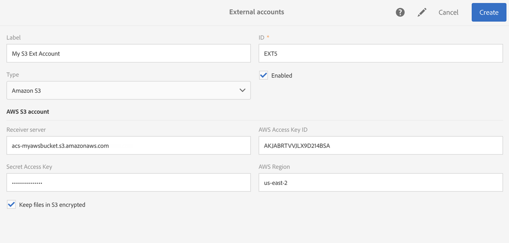

# Cuentas externas{#external-accounts}

Una cuenta externa es una configuración que permite configurar y probar el acceso a un servidor que sea externo a Adobe Campaign.

Estas cuentas externas se pueden utilizar en flujos de trabajo de Campaign para acceder y administrar datos.

Puede configurar los siguientes tipos de cuentas externas:

* SFTP. Para obtener más información, consulte [esta sección](#sftp-external-account).
* Amazon Storage Service (S3). Para obtener más información, consulte [esta sección](#amazon-s3-external-account).
* Adobe Experience Manager. Para obtener más información, consulte [esta sección](#adobe-experience-manager-external-account).
* Adobe Analytics. Para obtener más información, consulte [esta sección](../../integrating/using/configure-campaign-analytics-integration.md).
* Google reCAPTCHA. Para obtener más información, consulte [esta sección](#google-recaptcha-external-account).
* Almacenamiento de blob de Microsoft Azure. Para obtener más información, consulte [esta sección](#microsoft-azure-external-account).
* OAuth 2.0. Para obtener más información, consulte [esta sección](#oauth-account).

>[!NOTE]
>
>Adobe utiliza otros tipos de cuentas externas durante el proceso de aprovisionamiento de productos. A partir de la versión 17.9 de Campaign Standard, las cuentas externas de FTP aún se pueden definir, pero ya no se pueden utilizar en nuevas actividades del flujo de trabajo. Si ya tiene una conexión configurada, aún está habilitada.

Los administradores pueden configurar las cuentas externas en el menú **[!UICONTROL Administration > Application settings > External accounts]**.

## Creación de una cuenta externa {#creating-an-external-account}

Adobe Campaign viene con un conjunto de cuentas externas predefinidas. Para configurar conexiones con sistemas externos como servidores FTP utilizados para transferencias de archivos, puede crear cuentas externas propias.

Los procesos técnicos utilizan las cuentas externas como flujos de trabajo técnicos o flujos de trabajo de campaña. Al configurar una transferencia de archivos en un flujo de trabajo o un intercambio de datos con cualquier otra aplicación (Adobe Target, Experience Manager, etc.), debe seleccionar una cuenta externa.

1. Haga clic en el botón **[!UICONTROL Create]**.
1. Introduzca una etiqueta. La etiqueta y el ID se utilizarán al seleccionar cuentas externas en flujos de trabajo.
1. Seleccione el tipo de cuenta que desea crear.
1. Configure el acceso a la cuenta especificando las credenciales, la dirección del servidor, el número de puerto y las claves cuando corresponda.

   La información necesaria suele ser proporcionada por el proveedor del servidor al que está conectándose.

1. Guarde su cuenta.

La cuenta externa se crea y se agrega a la lista de cuentas. Ahora está disponible para las transferencias de datos y archivos o las configuraciones de enrutamiento en las actividades de flujo de trabajo y propiedades de entrega.

## Cuenta externa SFTP {#sftp-external-account}

Los distintos tipos de cuenta externa requieren que se especifique información diferente.

Para una cuenta externa SFTP, proporcione los siguientes detalles:

* Dirección del servidor. Por ejemplo, **ftp.domain.com**.
* Número de puerto. Por ejemplo, **22**.
* Credenciales del servidor SFTP: nombre y contraseña de la cuenta utilizados para conectarse al servidor.

### Recomendaciones de servidor SFTP alojado por Adobe {#adobe-hosted-sftp-server-recommendations}

Al administrar archivos y datos para fines de ETL, estos archivos se almacenan en un servidor SFTP alojado proporcionado por Adobe. Este SFTP está diseñado para ser un espacio de almacenamiento temporal en el que se puede controlar la retención y eliminación de archivos.

Cuando no se utiliza o monitoriza correctamente, este espacio puede llenar rápidamente el espacio físico disponible en el servidor y causar problemas graves. Puede dañar y provocar la pérdida de datos en la plataforma.

Para evitar estos problemas, Adobe recomienda seguir las prácticas recomendadas a continuación:

* Mantenga el mínimo de datos posible.
* Utilice la autenticación basada en claves para evitar la caducidad de la contraseña. Los formatos admitidos son **OpenSSH** y **SSH2** únicamente. Deberá proporcionar la clave pública al equipo de asistencia de Adobe para que se cargue en el servidor de Campaign.
* Guarde los datos solo durante el tiempo que sea necesario. 15 días es el plazo máximo.
* Utilice flujos de trabajo para eliminar correctamente los datos (administrar la retención de flujos de trabajo que consuman datos).
* Utilice lotes en sus cargas por SFTP y sus flujos de trabajo.
* Gestionar errores/excepciones.
* Inicie sesión ocasionalmente en el SFTP para comprobar directamente lo que sucede allí.
* Recuerde que la gestión de discos SFTP es responsabilidad principalmente suya.

Además, tenga en cuenta que las IP públicas desde las que intente iniciar la conexión SFTP deben agregarse a la lista de permitidos de la instancia de Campaign. La adición de direcciones IP a la lista de permitidos se puede solicitar a través de un [ticket de asistencia](https://helpx.adobe.com/es/enterprise/using/support-for-experience-cloud.html), junto con la clave pública que se utilizará para la autenticación.

Los servidores SFTP se pueden administrar desde el panel de control. Para obtener más información, consulte la [documentación del panel de control](https://experienceleague.adobe.com/docs/control-panel/using/sftp-management/about-sftp-management.html).

>[!NOTE]
>
>Todos los usuarios administradores pueden acceder al Panel de control de Campaign. Los pasos para otorgar acceso de administrador a un usuario se detallan en [esta página](https://experienceleague.adobe.com/docs/control-panel/using/discover-control-panel/managing-permissions.html?lang=es#discover-control-panel).

## Cuenta de OAuth 2.0 {#oauth-account}

Para una cuenta externa de OAuth 2.0, proporcione los siguientes detalles:

* Un **Tipo de beca**: solo se admiten **credenciales de cliente**.
* Una **URL de API segura**: introduzca el extremo de autorización.
* **Credenciales** confidenciales de OAuth 2.0: Esta sección está diseñada para credenciales de naturaleza confidencial. Los valores de Credencial se ocultarán en la pantalla una vez añadidos. en este punto, no serán legibles ni editables. Si el extremo de autorización requiere que se inserte una credencial particular en el encabezado de autorización HTTP en lugar del parámetro de cuerpo del POST, puede seleccionar la opción Incluir en el encabezado para esa credencial.
* **Credenciales** no confidenciales de OAuth 2.0: Esta sección está diseñada para credenciales de naturaleza no sensible. Los valores de Credencial serán visibles en la pantalla una vez añadidos. también se pueden editar.  Si el extremo de autorización requiere que se inserte una credencial particular en el encabezado de autorización HTTP en lugar del parámetro de cuerpo del POST, puede seleccionar la opción Incluir en el encabezado para esa credencial.

Después de introducir la información de la cuenta, haga clic en **Probar conexión** para verificar que la cuenta externa se haya configurado correctamente.


>[!NOTE]
>
>Las credenciales &quot;Content-Type: application/x-www-form-urlencoded&quot; y &quot;grant_type=client_credentials&quot; se añadirán automáticamente a la llamada de API; por lo tanto, no es necesario agregarlos en la sección de credenciales.

## Cuenta externa de Amazon S3 {#amazon-s3-external-account}

El campo del servidor de Amazon S3 debe rellenarse de la siguiente manera:

```
<S3 bucket name>.s3.amazonaws.com/<s3 object path>
```

Para almacenar su archivo en modo cifrado S3, marque la casilla **[!UICONTROL Keep files in S3 encrypted]**.



La información necesaria suele ser proporcionada por el proveedor del servidor al que está conectándose.

Especifique la **[!UICONTROL AWS Region]** asociada a su extremo. Puede consultar las regiones compatibles y las versiones de la firma en la [documentación oficial de Amazon S3](https://docs.aws.amazon.com/es_es/general/latest/gr/rande.html#s3_region).

>[!NOTE]
>
>Debe introducirse su **[!UICONTROL Receiver server]** sin la región de AWS; más adelante se agregará automáticamente a su URL.

### Recomendaciones de cuenta de Amazon S3 {#amazon-s3-account-recommendations}

Para ayudarle a configurar su cuenta de Amazon S3, le aconsejamos que siga estas recomendaciones:

* Cree una política de compartimento estricta para restringir el acceso a los compartimentos de S3. La política de compartimento se puede configurar al crear un compartimento. Para obtener más información, consulte la [documentación de Amazon S3](https://docs.aws.amazon.com/es_es/AmazonS3/latest/dev//example-bucket-policies.html).
* Durante la creación de una cuenta externa, active la casilla **[!UICONTROL Keep files in S3 encrypted]** para que el cifrado almacene datos confidenciales en el compartimento de S3.
* Conceda permisos de compartimento para especificar quién puede acceder al objeto en un compartimento. Para obtener más información sobre el permiso del compartimento, consulte la [documentación de Amazon S3](https://docs.aws.amazon.com/es_es/AmazonS3/latest/dev//access-control-overview.html).

## Cuenta externa de Adobe Experience Manager {#adobe-experience-manager-external-account}

Las cuentas externas de Adobe Experience Manager se utilizan al integrar Campaign con Experience Manager.

El proceso y los requisitos relacionados con esta integración están disponibles en [este documento](../../integrating/using/get-started-campaign-integrations.md).

Al configurar esta nueva cuenta externa, debe proporcionar los siguientes detalles:

* Servidor: introduzca la URL del servidor de Adobe Experience Manager. Por ejemplo:

   ```
   http://aem.domain.com:4502
   ```

* Credenciales de cuenta de AEM: utilice la cuenta que accederá a la instancia de Adobe Experience Manager. Debe ser una cuenta que forme parte del grupo remoto de campañas en Experience Manager.

## Cuenta externa de Google reCAPTCHA {#google-recaptcha-external-account}

>[!NOTE]
>
>La configuración de Google reCAPTCHA requiere una cuenta de Google.

El mecanismo de Google reCAPTCHA le permite proteger su página de aterrizaje del spam y los abusos causados por los bots. Esto no es intrusivo para los clientes, ya que no requiere ninguna interacción por parte de ellos y se basa en las interacciones con el sitio. Para registrar su sitio, consulte esta [página](https://www.google.com/recaptcha/admin/create). Debe elegir el tipo de reCAPTCHA V3.

Para añadir Google reCAPTCHA V3 a la página de aterrizaje, configúrelo en la cuenta externa. Para obtener más información sobre cómo añadirlo a su página de aterrizaje, consulte esta [sección](../../channels/using/configuring-landing-page.md#setting-google-recaptcha).

Para una cuenta externa de Google reCAPTCHA V3, proporcione los siguientes detalles:

* Una **[!UICONTROL Label]** y un **[!UICONTROL ID]** de su cuenta externa
* **[!UICONTROL Type]**: Google reCAPTCHA
* Su **[!UICONTROL Site key]** y **[!UICONTROL Site secret]**
* Un **[!UICONTROL Threshold]** entre 0 y 1

   El valor **[!UICONTROL Threshold]** 0,0 significa que es probable que sea un bot y 1,0 seguramente sea una buena interacción. De forma predeterminada, puede utilizar un umbral de 0,5.


## Cuenta externa del almacenamiento de blob de Microsoft Azure {#microsoft-azure-external-account}

>[!NOTE]
>
>La información necesaria para configurar su cuenta externa en Adobe Campaign Standard se encuentra en Azure Portal seleccionando **[!UICONTROL Settings]** > **[!UICONTROL Access keys]**.

El conector de almacenamiento del blob de Azure se puede utilizar para importar o exportar datos a Adobe Campaign mediante una actividad de flujo de trabajo de **[!UICONTROL Transfer file]**. Para obtener más información, consulte [esta sección](../../automating/using/transfer-file.md#azure-blob-configuration-wf).

Para una cuenta externa de almacenamiento del blob de Microsoft Azure, proporcione los siguientes detalles:

* Una **[!UICONTROL Label]** y un **[!UICONTROL ID]** de su cuenta externa
* **[!UICONTROL Type]**: almacenamiento de blob de Microsoft Azure
* Su **[!UICONTROL Account name]** y **[!UICONTROL Account key]**. Para saber dónde encontrar su nombre y clave de la cuenta, consulte [esta página](https://docs.microsoft.com/es-es/azure/storage/common/storage-account-keys-manage).
* Su **[!UICONTROL Endpoint suffix]**. Se encuentra dentro de **[!UICONTROL Connection string]** del menú **[!UICONTROL Access keys]** en el Azure Portal. Para obtener más información, consulte [esta página](https://docs.microsoft.com/en-us/azure/storage/common/storage-account-keys-manage).
* El nombre de su **[!UICONTROL Container]**. Si planea utilizar más de un contenedor, cree tantas cuentas externas como contenedores.
* La opción **[!UICONTROL Concurrency]** le permite ajustar la velocidad de las transferencias de archivos.


Una vez configurada, haga clic en **[!UICONTROL Test connection]** para vincular Adobe Campaign al almacenamiento del blob de Microsoft Azure.

### Recomendaciones de almacenamiento del blob de Microsoft Azure {#azure-blob-recommendations}

**Cifrado**

Adobe Campaign utiliza una conexión segura (HTTPS) para acceder a su cuenta de almacenamiento del blob de Microsoft Azure.

**Clave de la cuenta**

Al configurar su cuenta externa, debe utilizar uno de las **[!UICONTROL Account key]** disponibles en Azure Portal. Para obtener más información sobre dónde encontrar las claves de su cuenta, consulte esta [página](https://docs.microsoft.com/es-es/azure/storage/common/storage-account-keys-manage#view-access-keys-and-connection-string).

**Optimización de la velocidad de transferencia de archivos**

La opción **[!UICONTROL Concurrency]** le permite ajustar la velocidad de las transferencias de archivos.
Representa el número de subprocesos que se utilizarán para realizar la transferencia de archivos. Cada uno de estos subprocesos descargará una parte de aproximadamente 1 MB del blob. Luego se colocarán en la cola para que se escriban en el disco. Tenga en cuenta que al aumentar el número de subprocesos también aumentará la carga en los recursos utilizados por la aplicación durante la transferencia de archivos.

Una vez finalizada la transferencia de archivos, puede encontrar métricas de rendimiento en los registros de flujo de trabajo.

**Reintentos**

De forma predeterminada, la transferencia de archivos para el blob de Azure tendrá hasta cuatro reintentos.  Si el servicio de almacenamiento de Azure devuelve un código de error como 503 (servidor ocupado) o 500 (tiempo de espera de la operación), esto puede indicar que se está acercando o excediendo la escalabilidad de la cuenta de almacenamiento. Esto puede suceder cuando se utiliza una cuenta nueva o se realizan pruebas.

Si el error persiste, puede aumentar el número de reintentos creando una opción en el menú avanzado **[!UICONTROL Administration]** > **[!UICONTROL Application Settings]** > **[!UICONTROL Options]**.

Si se implementa, la opción debe crearse de la siguiente manera:

```
ID:        AzureBlob_Max_Retries
Date type: Integer
Default:   <the number of retries needed>
```
