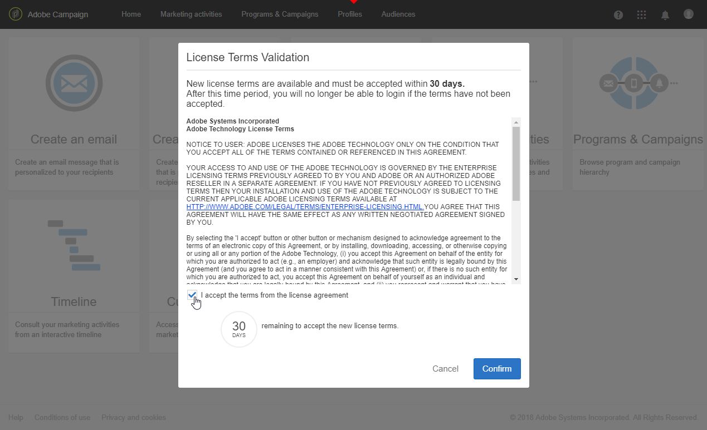

# Licencias{#licenses}

El **[!UICONTROL Licenses]** La ventana de permite ver las licencias instaladas en la instancia y otra información sobre ella, como el número de compilación, la versión de lanzamiento o si los términos del acuerdo se han aceptado y quién los ha aceptado.

Con una nueva versión o función, los términos de licencia pueden cambiar y un administrador funcional de la instancia debe aceptarlos.

La siguiente ventana aparecerá para los usuarios estándar después de iniciar sesión, no se requiere ninguna acción por su parte. Todavía pueden trabajar en Adobe Campaign haciendo clic en el **[!UICONTROL OK]** botón.

Un administrador debe leer y confirmar las nuevas condiciones del acuerdo en los 30 días siguientes a la instalación de la versión comprobando **[!UICONTROL I accept the terms from the license agreement]** y haciendo clic en **[!UICONTROL Confirm]**.

Transcurridos estos 30 días si no se acepta el acuerdo, ningún usuario podrá utilizar esta instancia. Los usuarios estándar no podrán acceder a las funcionalidades de Adobe Campaign y solo verán el siguiente mensaje hasta que un administrador funcional acepte los términos del acuerdo.

