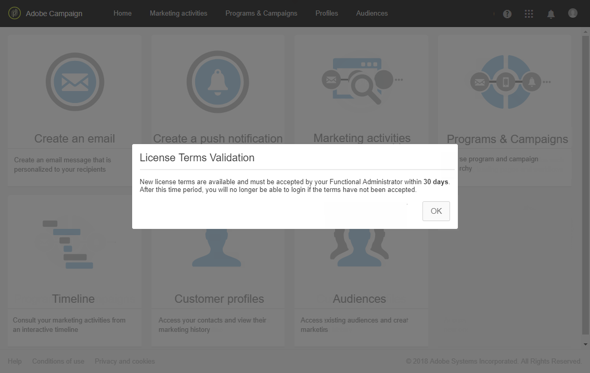

# Licencias{#licenses}

La ventana **[!UICONTROL Licenses]** le permite ver las licencias instaladas en su instancia y otra información sobre la misma, como el número de compilación, la versión de lanzamiento o si se han aceptado los términos del acuerdo y quién los ha aceptado.

Con una nueva versión o función, los términos de licencia pueden cambiar y un administrador funcional de la instancia debe aceptarlos.

La siguiente ventana aparecerá para los usuarios estándar después de iniciar sesión, no se requiere ninguna acción por su parte. Pueden seguir funcionando en Adobe Campaign si hace clic en el botón **[!UICONTROL OK]**.

Un administrador debe leer y confirmar las nuevas condiciones del contrato en los 30 días siguientes a la instalación de la compilación. Para ello, debe marcar **[!UICONTROL I accept the terms from the license agreement]** y hacer clic en **[!UICONTROL Confirm]**.

Transcurridos estos 30 días si no se acepta el acuerdo, ningún usuario podrá utilizar esta instancia. Los usuarios estándar no podrán acceder a las funcionalidades de Adobe Campaign y solo verán el siguiente mensaje hasta que un administrador funcional acepte los términos del acuerdo.

