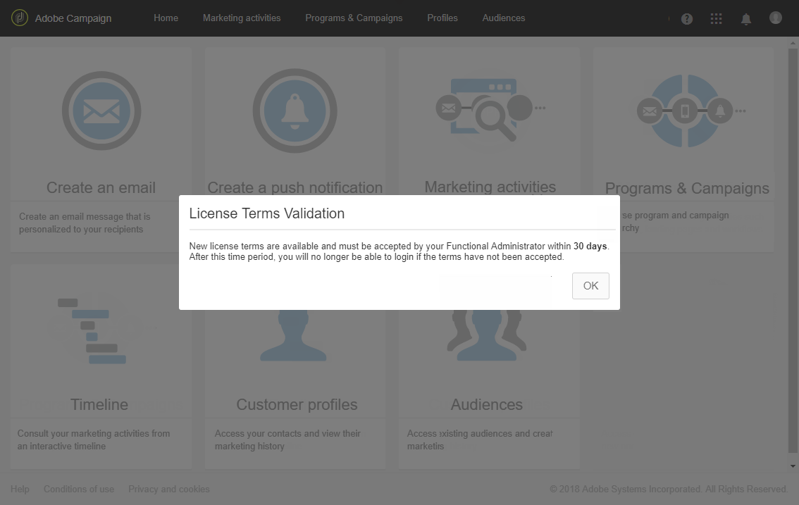

# Licenses{#licenses}

The **[!UICONTROL Licenses]** window allows you to view the installed licenses on your instance and different information about it such as the build number, release version or if the terms of agreement have been accepted and by whom.

Con una nueva compilación o una nueva función, los términos de licencia pueden cambiar y ser aceptados por un administrador funcional de la instancia.

La siguiente ventana aparecerá para los usuarios estándar después de iniciar sesión, no se requiere ninguna acción por su parte. They can still work on Adobe Campaign by clicking the **[!UICONTROL OK]** button.

An administrator has to read and confirm the new terms of agreement in the following 30 days of the build installation by checking **[!UICONTROL I accept the terms from the license agreement]** and clicking **[!UICONTROL Confirm]**.

Pasados estos 30 días, si no se acepta el acuerdo, ningún usuario podrá utilizar esta instancia. Los usuarios estándar no podrán acceder a las funciones de Adobe Campaign y solo verán el siguiente mensaje hasta que un administrador funcional acepte las condiciones de acuerdo.

