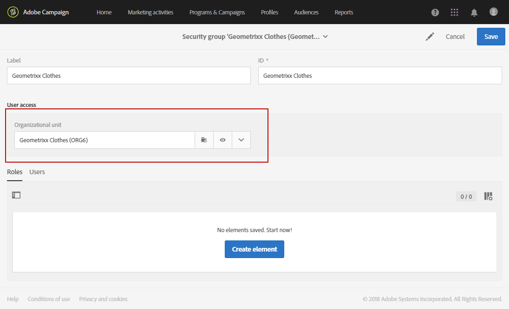

# Administración de grupos y usuarios{#managing-groups-and-users}

## Acerca de los grupos de seguridad {#about-security-groups}

Los grupos de seguridad son conjuntos de usuarios que comparten las mismas funciones y derechos dentro de la organización.

Los usuarios siempre deben estar vinculados a un grupo de seguridad. Esto le permitirá asignarles funciones y unidades organizativas específicas.

Para obtener más información sobre las funciones, la tabla de la siguiente página presenta las posibles operaciones disponibles según las funciones de un usuario: [Autorizaciones de Adobe Campaign Standard](https://experienceleague.adobe.com/docs/campaign-standard/assets/acs_rights.pdf?lang=en).

Los grupos de seguridad predeterminados son así:

* **[!UICONTROL Administrators]**
* **[!UICONTROL Delivery supervisors]**
* **[!UICONTROL Standard Users]**
* **[!UICONTROL Workflow supervisors]**

>[!IMPORTANT]
>
>Los grupos de seguridad **[!UICONTROL Access to the deliverability parameters (Deliverability)]** y **[!UICONTROL Message Center agents (mcExec)]** son de Adobe interno solamente y no deben asignarse a ningún usuario.

Para poder acceder a Adobe Campaign, cada usuario debe estar asignado a un grupo de seguridad.

Para restringir el acceso de un usuario, no agregue el usuario al grupo de usuarios de Campaign Standard, ya que está vinculado a la unidad organizativa **[!UICONTROL All]** .

>[!NOTE]
>
>De forma predeterminada, la **[!UICONTROL All (all)]** unidad organizativa se asigna al grupo de seguridad **[!UICONTROL Administrators]**. Es de solo lectura y no se puede modificar.

## Creación de un grupo de seguridad y asignación de usuarios {#creating-a-security-group-and-assigning-users}

>[!IMPORTANT]
>
>Tenga en cuenta que en Admin Console, los grupos de seguridad se denominan perfiles.

Puede crear sus propios grupos de seguridad si los grupos predeterminados no son suficientes para administrar a los usuarios. Pueden ser administrados por administradores que tienen acceso a menús de administración de Adobe Campaign y Admin Console. Para obtener más información sobre Admin Console, consulte esta [documentación](https://helpx.adobe.com/es/enterprise/managing/user-guide.html).

En este caso, primero debemos asignar los dos grupos predeterminados Usuario estándar y Administrador a nuestros usuarios. Estos grupos de seguridad restringirán algunas funciones de Adobe Campaign: el usuario estándar tiene acceso básico a Adobe Campaign, mientras que el administrador puede acceder a los menús de administración, por ejemplo.

Tenga en cuenta que los cambios realizados en los grupos de seguridad en Admin Console se sincronizarán en cuanto los usuarios inicien sesión en Adobe Campaign.

A continuación, queremos crear un conjunto de grupos de seguridad Geometrixx y Geometrixx Clothes que restringirán el acceso en función de las unidades organizativas de nuestro usuario y administrador estándar.

Primero debe asignar uno de los grupos de seguridad integrados a los usuarios:

1. En Admin Console, seleccione la instancia y, a continuación, la pestaña **Usuarios** .

   

1. Haga clic en el botón **[!UICONTROL Add user]** e introduzca la dirección de correo electrónico del usuario.
1. En la pestaña **[!UICONTROL Assign Products]**, seleccione la instancia y, a continuación, el grupo de seguridad **[!UICONTROL Administrators]** predeterminado en la lista desplegable. Esto permitirá al usuario tener acceso a los menús de administración y crear los siguientes grupos de seguridad.

   

1. Haga clic en **[!UICONTROL Save]** y siga los mismos procedimientos para asignar el grupo de seguridad **[!UICONTROL Standard Users]** integrado al nuevo usuario.

   

Una vez que los dos usuarios están conectados a los grupos de seguridad **[!UICONTROL Administrators]** y **[!UICONTROL Standard users]** integrados que asignan funciones a nuestros usuarios, el administrador puede crear los dos grupos de seguridad **Geometrixx** y **Geometrixx Clothes** que asignarán unidades organizativas a nuestros usuarios, además de los grupos de seguridad integrados.

1. En Admin Console, seleccione la instancia y, a continuación, la pestaña **Productos**.
1. Haga clic en el botón **Nuevo perfil** para crear el grupo de seguridad de **Geometrixx** .

   

1. Escriba el **[!UICONTROL Profile name]** siguiendo esta sintaxis exacta: **[!UICONTROL Campaign Standard- instance name - ID of the security group]**. Luego, haga clic en **[!UICONTROL Done]**.

   El ID seleccionado se utilizará al crear el grupo de seguridad en Adobe Campaign.

   >[!NOTE]
   >
   >Si la sintaxis anterior no parece funcionar con una instancia anterior, debe reemplazarse por **[!UICONTROL Campaign - instance name - ID of the security group]**.

   

1. A continuación, siga los mismos procedimientos para crear el grupo de seguridad **Geometrixx Clothes**.
1. Asigne su grupo de seguridad al usuario seleccionando la pestaña **[!UICONTROL Users]**.

   

1. Haga clic en el usuario creado anteriormente y, a continuación, en el icono  de la categoría **[!UICONTROL Products]**.

   Seleccione **[!UICONTROL Edit products assigned directly]** para empezar a asignar un nuevo grupo de seguridad al usuario.

   

1. En la pestaña **[!UICONTROL Assign Products]**, seleccione la instancia y, a continuación, los grupos de seguridad creados anteriormente con Geometrixx en la lista desplegable para asignarla al usuario administrador.

   Haga clic en **[!UICONTROL Save]**.

   

   Si un usuario está en varios grupos:

   * Las funciones de los diferentes grupos se acumulan. Aquí, los usuarios están en dos grupos diferentes: uno que actuará sobre las funciones y otro sobre las unidades.
   * Se usará la unidad mayor de la jerarquía (consulte el ejemplo en la sección [Unidades organizativas](../../administration/using/organizational-units.md)).
   * El usuario no podrá conectarse si las unidades tienen el mismo nivel equivalente y están en ramas paralelas de la jerarquía.

1. Siga los mismos procedimientos para asignar el grupo de seguridad Geometrixx Clothes a su usuario estándar.

   

Los grupos de seguridad recién creados ahora se crean en Admin console. Para que se sincronicen completamente, también debe crearlos en Adobe Campaign.

El usuario administrador debe crear el conjunto de grupos de seguridad que se utilizan para asignar unidades organizativas: Geometrixx Clothes y Geometrixx. Para aprender a crear unidades organizativas, consulte [Creación y administración de unidades](../../administration/using/organizational-units.md#creating-and-managing-units) .

1. Haga clic en el logotipo **Adobe**, en la esquina superior izquierda, y seleccione **[!UICONTROL Administration > Users & Security > Security groups]**.
1. Cree el nuevo grupo de seguridad, y especifique su **[!UICONTROL Label]** y **[!UICONTROL ID]**.

   El ID debe ser el mismo que el elegido en Admin Console.

1. En el campo **[!UICONTROL User access]**, asigne una unidad organizativa. Aquí, el grupo de seguridad de Geometrixx se asigna a la unidad organizativa **[!UICONTROL All]**.

   >[!NOTE]
   >
   >Si va a asignar un grupo de seguridad integrado a los usuarios, deberá restablecer la unidad organizativa.

   

1. También puede asignar funciones a su grupo de seguridad. En nuestro caso, este paso no es necesario, ya que los grupos de seguridad **[!UICONTROL Administrators]** y **[!UICONTROL Standard users]** integrados se utilizan para asignar funciones.
1. Siga los mismos procedimientos para crear el último grupo de seguridad Geometrixx Clothes y asignar la unidad organizativa de Geometrixx Clothes.

   

Los usuarios estarán asignados a un grupo de seguridad y podrán conectarse a Adobe Campaign.

>[!IMPORTANT]
>
>Si los usuarios se eliminan de un grupo de seguridad en Admin Console, seguirán formando parte del grupo de seguridad de Adobe Campaign y ya no podrán iniciar sesión en Adobe Campaign. En este caso, elimine las direcciones de correo electrónico de los usuarios en Admin Console para evitar que reciban información confidencial.
