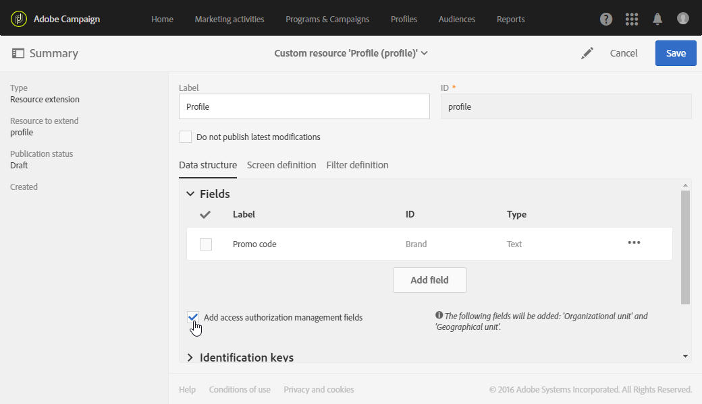

# Unidades organizativas{#organizational-units}

## Acerca de las unidades {#about-units}

Cada objeto y usuario de la plataforma está vinculado a una unidad organizativa. Esta unidad permite definir una estructura jerárquica para proporcionar a los usuarios una vista filtrada. La unidad de un usuario define su nivel de acceso para diferentes objetos de plataforma.

>[!IMPORTANT]
>
>Si un usuario no está vinculado a ninguna unidad, no podrá conectarse a Adobe Campaign. Si desea restringir el acceso de un usuario o grupo de usuarios en particular, no lo vincule a la unidad **[!UICONTROL All]**. Se recomienda añadir la opción **Access authorization management fields** antes de importar cualquier perfil. Para obtener más información, consulte [esta sección](../../administration/using/organizational-units.md#partitioning-profiles).
>
>De forma predeterminada, la **[!UICONTROL All (all)]** unidad organizativa se asigna al grupo de seguridad **[!UICONTROL Administrators]**. Es de solo lectura y no se puede modificar.

Un usuario tiene acceso de solo lectura a todos los objetos de las unidades principales. Tiene acceso de lectura y escritura a todos los objetos de su unidad y unidades infantiles. Un usuario no tiene acceso a objetos en ramas paralelas.

De forma predeterminada, solo están disponibles las unidades **[!UICONTROL All]** .

Cuando al usuario se le asigna una unidad organizativa, esta unidad siempre se aplicará a los objetos que el usuario haya creado.

>[!NOTE]
>
>Cuando un usuario está en varios grupos vinculados a diferentes unidades, se aplican ciertas reglas. Para obtener más información, consulte la sección [Administración de grupos y usuarios](../../administration/using/managing-groups-and-users.md).

## Creación y administración de unidades {#creating-and-managing-units}

Las unidades organizativas permiten filtrar la instancia según la organización a la que estén vinculados los usuarios. Esta unidad puede representar una región, un país o incluso una marca en su caso.

Aquí, anteriormente, creamos grupos de seguridad con diferentes funciones para dos usuarios: a un usuario se le asignan los grupos de seguridad Administradores y Geometrixx, el otro usuario pertenece a los grupos de seguridad Usuario estándar y Ropa de Geometrixx Consulte [Creación de un grupo de seguridad y asignación de usuarios](../../administration/using/managing-groups-and-users.md#creating-a-security-group-and-assigning-users) para el ejemplo completo.

Ahora necesitamos crear las unidades organizativas para los grupos de seguridad de Ropa de Geometrixx y Geometrixx:

1. En el menú avanzado de campaña de Adobe, seleccione **[!UICONTROL Administration]** > **[!UICONTROL Users & security]** > **[!UICONTROL Organizational units]**.
1. Haga clic en **[!UICONTROL Create]** para comenzar a configurar la unidad organizativa.

   

1. Cambie los valores predeterminados **[!UICONTROL Label]** y **[!UICONTROL ID]** a Geometrixx.
1. A continuación, vincule esta unidad a una unidad principal. Aquí, elegimos **[!UICONTROL All]**.

   

1. Finalmente, haga clic en **[!UICONTROL Create]** para empezar a asignar la nueva unidad organizativa al grupo de seguridad.
1. Siga el mismo procedimiento para la unidad de ropa de Geometrixx, excepto que su unidad principal debe ser la unidad creada anteriormente, Geometrixx.

   

Para ver el impacto de asignar diferentes unidades a diferentes grupos de seguridad, el usuario asignado a los grupos Administrador y Geometrixx creará dos plantillas de correo electrónico para ver a qué pueden o no acceder el otro usuario asignado a Usuario estándar y Ropa de Geometrixx.

1. En el menú avanzado, seleccione **[!UICONTROL Resources]** > **[!UICONTROL Templates]** > **[!UICONTROL Delivery Templates]**.
1. Duplique una plantilla existente y personalícela según sea necesario. Para obtener más información, consulte la sección [Acerca de las plantillas](../../start/using/marketing-activity-templates.md).
1. Cuando se cree la plantilla, seleccione el icono **[!UICONTROL Edit properties]** para asignar unidades a la plantilla.

   

1. En el menú desplegable **[!UICONTROL Access authorization]**, seleccione la unidad organizativa.

   Aquí vamos a crear una plantilla con la Geometrixx de unidad organizativa creada anteriormente.

   

1. Siga los mismos procedimientos para crear la segunda plantilla asignada a la unidad organizativa de ropa de Geometrixx creada anteriormente.

El usuario asignado a los grupos Usuario estándar y Ropa de Geometrixx podrá ver ambas plantillas. Debido a la estructura jerárquica de las unidades organizativas, tendrá acceso de lectura y escritura a la plantilla vinculada a la unidad de ropa de Geometrixx y solo acceso de sólo lectura a la plantilla vinculada a la unidad de Geometrixx.

Dado que la unidad Ropa de Geometrixx es una unidad secundaria de Geometrixx, aparece el siguiente mensaje cuando el usuario intenta modificar la plantilla de Geometrixx:

Las unidades organizativas pueden restringir el acceso a diferentes funciones, como perfiles. Por ejemplo, si nuestro usuario de Ropa de Geometrixx accede a la pestaña **[!UICONTROL Profiles]**, podrá acceder y modificar completamente los perfiles con la unidad organizativa de Ropa de Geometrixx.

Mientras que los perfiles con la unidad organizativa de Geometrixx serán de solo lectura, el siguiente error aparecerá si el usuario intenta modificar un perfil: **[!UICONTROL You do not have the rights needed to modify the 'profile' resource of ID]**.

## Partición de perfiles {#partitioning-profiles}

>[!IMPORTANT]
>
>Se recomienda añadir esta opción antes de importar cualquier perfil, ya que los usuarios no pueden acceder a los perfiles sin unidades organizativas.
>
>Si ya ha importado la base de datos de clientes, es necesario actualizar la base de datos para establecer los valores de la unidad organizativa en los perfiles ya importados.

Si la organización necesita aislar los perfiles contactados por cada una de las marcas diferentes, puede dividir los perfiles por sus unidades organizativas.

De forma predeterminada, los campos de unidad organizativa no están disponibles en los perfiles y es necesario añadirlos.

1. En el menú avanzado, en el logotipo de Adobe Campaign, seleccione **Administration > Development > Custom resources**.
1. Seleccione **Perfil** o cree un nuevo recurso personalizado para ampliar los perfiles. Para obtener más información sobre cómo ampliar los perfiles, consulte esta [página](../../developing/using/extending-the-profile-resource-with-a-new-field.md#step-1--extend-the-profile-resource).
1. Marque la casilla **Add access authorization management fields** para añadir las unidades organizativas en la extensión **Profile**.

   

1. Haga clic en **[!UICONTROL Save]**.
1. Actualice la estructura publicando de nuevo los recursos personalizados. Para obtener más información sobre el proceso de publicación, consulte la sección [Actualización de la estructura](../../developing/using/updating-the-database-structure.md) .

El campo unidad organizativa se agrega a los perfiles en la sección **[!UICONTROL Access authorization]** .

**Temas relacionados**:

* [Acerca de las unidades](../../administration/using/organizational-units.md#about-units)
* [Acerca de la administración de acceso](../../administration/using/about-access-management.md)
