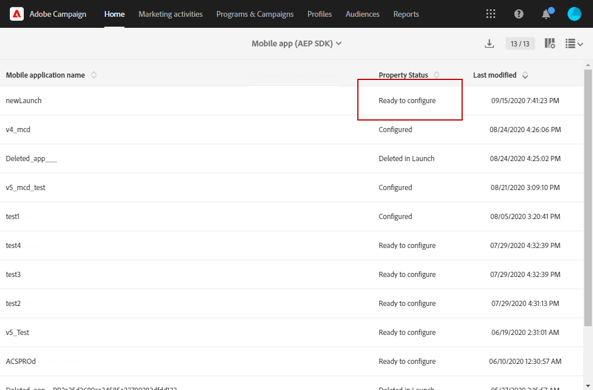
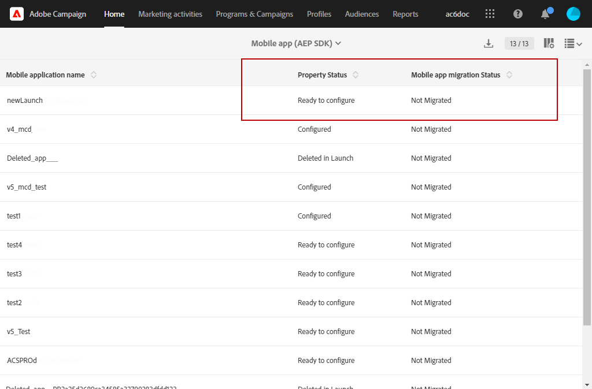

# Migración de la aplicación móvil del SDK v4 al SDK de Adobe Experience Platform {#sdkv4-migration}

>[!IMPORTANT]
>
> El proceso de migración es irreversible.
>
> Lea detenidamente el documento antes de iniciar la migración de la aplicación móvil SDK V4 al SDK para Adobe Experience Platform.

## Acerca de la migración del SDK V4

Adobe Campaign Standard procesa las aplicaciones móviles mediante el SDK V4 como aplicaciones independientes de las que utilizan el SDK de Adobe Experience Platform.
Después de actualizar la versión del SDK de Adobe de 4 a Adobe Experience Platform, las aplicaciones móviles deben seguir utilizando los datos y campañas del suscriptor de la aplicación existente: por lo tanto, es necesaria una migración.

>[!NOTE]
>
> Esta página documenta la migración de una aplicación móvil SDK v4 a una aplicación SDK para Adobe Experience Platform recién creada. Las aplicaciones móviles SDK v4 no se combinarán con una aplicación móvil Adobe Experience Platform SDK **[!UICONTROL Configured]** **[!UICONTROL Property status]**.

| Qué no cambiará después de la migración |
|:-:|
| No habrá ningún efecto en los envíos y campañas existentes que utilicen la aplicación V4 del SDK migrado. |
| El nombre de la aplicación móvil seguirá siendo el mismo. |
| Se conservarán las credenciales de la plataforma para iOS y Android. |
| Se conservarán todos los suscriptores de la aplicación y sus datos. |
| La aplicación móvil v4 del SDK existente seguirá enviando datos (datos PII, información del suscriptor y del token) a Adobe Campaign Standard. |
| La variable **[!UICONTROL Organizational unit]** de la aplicación móvil permanecerá igual. |

| Qué cambiará después de la migración |
|:-:|
| La aplicación móvil estará disponible en **[!UICONTROL Administration]** > **[!UICONTROL Channels]** > **[!UICONTROL Mobile app (Adobe Experience Platform SDK)]**. Antes de la migración, estaba disponible en **[!UICONTROL Administration]** > **[!UICONTROL Channels]** > **[!UICONTROL Mobile app (SDK V4)]**. |
| La variable **[!UICONTROL Collect PII Endpoint]** de la aplicación cambiará. La mayor **[!UICONTROL Collect PII Endpoint]** seguirá funcionando, los datos enviados no se perderán. |
| La aplicación estará vinculada a una etiqueta **[!UICONTROL Mobile Property]**. Se procesará como una aplicación móvil recién creada. |
| La aplicación de SDK de Adobe Experience Platform original utilizada en la migración no existe como aplicación independiente. Solo estará disponible la aplicación SDK v4 migrada. |

## Migración de la aplicación móvil del SDK v4 al SDK para Adobe Experience Platform {#how-to-migrate}

Antes de migrar, debe tener en cuenta las siguientes recomendaciones:

* El proceso de migración es irreversible.
* No debe ejecutar la migración de varias aplicaciones al mismo tiempo. También debe asegurarse de que la migración de una misma aplicación no se active por varias ventanas al mismo tiempo.
* Antes de la migración, asegúrese de que tiene asignado el **[!UICONTROL Organizational unit]** de la aplicación móvil que desea migrar y de la aplicación Adobe Experience Platform que utiliza para la migración.
* Después de la migración, la aplicación se convertirá en una aplicación de SDK para Adobe Experience Platform. Sus cambios se vincularán a la etiqueta correspondiente **[!UICONTROL Mobile Property]**.

1. Cree una nueva **[!UICONTROL Mobile property]** en la interfaz de usuario de la recopilación de datos. Para obtener más información, consulte [documentación](https://aep-sdks.gitbook.io/docs/getting-started/create-a-mobile-property#create-a-mobile-property).

1. En Adobe Campaign Standard, en el menú avanzado, seleccione **[!UICONTROL Administration]** > **[!UICONTROL Application Settings]** > **[!UICONTROL Workflows]** y abra el **[!UICONTROL syncWithLaunch]** flujo de trabajo. Compruebe si el flujo de trabajo ha finalizado sin errores.

1. Una vez finalizado el flujo de trabajo, desde la variable **[!UICONTROL Administration]** > **[!UICONTROL Channels]** > **[!UICONTROL Mobile app (Adobe Experience Platform SDK)]** , compruebe si la aplicación móvil está disponible en Adobe Campaign Standard y está en **[!UICONTROL Ready to Configure]** estado.

   

1. En **[!UICONTROL Administration]** > **[!UICONTROL Channels]** > **[!UICONTROL Mobile app (SDK V4)]**, seleccione la aplicación SDK V4 que desee migrar.

1. Seleccione la pestaña **[!UICONTROL Mobile application migration to AEP SDK]** .

   

1. En el **[!UICONTROL Select AEP SDK mobile application to merge current application with]** , seleccione la aplicación móvil del SDK de Adobe Experience Platform creada anteriormente.

1. Haga clic en **[!UICONTROL Migrate]**.

   

1. En la ventana **[!UICONTROL Migration application]**, haga clic en **[!UICONTROL Ok]**.

   

1. Aparece la ventana de finalización correcta, haga clic en **[!UICONTROL Go to Adobe Experience Platform SDK Channel list]**.

1. En la página de lista de canales del SDK para Adobe Experience Platform, compruebe que la aplicación móvil V4 anterior esté configurada en **[!UICONTROL Ready To Configure]**.

1. Seleccione la aplicación móvil y haga clic en **[!UICONTROL Save]** para completar la migración.

Después de esta migración, los suscriptores recopilados por la versión V4 de la aplicación móvil y los nuevos suscriptores recopilados por la versión AEP de la aplicación móvil estarán disponibles en la aplicación migrada.

Para distinguir los dos tipos diferentes de suscriptores, puede añadir un nuevo campo personalizado de **[!UICONTROL Text]** tipo al ampliar el recurso personalizado **[!UICONTROL Subscriptions to an application (appSubscriptionRcp)]** como `sdkversion` o `appVersion` por ejemplo. Para obtener más información sobre cómo ampliar un recurso personalizado, consulte esta [página](../../developing/using/creating-or-extending-the-resource.md).
Luego tendrá que configurar la etiqueta asociada **[!UICONTROL Mobile property]** para enviar este valor de campo personalizado en la llamada a Collect PII y cambiar la configuración de la aplicación móvil en consecuencia.

## Preguntas frecuentes {#faq}

### P: En la aplicación móvil SDK v4, la migración de la aplicación móvil a la pestaña SDK de Adobe Experience Platform no está visible. {#tab-not-visible}

A: Desde el menú avanzado **[!UICONTROL Administration]** > **[!UICONTROL Application Settings]** > **[!UICONTROL Options]**, compruebe el valor de la variable **[!UICONTROL Enable migration of mobile app from SDK v4 to Adobe Experience Platform SDK option]** . Debe estar establecido en 1 y habilitado de forma predeterminada. Es posible que el administrador lo haya deshabilitado manualmente.

### P: Desde la pestaña Mobile application migration to Adobe Experience Platform SDK , aparece el mensaje No data . {#no-data}

A: Únicamente la solicitud elegible de su **[!UICONTROL Organizational unit]** se muestra en la lista. Asegúrese de que tiene la aplicación de Adobe Experience Platform correcta para la migración. La variable **[!UICONTROL Property Status]** de la aplicación de Adobe Experience Platform debe establecerse en **[!UICONTROL Ready to Configure]**  y **[!UICONTROL Mobile app migration status]** configure como **[!UICONTROL Not Migrated]**.

### P: ¿Por qué no se puede utilizar para la migración la aplicación SDK de Adobe Experience Platform con el estado de propiedad configurado? {#property-status}

A: El proceso de migración conserva los suscriptores y atributos de SDK v4. Solo conserva la información relacionada con las etiquetas de la aplicación del SDK para Adobe Experience Platform. Se perderán los suscriptores y otros datos de la aplicación de SDK para Adobe Experience Platform. Para evitar la pérdida de datos, solo las aplicaciones de SDK de Adobe Experience Platform con la variable **[!UICONTROL Ready to Configure]** **[!UICONTROL Property Status]** son aptos para la migración.

### P: Después de la migración, ¿dónde puedo encontrar mi aplicación móvil v4 SDK anterior? {#v4-app-not-visible}

A: La aplicación móvil después de la migración será visible desde el menú avanzado **[!UICONTROL Administration]** > **[!UICONTROL Channels]** > **[!UICONTROL Mobile app (Adobe Experience Platform SDK)]**.

### P: Después de la migración, ¿dónde puedo encontrar la aplicación de SDK para Adobe Experience Platform recién creada? {#aep-not-visible}

A: La aplicación de SDK de Adobe Experience Platform recién creada que se utiliza para la migración no existe como aplicación independiente. Solo estará disponible la aplicación SDK v4 migrada.

### P: Si la unidad organizativa de la aplicación móvil SDK v4 está establecida en A (un elemento secundario de la unidad organizativa ALL) y el SDK de Adobe Experience Platform está establecido en ALL. ¿Cómo puedo migrar mi aplicación móvil? {#v4-org-unit}

A: Los administradores de **[!UICONTROL Organizational unit]** TODOS tendrán los derechos para administrar ambas aplicaciones móviles y estarán a cargo de la migración.

### P: Si la unidad organizativa de la aplicación móvil SDK v4 está definida en A y la aplicación del SDK de Adobe Experience Platform en B (elemento del mismo nivel que la unidad organizativa A). ¿Cómo puedo migrar mi aplicación móvil? {#aep-org-unit}

A: La aplicación de SDK de Adobe Experience Platform es el recurso de un hermano **[!UICONTROL Organizational unit]**, la aplicación móvil no será visible para los usuarios del **[!UICONTROL Organizational unit]** A. La aplicación móvil estará disponible para los administradores del **[!UICONTROL Organizational unit]** TODOS, pero no recomendamos a estos administradores migrar la aplicación móvil.
En este caso, debe mover las aplicaciones móviles del mismo modo **[!UICONTROL Organizational unit]** o en un **[!UICONTROL Organizational unit]** con un vínculo principal.
Para obtener más información, consulte **[!UICONTROL Organizational unit]**, consulte esta [sección](../../administration/using/organizational-units.md).

### P: Desde la aplicación móvil del SDK de Adobe Experience Platform (migrada desde la aplicación móvil v4), en la lista desplegable Configuración de canal push , no se muestra información como la fecha y el nombre cargados para la clave de Android o el certificado de iOS {#no-information-v5}

A: El sistema no almacena esta información cuando se crea la aplicación móvil SDK V4. Al migrar la aplicación móvil SDK V4 a una aplicación móvil del SDK de Adobe Experience Platform, la aplicación móvil migrada no tendrá este tipo de información. Tan pronto como un usuario cargue un nuevo certificado de iOS o una clave de Android, los distintos detalles de la clave o certificado se almacenarán y mostrarán correctamente en la sección **[!UICONTROL Push channel settings]** lista desplegable.
