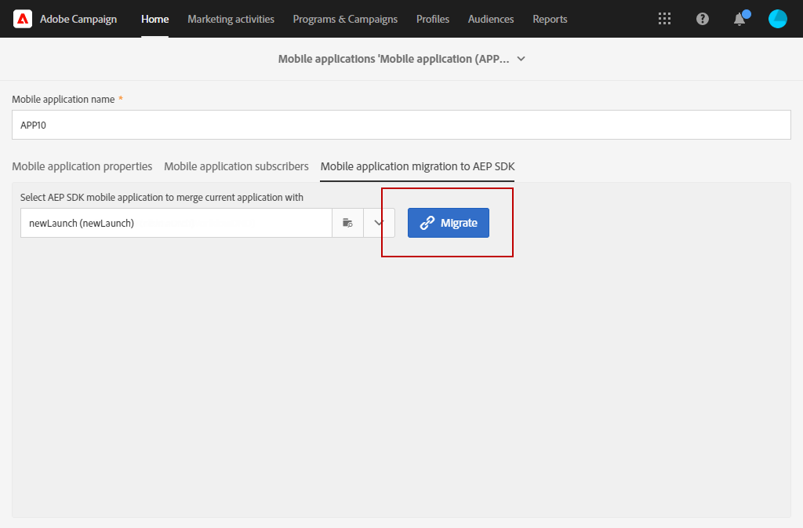
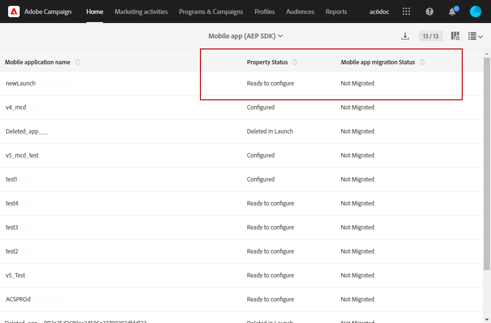

# Migración de la aplicación móvil del SDK v4 al SDK de Adobe Experience Platform {#sdkv4-migration}

La compatibilidad con los SDK de Adobe Experience Platform Mobile versión 4 finalizó el 31 de agosto de 2021. Si todavía utiliza esta versión heredada de SDK, debe actualizar la implementación con Adobe Experience Platform SDK **antes del final de junio de 2024**. Descubra cómo migrar a Adobe Experience Platform SDK en este artículo.

>[!IMPORTANT]
>
> Lea detenidamente el documento antes de iniciar la migración de la aplicación móvil de SDK V4 a Adobe Experience Platform SDK.

## Acerca de la migración a SDK V4

Adobe Campaign Standard procesa las aplicaciones móviles que utilizan SDK V4 como aplicaciones independientes de las que utilizan Adobe Experience Platform SDK.

Después de actualizar la versión de Adobe SDK de v4 a Adobe Experience Platform, las aplicaciones móviles deben seguir utilizando los datos y las campañas de suscriptores de las aplicaciones existentes; por lo tanto, es necesaria una migración.

>[!NOTE]
>
> Esta página documenta la migración de una aplicación móvil de SDK v4 a una aplicación SDK de Adobe Experience Platform recién creada. Sus aplicaciones móviles de SDK v4 no se combinarán con una aplicación móvil de Adobe Experience Platform SDK con un **[!UICONTROL Configured]** **[!UICONTROL Property status]**.

| Qué no cambiará después de la migración |
|:-:|
| No habrá ningún efecto en los envíos y campañas existentes que utilicen la aplicación SDK V4 migrada. |
| El nombre de la aplicación móvil seguirá siendo el mismo. |
| Se conservarán las credenciales de plataforma de iOS y Android. |
| Se conservarán todos los suscriptores de la aplicación y sus datos. |
| La aplicación móvil SDK v4 existente seguirá enviando datos (datos PII, información de suscriptor y token) a Adobe Campaign Standard. |
| El **[!UICONTROL Organizational unit]** de la aplicación móvil seguirá siendo el mismo. |

| Cambios después de la migración |
|:-:|
| La aplicación móvil estará disponible en **[!UICONTROL Administration]** > **[!UICONTROL Channels]** > **[!UICONTROL Mobile app (Adobe Experience Platform SDK)]**. Antes de la migración, estaba disponible en **[!UICONTROL Administration]** > **[!UICONTROL Channels]** > **[!UICONTROL Mobile app (SDK V4)]**. |
| El **[!UICONTROL Collect PII Endpoint]** de la aplicación cambiará. La carpeta **[!UICONTROL Collect PII Endpoint]** seguirá funcionando, los datos enviados no se perderán. |
| La aplicación estará vinculada a una etiqueta **[!UICONTROL Mobile Property]**. Se procesará como una aplicación móvil recién creada. |
| La aplicación original de Adobe Experience Platform SDK utilizada en la migración no existirá como una aplicación independiente. Solo estará disponible la aplicación SDK v4 migrada. |

## Migración de la aplicación móvil de SDK v4 a Adobe Experience Platform SDK {#how-to-migrate}

Antes de migrar, debe tener en cuenta las siguientes recomendaciones:

* El proceso de migración es irreversible.
* No debe ejecutar la migración de varias aplicaciones al mismo tiempo. También debe asegurarse de que la migración de una misma aplicación no se active mediante varias ventanas al mismo tiempo.
* Antes de la migración, asegúrese de que tiene asignado el **[!UICONTROL Organizational unit]** de la aplicación móvil que desea migrar y de la aplicación de Adobe Experience Platform que está utilizando para la migración.
* Después de la migración, la aplicación se convertirá en una aplicación de Adobe Experience Platform SDK. Sus cambios se vincularán a su etiqueta correspondiente **[!UICONTROL Mobile Property]**.

1. Crear un nuevo(a) **[!UICONTROL Mobile property]** en la IU de recopilación de datos. Para obtener más información, consulte la [documentación](https://developer.adobe.com/client-sdks/documentation/getting-started/create-a-mobile-property/).

1. En Adobe Campaign Standard, en el menú avanzado, seleccione **[!UICONTROL Administration]** > **[!UICONTROL Application Settings]** > **[!UICONTROL Workflows]** y abra el flujo de trabajo **[!UICONTROL syncWithLaunch]**. Compruebe si el flujo de trabajo ha finalizado sin errores.

1. Una vez finalizado el flujo de trabajo, en el menú **[!UICONTROL Administration]** > **[!UICONTROL Channels]** > **[!UICONTROL Mobile app (Adobe Experience Platform SDK)]**, compruebe si la aplicación móvil está disponible en Adobe Campaign Standard y está en estado **[!UICONTROL Ready to Configure]**.

   

1. En **[!UICONTROL Administration]** > **[!UICONTROL Channels]** > **[!UICONTROL Mobile app (SDK V4)]**, seleccione la aplicación de SDK V4 que desee migrar.

1. Seleccione la pestaña **[!UICONTROL Mobile application migration to AEP SDK]** .

   

1. En la lista desplegable **[!UICONTROL Select AEP SDK mobile application to merge current application with]**, seleccione la aplicación móvil Adobe Experience Platform SDK creada anteriormente.

1. Haga clic **[!UICONTROL Migrate]**.

   

1. En la ventana **[!UICONTROL Migration application]**, haga clic en **[!UICONTROL Ok]**.

   

1. Aparece la ventana de finalización correcta, haga clic en **[!UICONTROL Go to Adobe Experience Platform SDK Channel list]**.

1. En la página de lista de canales de Adobe Experience Platform SDK, compruebe que la aplicación móvil V4 anterior esté configurada como **[!UICONTROL Ready To Configure]**.

1. Seleccione su aplicación móvil y haga clic en **[!UICONTROL Save]** para completar la migración.

Después de esta migración, los suscriptores recopilados por la versión V4 de la aplicación móvil y los nuevos suscriptores recopilados por la versión AEP de la aplicación móvil estarán disponibles en la aplicación migrada.

Para distinguir los dos tipos diferentes de suscriptores, puede agregar un nuevo campo personalizado de tipo **[!UICONTROL Text]** al ampliar el recurso personalizado **[!UICONTROL Subscriptions to an application (appSubscriptionRcp)]** como `sdkversion` o `appVersion`, por ejemplo. Para obtener más información sobre cómo ampliar un recurso personalizado, consulte esta [página](../../developing/using/creating-or-extending-the-resource.md).
Luego tendrá que configurar la etiqueta asociada **[!UICONTROL Mobile property]** para enviar este valor de campo personalizado en la llamada a Collect PII y cambiar la configuración de la aplicación móvil según corresponda.

## Preguntas frecuentes {#faq}

### P: En la aplicación móvil SDK v4, la pestaña Migración de aplicaciones móviles a Adobe Experience Platform SDK no está visible. {#tab-not-visible}

R: En el menú avanzado **[!UICONTROL Administration]** > **[!UICONTROL Application Settings]** > **[!UICONTROL Options]**, compruebe el valor de la opción **[!UICONTROL Enable migration of mobile app from SDK v4 to Adobe Experience Platform SDK option]**. Debe establecerse en 1 y habilitarse de forma predeterminada. Es posible que el administrador lo haya desactivado manualmente.

### P: En la pestaña Migración de aplicaciones móviles a Adobe Experience Platform SDK, aparece el mensaje Sin datos. {#no-data}

R: En la lista solo se muestra la aplicación elegible de su **[!UICONTROL Organizational unit]**. Asegúrese de que tiene la aplicación de Adobe Experience Platform correcta para la migración. **[!UICONTROL Property Status]** de su aplicación de Adobe Experience Platform debe establecerse en **[!UICONTROL Ready to Configure]** y **[!UICONTROL Mobile app migration status]** en **[!UICONTROL Not Migrated]**.

### P: ¿Por qué no se puede utilizar la aplicación Adobe Experience Platform SDK con el estado de propiedad configurado para la migración? {#property-status}

R: El proceso de migración conserva los suscriptores y atributos de SDK v4. Solo mantiene la información relacionada con las etiquetas de la aplicación Adobe Experience Platform SDK. Se perderán los suscriptores y otros datos de la aplicación Adobe Experience Platform SDK. Para evitar la pérdida de datos, solo las aplicaciones de Adobe Experience Platform SDK con **[!UICONTROL Ready to Configure]** **[!UICONTROL Property Status]** pueden migrar.

### P: Después de la migración, ¿dónde puedo encontrar la aplicación móvil SDK v4 anterior? {#v4-app-not-visible}

R: La aplicación móvil después de la migración estará visible desde el menú avanzado **[!UICONTROL Administration]** > **[!UICONTROL Channels]** > **[!UICONTROL Mobile app (Adobe Experience Platform SDK)]**.

### P: Después de la migración, ¿dónde puedo encontrar la aplicación de Adobe Experience Platform SDK recién creada? {#aep-not-visible}

R: La aplicación de Adobe Experience Platform SDK recién creada que se utilizó para la migración no existirá como una aplicación independiente. Solo estará disponible la aplicación SDK v4 migrada.

### P: Si la unidad organizativa de la aplicación móvil SDK v4 está configurada en A (un elemento secundario de la unidad organizativa ALL) y Adobe Experience Platform SDK está configurada en ALL. ¿Cómo puedo migrar mi aplicación móvil? {#v4-org-unit}

R: Los administradores de **[!UICONTROL Organizational unit]** ALL tendrán derechos para administrar ambas aplicaciones móviles y se encargarán de la migración.

### P: Si la unidad organizativa de la aplicación móvil SDK v4 está configurada en A y la aplicación SDK de Adobe Experience Platform está configurada en B (elemento secundario de la unidad organizativa A). ¿Cómo puedo migrar mi aplicación móvil? {#aep-org-unit}

R: La aplicación Adobe Experience Platform SDK es el recurso de un elemento secundario **[!UICONTROL Organizational unit]**, por lo que la aplicación móvil no será visible para los usuarios de **[!UICONTROL Organizational unit]** A. La aplicación móvil estará disponible para los administradores de **[!UICONTROL Organizational unit]** ALL, pero no se recomienda que estos administradores migren la aplicación móvil.
En este caso, debe mover las aplicaciones móviles en el mismo(a) **[!UICONTROL Organizational unit]** o en un(a) **[!UICONTROL Organizational unit]** con un vínculo principal.
Para obtener más información sobre **[!UICONTROL Organizational unit]**, consulte esta [sección](../../administration/using/organizational-units.md).

### P: Desde la página de la aplicación móvil Adobe Experience Platform SDK (migrada desde la aplicación móvil v4), en la lista desplegable Configuración del canal push, no se muestra ninguna información, como la fecha/nombre cargado, para la clave de Android o el certificado de iOS {#no-information-v5}

R: El sistema no almacena esta información cuando se crea la aplicación móvil SDK V4. Al migrar la aplicación móvil de SDK V4 a una aplicación móvil de Adobe Experience Platform SDK, la aplicación móvil migrada tampoco tendrá este tipo de información. En cuanto un usuario cargue un nuevo certificado de iOS o clave de Android, los diferentes detalles de la clave o del certificado se almacenarán y se mostrarán correctamente en la lista desplegable **[!UICONTROL Push channel settings]**.
