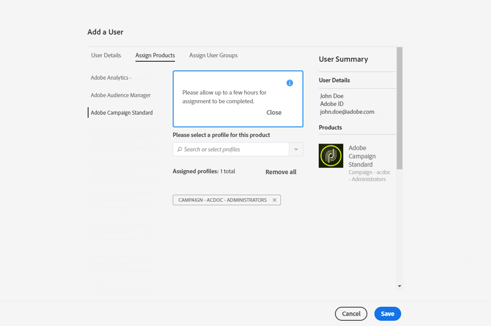

# Administración de usuarios{#users-management}

## Acerca de los usuarios {#about-users}

Adobe Campaign permite asignar un conjunto de funciones a los usuarios para definir a qué parte de la interfaz pueden acceder.

Las funciones específicas y las autorizaciones correspondientes se detallan en las secciones siguientes: [comprensión de funciones](../../administration/using/list-of-roles.md) y [autorizaciones](https://experienceleague.adobe.com/docs/campaign-standard/assets/acs_rights.pdf?lang=en).

Los administradores pueden administrar usuarios desde Admin Console. Los usuarios se sincronizan automáticamente con Adobe Campaign. Para obtener más información, consulte la documentación de [Admin Console](https://helpx.adobe.com/es/enterprise/using/users.html).

 [Descubra esta función en vídeo](#video)

Para ver los usuarios en Adobe Campaign, haga clic en el logotipo **Adobe** en la esquina superior izquierda y, a continuación, seleccione **[!UICONTROL Administration > Users & Security > Users]**.

Para acceder a la interfaz de administración de usuarios desde Adobe Campaign, haga clic en **[!UICONTROL User administration]**.

**Temas relacionados:**

* Vídeo sobre la [administración de permisos de usuarios](https://experienceleague.adobe.com/docs/campaign-standard-learn/tutorials/administrating/managing-user-access-rights.html)
* [Lista de funciones](../../administration/using/list-of-roles.md)
* [Lista de autorizaciones](https://experienceleague.adobe.com/docs/campaign-standard/assets/acs_rights.pdf?lang=en)

## Tipo de usuarios {#type-of-users}

Esta segmentación de usuarios no es obligatoria, pues solo representa el uso más común de Adobe Campaign.

Esta sección le ayudará a comprender los principales tipos de usuarios de Adobe Campaign. Aquí, no vamos a entrar en todas las funciones específicas que puede tener un usuario (envíos de inicio, exportación, preparación de envíos, etc.). Para obtener más información sobre las funciones, consulte las páginas [Lista de funciones](../../administration/using/list-of-roles.md) y [Administración de grupos y usuarios](../../administration/using/managing-groups-and-users.md) .

Preferiremos centrarnos en cómo las diferentes tareas de Adobe Campaign están divididas en tres tipos de usuarios principales:

* [Administradores funcionales](#functional-administrators): entre todos los usuarios de su organización, son los más técnicos.
* [Usuarios avanzados](#advanced-users): configuran todos los elementos que los especialistas en marketing necesitan para enviar y supervisar sus envíos.
* [Usuarios básicos](#basic-users): son los especialistas en marketing que personalizan, entregan y supervisan sus campañas.

>[!NOTE]
>
>Los administradores funcionales son diferentes de los administradores técnicos de Adobe. Los administradores técnicos de Adobe tienen una función interna de Adobe que ningún cliente puede utilizar. Administran el aprovisionamiento de instancias, el alojamiento, la monitorización y supervisión de la infraestructura, y las soluciones técnicas de problemas.

### Administradores funcionales {#functional-administrators}

Los administradores funcionales son usuarios que pueden acceder a las partes más técnicas de la interfaz. Ellos tienen la función **[!UICONTROL Administration]** y se aseguran de que la plataforma esté configurada para que los especialistas en marketing solo tengan que centrarse en ofrecer sus campañas.

>[!IMPORTANT]
>
>Solo los administradores funcionales con la función **[!UICONTROL Administration]** y acceso a **Todas las unidades** pueden acceder a los registros de envío, los registros de mensajes, los registros de seguimiento, los registros de exclusión, los registros de propuestas y los registros de suscripción. Un usuario no administrador puede segmentar estos registros, pero comenzando en una tabla vinculada (perfiles, envío).

Los administradores funcionales son los únicos usuarios que pueden acceder al menú **[!UICONTROL Administration]** en la interfaz de Adobe Campaign. Dado que estos usuarios necesitan acceder a los recursos técnicos, se les deben asignar funciones más avanzadas, como las funciones **[!UICONTROL Administration]** y **[!UICONTROL Datamodel]** integradas. Estas funciones se combinan en el grupo de seguridad **[!UICONTROL Administrators]** integrado. Para obtener más información, consulte [esta sección](../../administration/using/list-of-roles.md).

Estas son las principales tareas que pueden realizar:

* [Administrar usuarios y permisos](../../administration/using/about-access-management.md): administrar el acceso a la plataforma (usuarios, funciones, grupos de seguridad y unidades).
* [Configurar los diferentes canales](../../administration/using/about-channel-configuration.md): configurar los diferentes canales de la plataforma, así como la administración de la tipología y la cuarentena.
* [Configurar las opciones generales de aplicaciones](../../administration/using/external-accounts.md): configurar los diferentes elementos de la aplicación (cuentas externas, opciones y flujos de trabajo técnicos).
* [Desarrollar nuevas funciones para mejorar las funcionalidades integradas](../../developing/using/data-model-concepts.md): administrar sus recursos personalizados y acceder a las herramientas de diagnóstico.
* [Configurar los parámetros de instancia](../../administration/using/branding.md): definir las diferentes marcas y configurar sus opciones (logotipo, administración del seguimiento y dominio de URL para acceder a las páginas de aterrizaje, etc.).
* [Exportar e importar paquetes de datos](../../automating/using/managing-packages.md): intercambiar recursos entre distintas instancias de Adobe Campaign a través de archivos XML estructurados.
* [Exportar registros](../../automating/using/exporting-logs.md) y [definir plantillas de importación](../../automating/using/importing-data-with-import-templates.md#setting-up-import-templates).

### Usuarios avanzados {#advanced-users}

Los usuarios avanzados son usuarios de marketing que se ocupan de los casos de uso más técnicos en Adobe Campaign. Preconfiguran todos los elementos que utilizan los especialistas en marketing para enviar y supervisar sus envíos.

Este tipo de usuario requiere funciones más generales que los administradores funcionales, pero debe poder realizar algunas operaciones técnicas. Para ello, se les deben asignar, por ejemplo, las funciones **[!UICONTROL Export]**, **[!UICONTROL Generic import]** o **[!UICONTROL Workflow]** integradas. Para obtener más información, consulte [esta sección](../../administration/using/list-of-roles.md).

Estas son las principales tareas que pueden realizar:

* [Crear y ejecutar flujos de trabajo de gestión de datos complejos](../../automating/using/about-data-management-activities.md): importar, enriquecer y transformar datos para alimentar la base de datos, o exportar los datos necesarios en archivos externos para procesarlos en sus propias herramientas.
* [Administrar plantillas](../../start/using/marketing-activity-templates.md): administrar plantillas para preconfigurar ciertos parámetros de actividades de marketing según las necesidades.
* [Crear consultas](../../automating/using/editing-queries.md#about-query-editor) y [administrar sus audiencias](../../audiences/using/about-audiences.md): crear audiencias manualmente con consultas o automáticamente con flujos de trabajo dedicados.
* [Realizar edición avanzada de expresiones](../../automating/using/editing-queries.md#about-query-editor): utilizar funciones avanzadas para manipular los valores utilizados para llevar a cabo consultas específicas como fechas, cadenas, campos numéricos, ordenación, etc.
* [Exportar listas](../../automating/using/exporting-lists.md) e [importar datos mediante plantillas de importación existentes](../../automating/using/importing-data-with-import-templates.md).

### Usuarios básicos {#basic-users}

Gracias al administrador funcional y a los usuarios avanzados, los especialistas en marketing pueden personalizar, entregar y supervisar sus campañas sin tener que preocuparse por la configuración técnica. Para ello, se les deben asignar, por ejemplo, las funciones **[!UICONTROL Prepare deliveries]**, **[!UICONTROL Workflow]** y **[!UICONTROL Start deliveries]** listas para usar. Estas funciones se combinan en el grupo de seguridad **[!UICONTROL Standard Users]** integrado. Para obtener más información, consulte [esta sección](../../administration/using/list-of-roles.md).

Estas son las principales tareas que pueden realizar:

* [Administrar programas y campañas](../../start/using/programs-and-campaigns.md): crear campañas de marketing que incluyan distintos tipos de actividades (correos electrónicos, mensajes SMS, notificaciones push, flujos de trabajo y páginas de aterrizaje).
* Administrar [perfiles](../../audiences/using/about-profiles.md) y [perfiles de prueba](../../audiences/using/managing-test-profiles.md): administrar destinatarios identificados y de prueba que serán el objetivo de los envíos. Añadir información como nombre, apellidos, información de contacto, suscripciones, correos electrónicos, etc.
* [Crear y enviar mensajes](../../sending/using/confirming-the-send.md): crear su mensaje, seleccionar la audiencia, definir el contenido del mensaje y sus elementos de personalización, enviar pruebas y enviar el mensaje final a la audiencia.
* [Crear y publicar páginas de aterrizaje](../../channels/using/getting-started-with-landing-pages.md): crear y administrar un conjunto de servicios que desee que tengan oferta con sus clientes (por ejemplo, formularios bajas o de suscripción).
* [Crear y ejecutar flujos de trabajo de la campaña](../../automating/using/building-a-workflow.md): automatizar los procesos de campaña mediante flujos de trabajo.
* Monitorizar las actividades de marketing a través de los [informes disponibles](../../reporting/using/defining-the-report-period.md).

## Creación de un usuario {#creating-a-user}

Para agregar un usuario a su instancia, primero debe crearlo en Admin Console antes de administrarlo en Adobe Campaign Standard.

1. En el menú avanzado, seleccione **[!UICONTROL Administration > Users & Security > Users]** y haga clic en **[!UICONTROL User administration]** para acceder a Admin Console.

   

1. En la **[!UICONTROL Admin Console]**, haga clic en la pestaña **[!UICONTROL Users]**.

1. Haga clic en **[!UICONTROL Add User]**.

   

1. En la pestaña **[!UICONTROL User details]**, rellene los detalles del usuario, como la dirección de correo electrónico, el nombre y los apellidos.

   

1. En la pestaña **[!UICONTROL Assign products]**, asigne uno o varios grupos de seguridad al usuario. Para obtener más información sobre los grupos de seguridad, consulte esta [página](../../administration/using/managing-groups-and-users.md).

   Haga clic en **[!UICONTROL Save]** cuando termine de configurar.

   

El usuario se habrá creado y recibirá una redirección por correo electrónico a la siguiente ventana donde el usuario debe establecer una contraseña. Luego, debe aceptar el contrato de términos de uso. Este usuario podrá conectarse a su instancia de Adobe Campaign Standard.

El usuario se sincronizará con Adobe Campaign Standard en cuanto inicie sesión en su instancia.

A continuación, puede comprobar si el usuario se ha sincronizado correctamente con Adobe Campaign:

1. En el menú avanzado **[!UICONTROL Administration > Users & Security > Users]**, seleccione el usuario creado anteriormente.

1. Actualice **[!UICONTROL Mobile]**, **[!UICONTROL Time zone]** o **[!UICONTROL Regional settings]** si es necesario.

1. Compruebe el grupo de seguridad del usuario. Aquí puede ver que al usuario se le ha asignado el grupo de seguridad **[!UICONTROL Administrators]**.

   >[!NOTE]
   >
   >Los grupos de seguridad solo se pueden eliminar o agregar a un usuario en Admin Console.

   

1. Verifique **[!UICONTROL Account disabled]** si desea desactivar este usuario.

1. En el campo **[!UICONTROL Authorized connection zone]**, seleccione la forma en que el usuario se conectará a esta instancia, por ejemplo, mediante una red interna o VPN.

1. Haga clic en **[!UICONTROL Save]**.

El usuario ya está listo para usar Adobe Campaign Standard.

## Tutorial en vídeo {#video}

Este vídeo muestra cómo administrar los derechos de acceso de los usuarios.

>[!VIDEO](https://video.tv.adobe.com/v/24671?quality=12)

Hay disponibles más vídeos prácticos del Campaign Standard [aquí](https://experienceleague.adobe.com/docs/campaign-standard-learn/tutorials/overview.html?lang=es).
