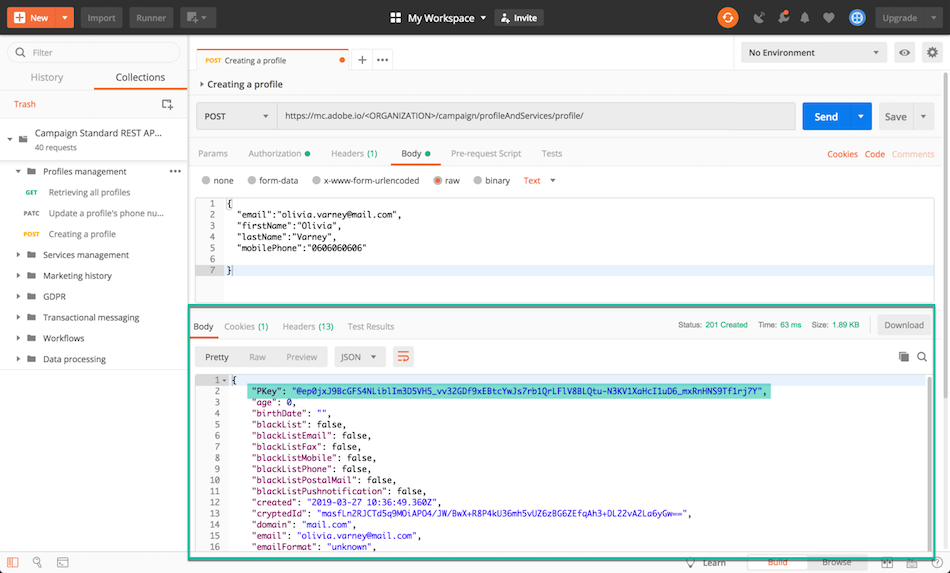

# Razones para utilizar las API de Campaign Standard {#why-using-campaign-standard-apis}

Adobe Campaign Standard proporciona API que permiten que los sistemas existentes se integren con la plataforma de Campaign para resolver problemas reales en tiempo real.

Los sitios web públicos como la página de registro o de exclusión deben conectarse a sistemas back-end para almacenar información de perfil. Los sistemas back-end como Adobe Campaign tienen la flexibilidad y la potencia para introducir datos de perfil en y realizar operaciones personalizadas en él.

Estos son algunos ejemplos:

* Posibles inscripciones en línea.
* Perfil del cliente existente y administración de preferencias de comunicación de marketing.
* Activación de comunicaciones transaccionales basadas en eventos: confirmación de pedido, itinerario de reserva, restablecimiento de contraseña, etc.
* Incluso la comunicación por correo electrónico de abandono del carro de compras.

Las páginas de aterrizaje de registro permiten a los clientes o posibles clientes registrar su nombre y dirección de correo electrónico. Una vez que el Campaign Standard captura la información de perfil y las preferencias, puede enviar mensajes personalizados según los intereses de la persona.

Se crean con los elementos siguientes:

1. Un formulario de registro con oyentes de API de campaña.

   

1. Acciones personalizadas que se deben realizar en función de casillas de verificación. A un cliente que seleccione &quot;Ofertas especiales de correo electrónico&quot; se le enviará un correo personalizado diferente con un cupón de regalo en comparación con el proceso normal de registro.

   

1. Un perfil puede cambiar sus detalles después de hacer clic en el vínculo &quot;Actualizar detalles&quot; del correo electrónico. Esto lleva el perfil a la página &quot;Actualizar los detalles de perfil y preferencias&quot;. Para realizar la operación, los detalles de perfil (Pkey) se pasan al servidor de Campaign y el perfil se recupera y se representa. Una vez que el perfil hace clic en el botón &quot;Actualizar&quot;, la información se actualiza en el sistema (a través de un comando del PATCH).

   

Hay disponible una colección de solicitudes para ayudarle a familiarizarse con las solicitudes de API de Campaign Standard. Esta colección en formato JSON proporciona solicitudes de API prediseñadas que representan casos de uso comunes.

Los pasos siguientes describen un caso de uso paso a paso para importar y utilizar la colección para crear un perfil en la base de datos de Campaign Standard.

>[!NOTE]
>
>Nuestro ejemplo usa Postman. Sin embargo, no dude en usar su cliente REST favorito.

1. Descargue la colección JSON haciendo clic [aquí](https://helpx.adobe.com/content/dam/help/en/campaign/kb/working-with-acs-api/_jcr_content/main-pars/download_section/download-1/KB_postman_collection.json.zip).

1. Abra Postman y, a continuación, seleccione el menú **File** / **Import**.

1. Arrastre y suelte el archivo descargado en la ventana . Se muestran las solicitudes de API prediseñadas, listas para utilizarse.

   

1. Seleccione la solicitud **Creating a profile** y, a continuación, actualice la solicitud del POST y la pestaña **Headers** con su propia información (&lt;ORGANIZACIÓN>, &lt;API_KEY>, &lt;ACCESS_TOKEN>). Para obtener más información, consulte [esta sección](../../api/using/setting-up-api-access.md).

   

1. Complete la pestaña **Body** con la información que desee agregar al nuevo perfil y luego haga clic en el botón **Send** para ejecutar la solicitud.

   

1. Una vez creado un objeto, se le asocia una clave principal (PKey). Se puede ver en la respuesta de solicitud, así como en otros atributos.

   

1. Abra la instancia de Campaign Standard y, a continuación, compruebe que se ha creado el perfil, con toda la información de la carga útil.

   
