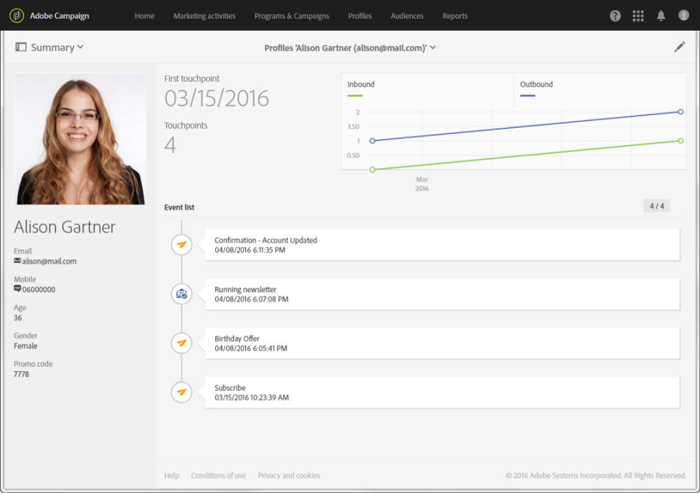

# About profiles{#about-profiles}

Adobe Campaign le permite gestionar contactos a lo largo del ciclo de vida completo: creación, importación, segmentación, seguimiento de acciones, actualizaciones, etc. Los contactos se almacenan en la base de datos como perfiles que contienen la información vinculada a ellos: apellidos, nombre, dirección, suscripciones, entregas, etc.

>[!NOTE]
>
>Los perfiles también están disponibles mediante la API de Adobe Campaign Standard. For more on this, refer to the [dedicated documentation](https://docs.campaign.adobe.com/doc/standard/en/api/ACS_API.html#retrieving-profiles) .

Al crear campañas, puede definir el objetivo de los envíos seleccionando perfiles según criterios simples o avanzados. Técnicamente, un perfil es una entrada en la base de datos que contiene toda la información necesaria para segmentación, calificar y rastrear comportamientos.

Un perfil puede ser: un cliente, un posible cliente, una persona suscrita a una newsletter, un destinatario, un usuario o cualquier otra confesión según la organización. To define various types of profiles, use [targeting dimensions](../../automating/using/query.md#targeting-dimensions-and-resources).

