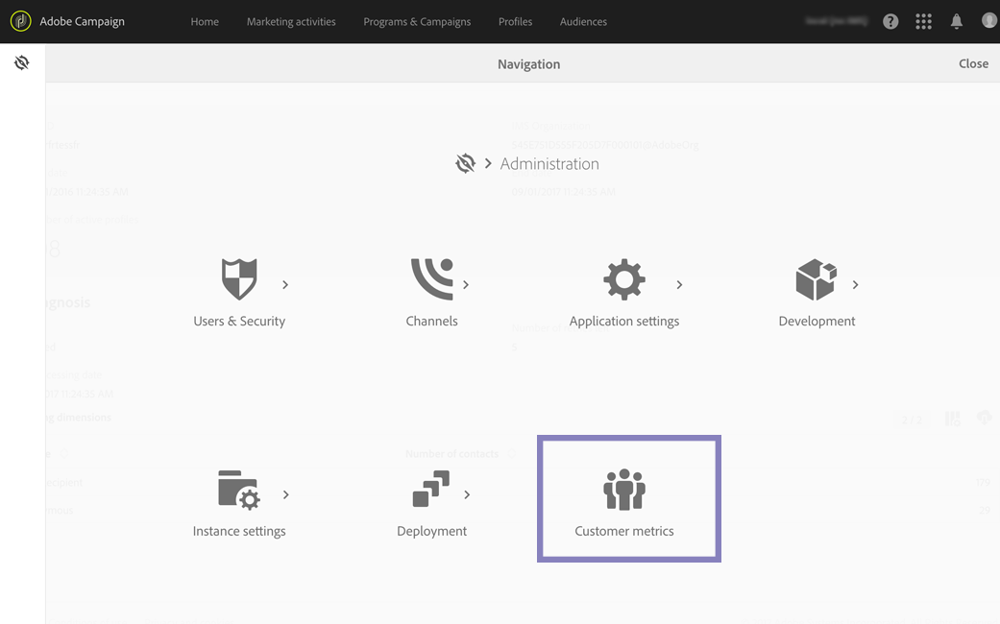

# Métricas del cliente {#customer-metrics}

Los administradores funcionales de Campaign pueden acceder al informe **[!UICONTROL Customer metrics]** desde **[!UICONTROL Administration > Customer metrics]**.

Se muestra el informe breve:

* el ID de Experience Cloud
* ID de organización de IMS
* el número de **perfiles activos**
* la lista de dimensiones de segmentación disponible en la instancia

Este informe se genera cada mes mediante el flujo de trabajo técnico **[!UICONTROL Billing]** .

## Perfiles activos{#active-profiles}

Según el contrato, cada una de las instancias de Campaign se aprovisiona con un número específico de perfiles activos. Consulte el contrato de licencia para obtener referencia sobre el número de perfiles activos adquiridos.

>[!NOTE]
>
>Como usuario administrador, también puede supervisar el número de perfiles activos utilizados en las instancias directamente desde el Panel de control de Campaign. Para obtener más información, consulte la [documentación del Panel de control de Campaign](https://experienceleague.adobe.com/docs/control-panel/using/performance-monitoring/active-profiles-monitoring.html?lang=es#performance-monitoring).

Un &quot;perfil&quot; es un registro de información que representa a un cliente final, a un cliente potencial o a un posible cliente. Los perfiles se consideran **activos** si han sido objetivos de un envío de Campaign en los últimos 12 meses a través de cualquier canal. Los perfiles que se excluyeron durante la preparación de la entrega (por reglas de tipología o mecanismo de cuarentena, por ejemplo) no se tienen en cuenta. Un perfil identificado por varios envíos solo se contará una vez. Este informe es solo informativo, no tiene un impacto directo en la facturación.

En la parte inferior del informe, encontrará la lista de perfiles activos para cada dimensión de segmentación. Muestra el número de perfiles activos que fueron seleccionados durante el último período móvil de 12 meses.

* La fuente **[!UICONTROL NmsRecipient]** incluye todos los perfiles a los que se contactó mediante información de su perfil de Campaign Standard.

* La fuente de clientes **[!UICONTROL anonymous]** muestra el número de perfiles que se segmentaron usando solo información específica (dirección de correo electrónico, número de teléfono), sin relación con su perfil de Campaign.
