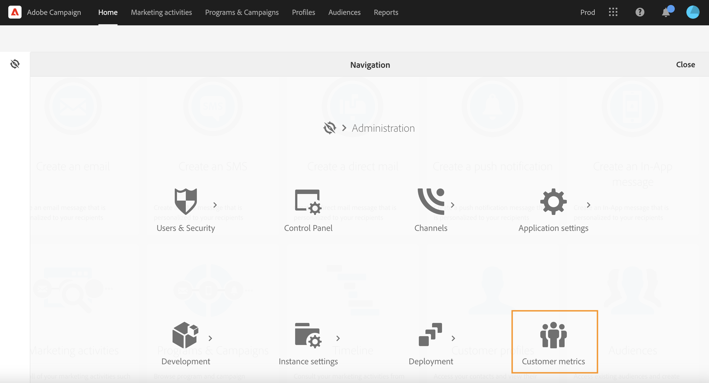

# Perfiles activos{#active-profiles}

Puede acceder a los detalles de los perfiles activos desde el informe **[!UICONTROL Customer metrics]**. Este informe solo está disponible para los administradores funcionales de Campaign. Para obtener acceso a este informe, haga clic en el icono Adobe Campaign en la parte superior izquierda de la [interfaz de usuario](../../start/using/interface-description.md#advanced-menu) y desplácese hasta **[!UICONTROL Administration > Customer metrics]**.

Este informe se genera cada mes mediante el flujo de trabajo técnico de **[!UICONTROL Billing]** y muestra la cantidad de **perfiles activos**. Obtenga más información acerca de los flujos de trabajo técnicos en [esta página](../../administration/using/technical-workflows.md).

Un &quot;perfil&quot; es un registro de información que representa a un cliente final, a un cliente potencial o a un posible cliente. Los perfiles se consideran **activos** si se han identificado con un envío de Campaign en los últimos 12 meses a través de cualquier canal.

Según el contrato, cada una de las instancias de Campaign se aprovisiona con una cantidad específica de perfiles activos. Consulte el acuerdo de licencia para obtener una referencia sobre la cantidad de perfiles activos adquiridos.

* Los perfiles que se excluyeron durante la preparación del envío (por ejemplo, mediante reglas de tipología o mecanismo de cuarentena) no se tienen en cuenta.

* Los destinatarios de los mensajes transaccionales se cuentan hacia los perfiles activos.

* Un perfil identificado por varios envíos solo se contará una vez.

* Este informe es solo informativo, no tiene un impacto directo en la facturación.

En la parte inferior de la página, las dimensiones de segmentación se enumeran con el número de perfiles para cada una. Los destinatarios de los mensajes transaccionales están asociados a la dimensión **Anónimo**.

>[!NOTE]
>
>Como usuario administrador, también puede monitorizar el número de perfiles activos utilizados en las instancias directamente desde la Panel de control de Campaign. Para obtener más información, consulte la [documentación del Panel de control](https://experienceleague.adobe.com/docs/control-panel/using/performance-monitoring/active-profiles-monitoring.html?lang=es).
>
