# Creación de públicos{#creating-audiences}

## Creación de audiencias de consulta {#creating-query-audiences}

En esta sección se describe cómo crear un público de **Consulta** . También puede crear públicos importando un archivo o segmentando en un [flujo de trabajo](../../automating/using/get-started-workflows.md).

Desde la lista de audiencia, puede crear audiencias realizando consultas en perfiles de Adobe Campaign o importando una audiencia de Adobe Experience Cloud.

1. Vaya a la lista de público mediante la tarjeta o pestaña **[!UICONTROL Audiences]**.

   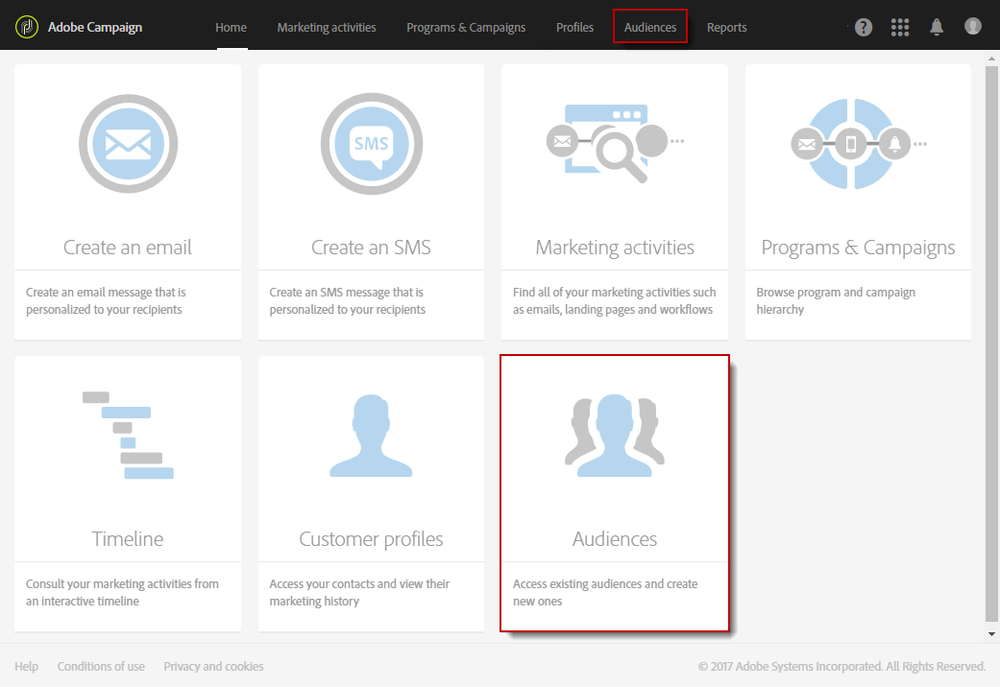

1. Seleccione **[!UICONTROL Create]** para acceder a la pantalla y crear un nuevo público.

   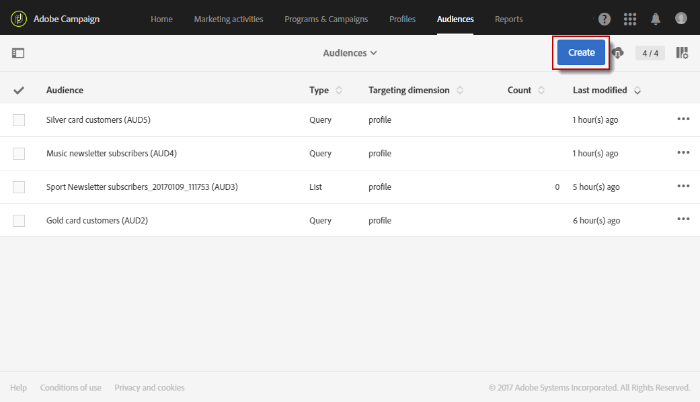

1. Asigne un nombre al público. La etiqueta de público se utiliza en la lista de públicos y en la paleta de la herramienta consulta.
1. Elija un tipo de público de **[!UICONTROL Query]**: los públicos definidos por una consulta se recomiendan para cada uso posterior.

   

1. A continuación, seleccione la **[!UICONTROL Targeting dimension]** que desee utilizar para filtrar a sus clientes. Cada público está formado por una sola dimensión de segmentación. Por ejemplo, no se puede crear un público compuesto por perfiles, perfiles de prueba y suscriptores. Para obtener más información sobre las dimensiones de segmentación, consulte [esta página](../../automating/using/query.md#targeting-dimensions-and-resources).
1. Cree la consulta para definir la población de públicos. Consulte la sección sobre [edición de consultas](../../automating/using/editing-queries.md).
1. Haga clic en el botón **[!UICONTROL Create]** para guardar el público.

>[!NOTE]
>
>Puede agregar una descripción a este público y definir las autorizaciones de acceso mediante el icono **[!UICONTROL Edit properties]**.

## Creación de audiencias de lista {#creating-list-audiences}

En esta sección se describe cómo crear un público de **Lista** después de segmentar en un flujo de trabajo. También puede crear públicos importando un archivo en un [flujo de trabajo](../../automating/using/get-started-workflows.md) o mediante una consulta desde el menú **[!UICONTROL Audiences]**.

Para crear un público de **Lista**, los pasos son los siguientes:

1. En la pestaña **Marketing activities**, haga clic en **Create** y seleccione **Workflow**.

   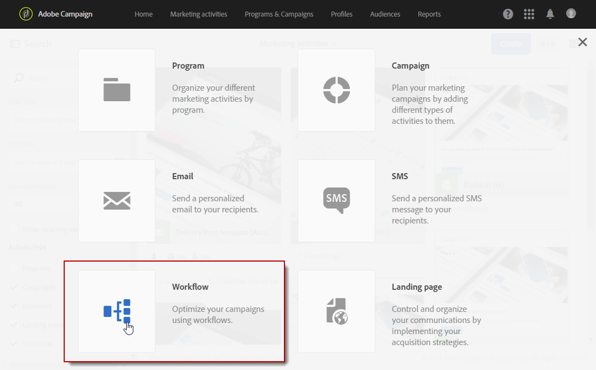

1. Arrastre y suelte y, a continuación, configure las actividades de segmentación que le permitirán seleccionar una población que tenga una dimensión **conocida**. La lista de las actividades disponibles y su configuración se detallan en la sección [Actividades de segmentación](../../automating/using/about-targeting-activities.md).

   Puede utilizar una actividad **[!UICONTROL Query]** o importar datos mediante una actividad **[!UICONTROL Load file]** antes de utilizar una actividad **[!UICONTROL Reconciliation]** para identificar la dimensión de los datos importados. Aquí, queremos segmentar a los destinatarios que se suscribieron al Sport Newsletter con una actividad **[!UICONTROL Query]**.

   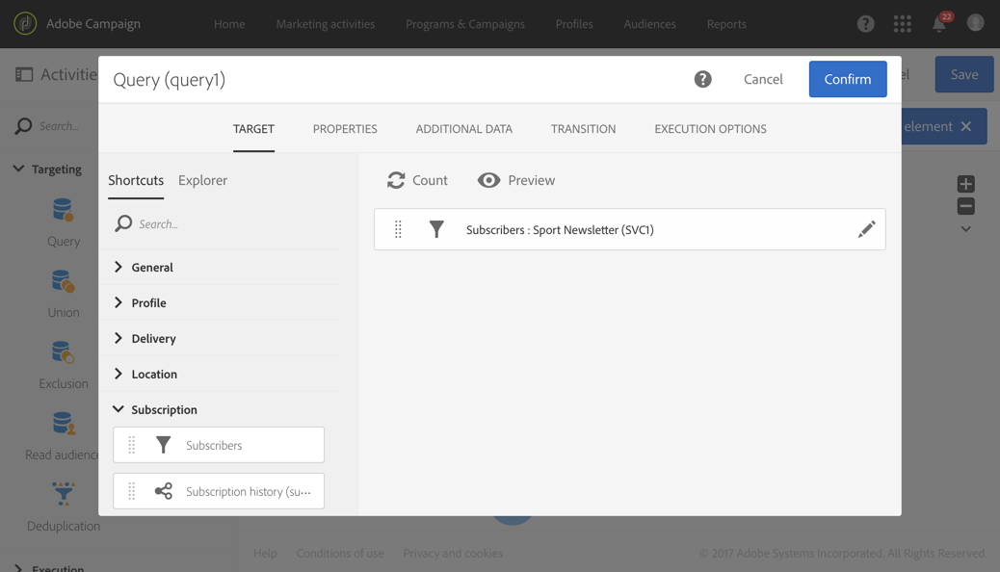

1. Después del objetivo, arrastre y suelte una actividad **[!UICONTROL Save audience]** en el flujo de trabajo. Por ejemplo, puede elegir **[!UICONTROL Create or update an audience]**, lo que le permite crear y actualizar automáticamente su público con nuevos datos. En este caso, agregue una actividad **[!UICONTROL Scheduler]** al principio del flujo de trabajo.

   Para obtener más información sobre la configuración de esta actividad, consulte la sección [Guardar público](../../automating/using/save-audience.md).

   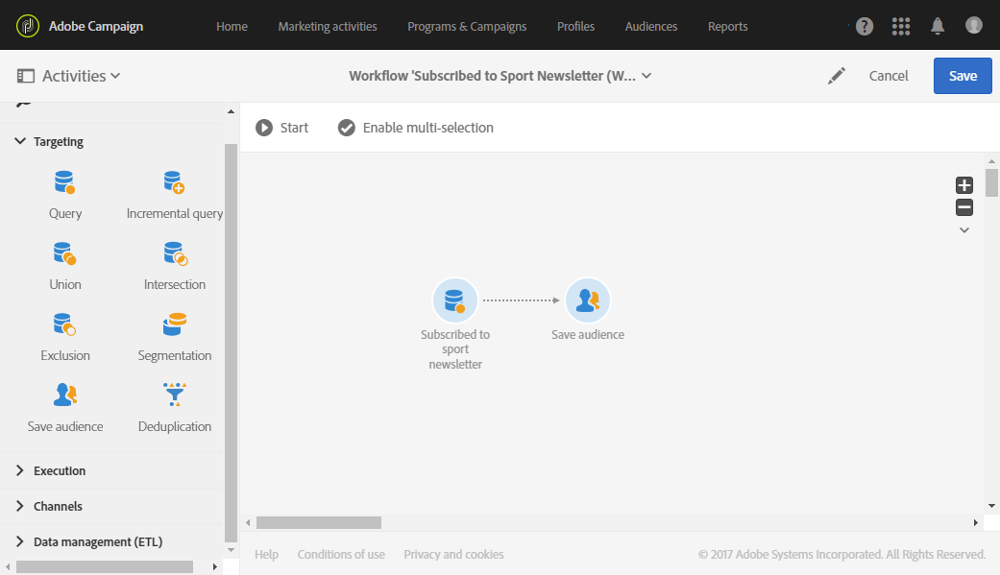

1. Guarde e inicie el flujo de trabajo.

   Como **[!UICONTROL Save audience]** se coloca después de una segmentación con una dimensión conocida, los públicos creados mediante esta actividad son públicos de **Lista** .

   El contenido del público guardado está disponible en la vista detallada del público, al que se puede acceder mediante la lista de públicos. Las columnas disponibles en esta vista corresponden a las columnas de la transición de entrada de la actividad de guardado del flujo de trabajo. Por ejemplo: las columnas del archivo importado, los datos adicionales agregados desde una consulta.

   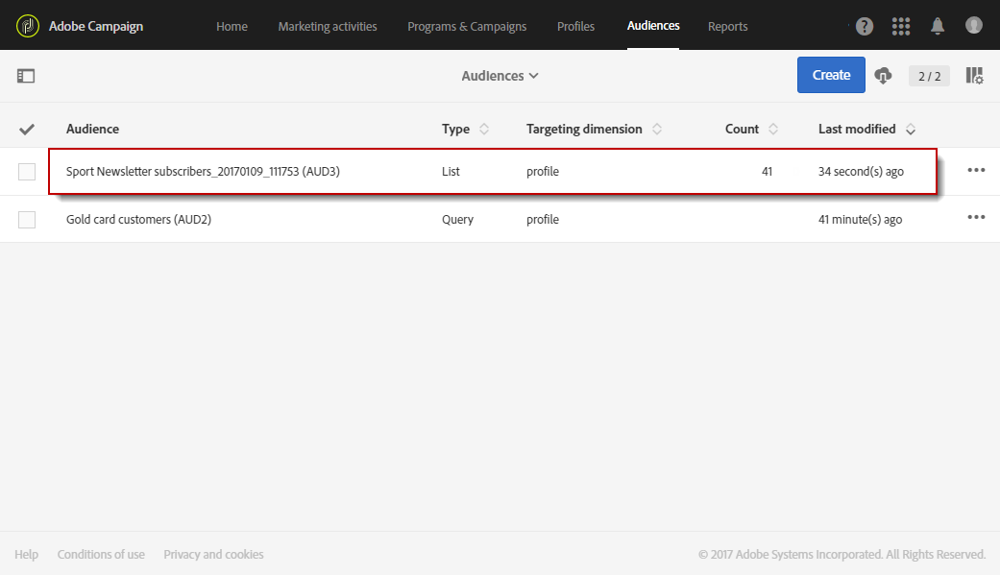

## Creación de audiencias de archivo {#creating-file-audiences}

En esta sección se explica cómo crear un público de **Archivo** mediante la importación de un archivo en un flujo de trabajo. También puede crear públicos a partir de una actividad de segmentación en un [flujo de trabajo](../../automating/using/get-started-workflows.md) o mediante una consulta desde el menú **[!UICONTROL Audiences]**.

Para crear un público de **Archivo**, los pasos son los siguientes:

1. En la pestaña **Marketing activities**, haga clic en **Create** y seleccione **Workflow**.
1. Arrastre y suelte y, a continuación, configure una actividad **[!UICONTROL Load file]** que le permitirá importar una población que tenga una dimensión **desconocida** cuando se ejecute el flujo de trabajo. Para obtener más información sobre la configuración de esta actividad, consulte la sección [Cargar archivo ](../../automating/using/load-file.md) .

   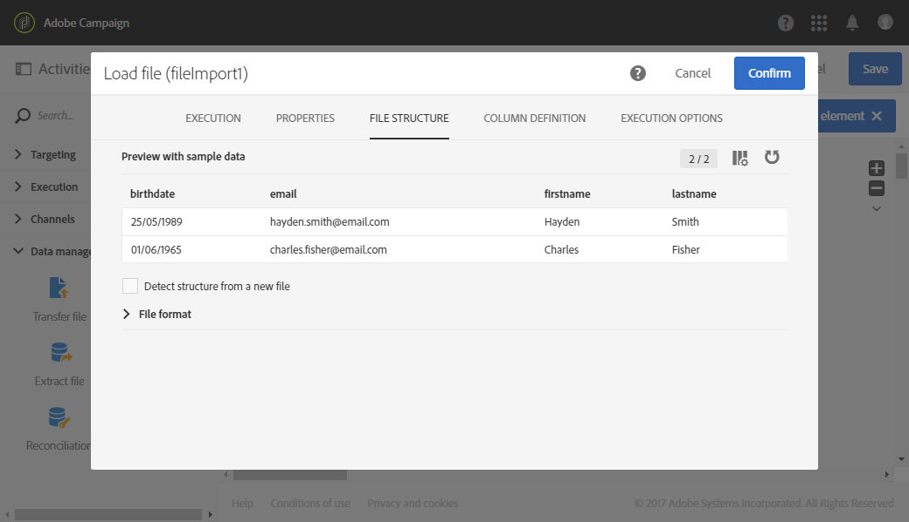

1. Arrastre y suelte una actividad **[!UICONTROL Save audience]** después de su actividad de **[!UICONTROL Load file]**. Para obtener más información sobre la configuración de esta actividad, consulte la sección [Guardar público](../../automating/using/save-audience.md).
1. Guarde e inicie el flujo de trabajo.

   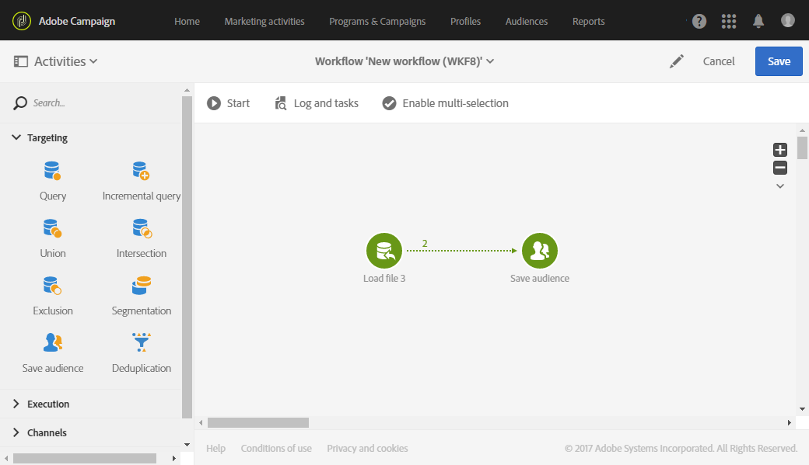

   Como el **[!UICONTROL Save audience]** se coloca después de una importación, la dimensión de datos es desconocida y los públicos creados mediante esta actividad son públicos de **Archivo** .

   El contenido del público guardado está disponible en la vista detallada del público, al que se puede acceder mediante la lista de públicos. Las columnas disponibles en esta vista corresponden a las columnas de la transición de entrada de la actividad de guardado del flujo de trabajo. Por ejemplo, las columnas del archivo importado o los datos adicionales añadidos desde una consulta.

   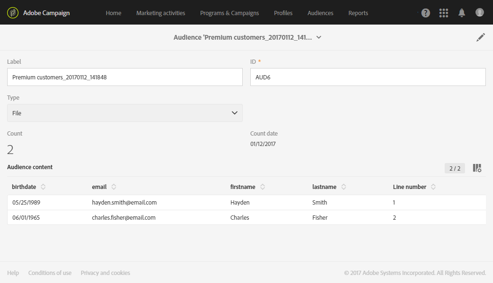

## Creación de audiencias de Experience Cloud {#creating-experience-cloud-audiences}

Adobe Campaign le permite compartir e intercambiar públicos con Adobe Experience Cloud. Un público de tipo **Experience Cloud** se importa directamente del servicio principal Personas a Adobe Campaign con el flujo de trabajo técnico **[!UICONTROL Import shared audience]**.

A diferencia del público de tipo **Consulta** que hará consulta de perfiles desde Adobe Campaign, el público de **Experience Cloud** está compuesta por una lista de ID de visitante.

Para que esta integración funcione, primero debe configurarla. Para obtener más información sobre la configuración y cómo importar o exportar públicos con el servicio principal Personas, consulte la siguiente [sección](../../integrating/using/sharing-audiences-with-audience-manager-or-people-core-service.md).

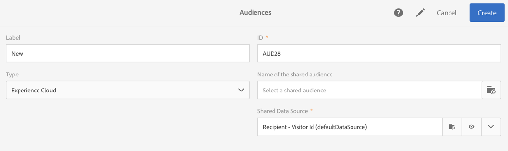

## Edición de audiencias {#editing-audiences}

Existen diferentes formas de editar un público según el tipo de público:

* Para editar un público de **Consulta**, vaya a la lista de públicos a través del menú **[!UICONTROL Audiences]** o la tarjeta **[!UICONTROL Audiences]** desde la página de inicio de Adobe Campaign.

  Abra el público pertinente. Se pueden editar todos los elementos de un público creado previamente.

  >[!CAUTION]
  >
  >Si cambia la **[!UICONTROL Filtering dimension]** en la consulta, se perderán las reglas que se hayan definido previamente.

* Para editar un público de **Lista** o un público de **Archivo**, edite el flujo de trabajo desde el que se creó y modifique la actividad **[!UICONTROL Save audience]**. Inicio el flujo de trabajo para modificar el público.
* Para editar un público de **Experience Cloud** , consulte la sección [Importación/exportación de públicos con el servicio principal Personas](../../integrating/using/sharing-audiences-with-audience-manager-or-people-core-service.md).

## Eliminación de audiencias {#deleting-audiences}

Existen dos formas de eliminar uno o varios públicos. Primero puede agregar una fecha de caducidad al público

Para ello:

1. Acceda a uno de sus públicos.
1. Haga clic en el botón  para acceder a la configuración del público.

   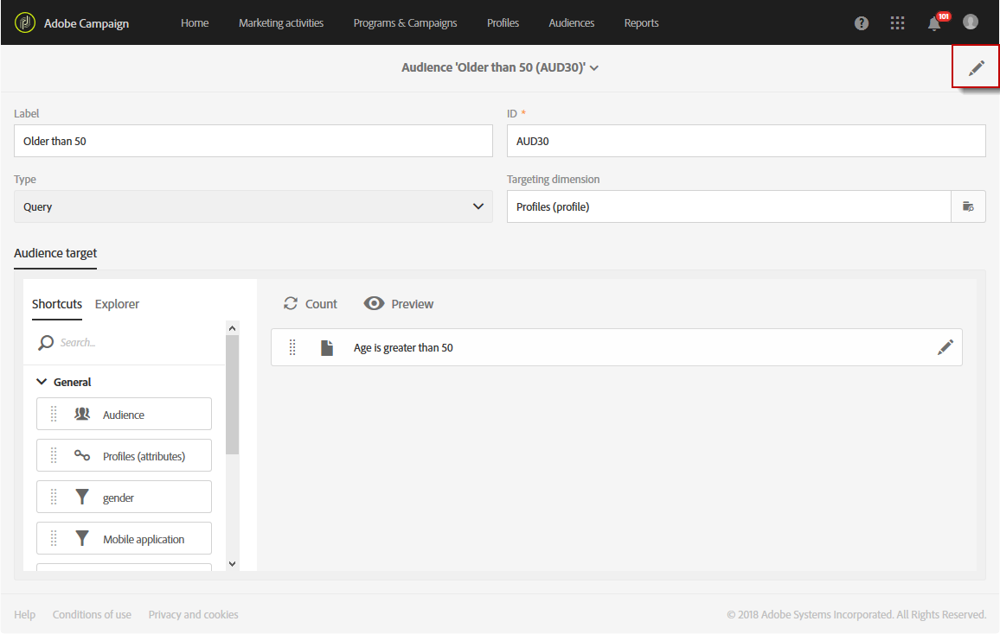

1. En el campo **[!UICONTROL Expires on]**, agregue una fecha de caducidad al público.

   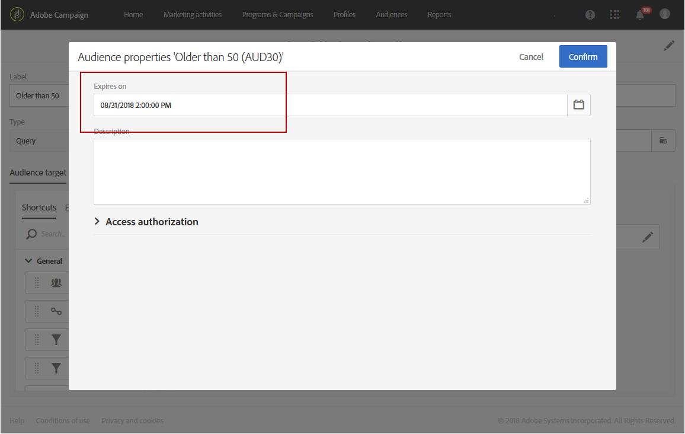

1. Haga clic en **[!UICONTROL Confirm]**, luego en **[!UICONTROL Save]**.

La fecha de caducidad ya estará configurada. En cuanto llegue la fecha, el público se eliminará automáticamente.

Si necesita eliminar un público, simplemente puede seleccionar uno o varios públicos y luego hacer clic en el botón **[!UICONTROL Delete element]**.

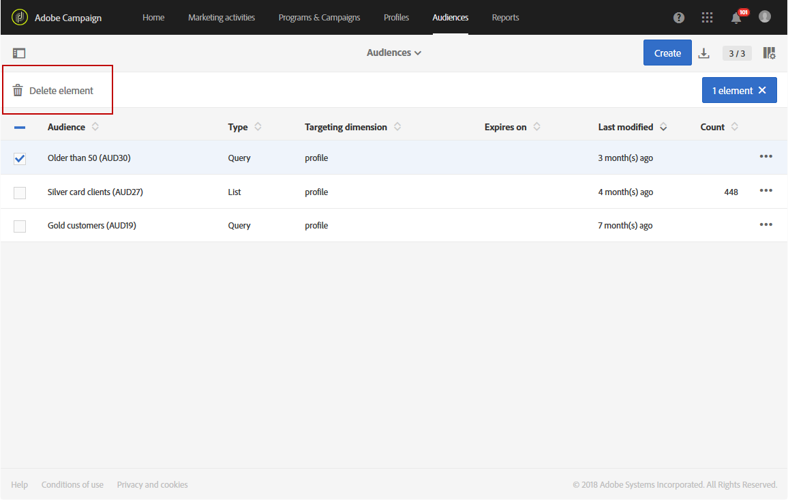
