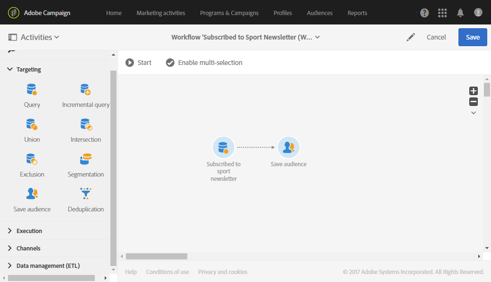
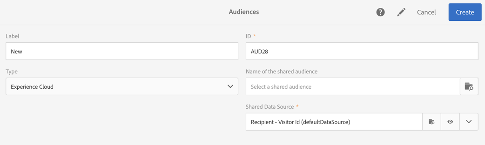

# Creación de audiencias{#creating-audiences}

## Creación de audiencias de consulta {#creating-query-audiences}

En esta sección se describe cómo crear una audiencia de **Consulta** . También puede crear audiencias desde la importación de un archivo o la segmentación en un [flujo de trabajo](../../automating/using/get-started-workflows.md).

Desde la lista de audiencia, puede crear audiencias realizando consultas en perfiles de Adobe Campaign o importando una audiencia de Adobe Experience Cloud.

1. Vaya a la lista de audiencia mediante la **[!UICONTROL Audiences]** ficha o la tarjeta.

   

1. Seleccione **[!UICONTROL Create]** para acceder a la pantalla y crear una nueva audiencia.

   

1. Asigne un nombre a la audiencia. La etiqueta de audiencia se utiliza en la lista de audiencias y en la paleta de la herramienta consulta.
1. Elija un tipo de **[!UICONTROL Query]** audiencia: las audiencias definidas por una consulta se recomiendan para cada uso posterior.

   

1. A continuación, seleccione el **[!UICONTROL Targeting dimension]** que desee utilizar para filtrar a sus clientes. Cada audiencia está formada por una sola dimensión de segmentación. Por ejemplo, no se puede crear una audiencia compuesta por perfiles, perfiles de prueba y suscriptores. For more on targeting dimensions, refer to [this page](../../automating/using/query.md#targeting-dimensions-and-resources).
1. Cree la consulta para definir la población de audiencias. Consulte la sección sobre [edición de consultas](../../automating/using/editing-queries.md).
1. Haga clic en el **[!UICONTROL Create]** botón para guardar la audiencia.

>[!NOTE]
>
>Puede agregar una descripción a esta audiencia y definir las autorizaciones de acceso mediante el **[!UICONTROL Edit properties]** icono .

## Creación de audiencias de lista {#creating-list-audiences}

En esta sección se describe cómo crear una audiencia de **Lista** después de segmentar en un flujo de trabajo. También puede crear audiencias importando un archivo en un [flujo de trabajo](../../automating/using/get-started-workflows.md) o mediante una consulta desde el **[!UICONTROL Audiences]** menú.

To create a **List** audience, the steps are as follows:

1. En la ficha actividades **** de marketing, haga clic en **Crear** y, a continuación, seleccione **Flujo de trabajo**.

   

1. Arrastre y suelte y, a continuación, configure las actividades de objetivo que le permitirán seleccionar una población que tenga una dimensión **conocida** . La lista de las actividades disponibles y su configuración se detallan en la sección actividades [de](../../automating/using/about-targeting-activities.md) objetivo.

   Puede utilizar una **[!UICONTROL Query]** actividad o importar datos mediante una **[!UICONTROL Load file]** actividad antes de utilizar una **[!UICONTROL Reconciliation]** actividad para identificar la dimensión de los datos importados. Aquí, queremos destinatario a los destinatarios que se suscribieron al Sport Newsletter con una **[!UICONTROL Query]** actividad .

   

1. Después del objetivo, arrastre y suelte una **[!UICONTROL Save audience]** actividad en el flujo de trabajo. Por ejemplo, puede elegir **[!UICONTROL Create or update an audience]**, lo que le permite crear y actualizar automáticamente su audiencia con nuevos datos. En este caso, agregue una **[!UICONTROL Scheduler]** actividad al principio del flujo de trabajo.

   Para obtener más información sobre la configuración de esta actividad, consulte la sección [Guardar audiencia](../../automating/using/save-audience.md) .

   

1. Guarde y inicio el flujo de trabajo.

   Como el **[!UICONTROL Save audience]** se coloca después de un objetivo con una dimensión conocida, las audiencias creadas mediante esta actividad son audiencias de **Lista** .

   El contenido de la audiencia guardada está disponible en la vista detallada de la audiencia, a la que se puede acceder mediante la lista de audiencias. Las columnas disponibles en esta vista corresponden a las columnas de la transición de entrada de la actividad de guardado del flujo de trabajo. Por ejemplo: las columnas del archivo importado, los datos adicionales agregados desde una consulta.

   

## Creación de audiencias de archivos {#creating-file-audiences}

En esta sección se explica cómo crear una audiencia de **archivo** mediante la importación de un archivo en un flujo de trabajo. También puede crear audiencias a partir de una actividad de objetivo en un [flujo de trabajo](../../automating/using/get-started-workflows.md) o mediante una consulta desde el **[!UICONTROL Audiences]** menú.

To create a **File** audience, the steps are as follows:

1. En la ficha actividades **** de marketing, haga clic en **Crear** y, a continuación, seleccione **Flujo de trabajo**.
1. Arrastre y suelte y, a continuación, configure una **[!UICONTROL Load file]** actividad que le permitirá importar una población que tenga una dimensión **desconocida** cuando se ejecute el flujo de trabajo. Para obtener más información sobre la configuración de esta actividad, consulte la sección [Cargar archivo](../../automating/using/load-file.md) .

   

1. Drag and drop a **[!UICONTROL Save audience]** activity after the **[!UICONTROL Load file]** activity. Para obtener más información sobre la configuración de esta actividad, consulte la sección [Guardar audiencia](../../automating/using/save-audience.md) .
1. Guarde y inicio el flujo de trabajo.

   

   Como el **[!UICONTROL Save audience]** se coloca después de una importación, la dimensión de datos es desconocida y las audiencias creadas mediante esta actividad son audiencias de **archivo** .

   El contenido de la audiencia guardada está disponible en la vista detallada de la audiencia, a la que se puede acceder mediante la lista de audiencias. Las columnas disponibles en esta vista corresponden a las columnas de la transición de entrada de la actividad de guardado del flujo de trabajo. Por ejemplo: las columnas del archivo importado, los datos adicionales agregados desde una consulta.

   

## Creación de audiencias de Experience Cloud {#creating-experience-cloud-audiences}

Adobe Campaign le permite compartir e intercambiar audiencias con Adobe Experience Cloud. Una audiencia de tipo **Experience Cloud** se importa directamente del servicio principal Personas al Adobe Campaign con el flujo de trabajo **[!UICONTROL Import shared audience]** técnico.

A diferencia de la audiencia de tipo de **Consulta** que hará consulta de perfiles desde Adobe Campaign, la audiencia de **Experience Cloud** está compuesta por una lista de ID de Visitante.

Para que esta integración funcione, primero debe configurarla. Para obtener más información sobre la configuración y cómo importar o exportar audiencias con el servicio principal Personas, consulte la siguiente [sección](../../integrating/using/sharing-audiences-with-audience-manager-or-people-core-service.md).

## Edición de audiencias {#editing-audiences}

Existen diferentes formas de editar una audiencia según el tipo de audiencia:

* Para editar una audiencia de **Consulta** , vaya a la lista de audiencias a través del **[!UICONTROL Audiences]** menú o a la **[!UICONTROL Audiences]** tarjeta desde la página de inicio de Adobe Campaign.

   Abra la audiencia pertinente. Se pueden editar todos los elementos de una audiencia creada previamente.

   >[!CAUTION]
   >
   >Si cambia el **[!UICONTROL Filtering dimension]** en la consulta, se perderán las reglas que se hayan definido previamente.

* Para editar una **Lista** o una audiencia **de archivo** , edite el flujo de trabajo desde el que se creó y modifique la **[!UICONTROL Save audience]** actividad. Inicio el flujo de trabajo para modificar la audiencia.
* Para editar una audiencia de **Experience Cloud** , consulte la sección del servicio [principal](../../integrating/using/sharing-audiences-with-audience-manager-or-people-core-service.md) Importación/Exportación de audiencias con personas.

## Eliminación de audiencias {#deleting-audiences}

Existen dos formas de eliminar una o varias audiencias. Primero puede agregar una fecha de caducidad a la audiencia

Para ello:

1. Acceda a una de sus audiencias.
1. Haga clic en el  botón para acceder a la configuración de la audiencia.

   

1. En el **[!UICONTROL Expires on]** campo, agregue una fecha de caducidad a la audiencia.

   

1. Haga clic en **[!UICONTROL Confirm]**, luego en **[!UICONTROL Save]**.

La fecha de caducidad ya está configurada. Tan pronto como se llegue a esta fecha, la audiencia se eliminará automáticamente.

O bien, si necesita eliminar una audiencia, simplemente puede seleccionar una o varias audiencias y luego hacer clic en el **[!UICONTROL Delete element]** botón.

