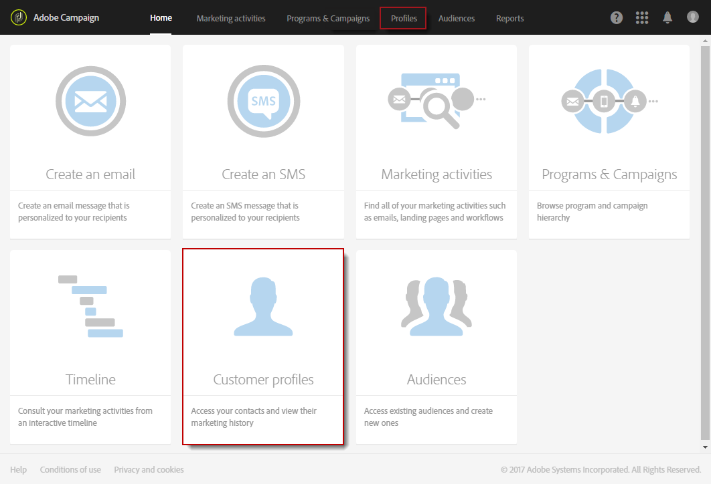
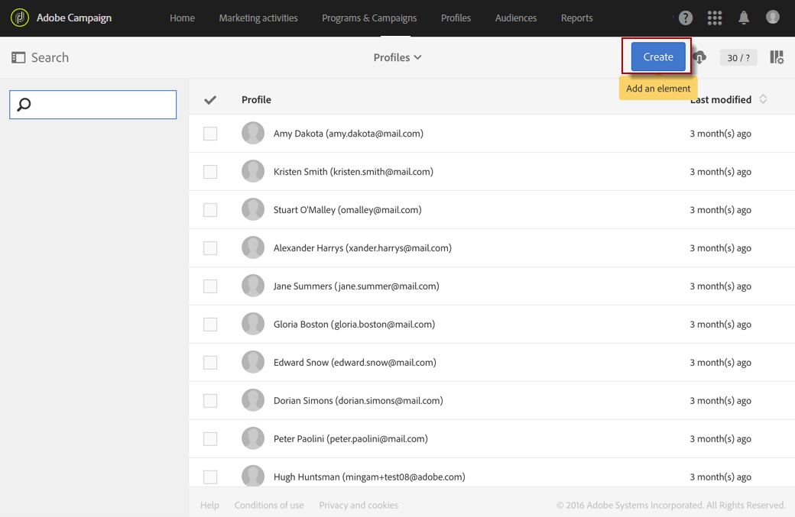
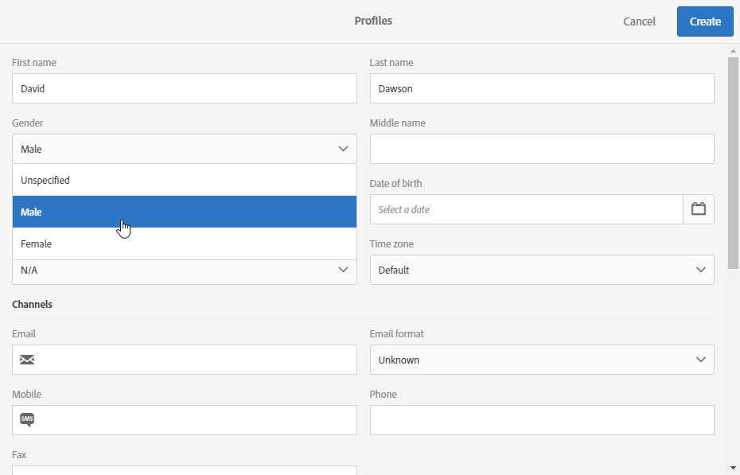

# Creación de perfiles{#creating-profiles}

En Adobe Campaign, los perfiles se utilizan de forma predeterminada para definir el destinatario principal de los mensajes.

>[!NOTE]
>
>También es posible crear perfiles mediante la API de Adobe Campaign Standard. Para obtener más información, consulte [la documentación dedicada](../../api/using/creating-profiles-api.md).

 [Descubra cómo importar perfiles mediante un flujo de trabajo en vídeo](#video)

Para crear o actualizar un perfil en Campaign, puede:

* Importar una lista de perfil desde un archivo mediante un [flujo de trabajo](../../automating/using/creating-import-workflow-templates.md)
* Recopilar datos en línea, mediante [páginas de destino](../../channels/using/getting-started-with-landing-pages.md)
* Realizar una creación masiva mediante la [API de REST](../../api/using/get-started-apis.md)
* Sincronizar perfiles de [Microsoft Dynamics](../../integrating/using/d365-acs-get-started.md)
* Introduzca datos mediante la interfaz de usuario de, como se explica a continuación

Por ejemplo, para crear un nuevo perfil directamente en la interfaz de usuario, siga los pasos a continuación:

1. En la página de inicio de Adobe Campaign, haga clic en la tarjeta **Perfiles del cliente** o en la pestaña **Perfiles** para acceder a la lista de perfiles.

   

1. Haga clic **[!UICONTROL Create]**.

   

1. Introduzca los datos del perfil.

   

   * La información de contacto, como el nombre, apellidos, género, fecha de nacimiento, foto, idioma preferido (para [correos electrónicos multilingües](../../channels/using/creating-a-multilingual-email.md)) ayuda a personalizar mejor los envíos.
   * El **[!UICONTROL Time zone]** del perfil se utiliza para realizar envíos en el huso horario adecuado. Para obtener más información, consulte [esta sección](../../sending/using/sending-messages-at-the-recipient-s-time-zone.md).
   * La categoría **[!UICONTROL Channels]**, que contiene la dirección de correo electrónico, el número de teléfono móvil y la información de exclusión, le permite saber por qué canal se puede acceder al perfil.

     >[!NOTE]
     > Los números de teléfono móvil siempre deben tener formato internacional (`+<country><number>`) en la tabla de perfiles.

   * La categoría **[!UICONTROL No longer contact]** se actualiza en cuanto el perfil cancela la suscripción a un canal.
   * La categoría **[!UICONTROL Address]** contiene la dirección postal que debe rellenarse junto con la opción **[!UICONTROL Address specified]** para enviar [correo directo](../../channels/using/about-direct-mail.md) a dicho perfil. Si la opción **[!UICONTROL Address specified]** no está marcada, este perfil se excluye de todos los envíos de correo directo.
   * La categoría **[!UICONTROL Access authorization]** indica las unidades organizativas del perfil para [administrar permisos](../../administration/using/about-access-management.md). Para añadir los campos organizativos a los perfiles, consulte la sección [Partición de perfiles](../../administration/using/organizational-units.md#partitioning-profiles).
   * La categoría **[!UICONTROL Traceability]** se actualiza automáticamente con información relativa al usuario que ha creado o modificado el perfil.

1. Haga clic en **[!UICONTROL Create]** para guardar el perfil.

El perfil aparece ahora en la lista.

>[!NOTE]
>El campo de idioma preferido se utiliza para seleccionar el idioma al enviar mensajes multilingües. Para obtener más información sobre los mensajes multilingües, [consulte esta página](../../channels/using/creating-a-multilingual-email.md).

## Tutorial en vídeo {#video}

Este vídeo muestra cómo importar perfiles con un flujo de trabajo.

>[!VIDEO](https://video.tv.adobe.com/v/24993?quality=12)

Hay disponibles [más vídeos de procedimientos para Campaign Standard aquí](https://experienceleague.adobe.com/docs/campaign-standard-learn/tutorials/overview.html?lang=es).
