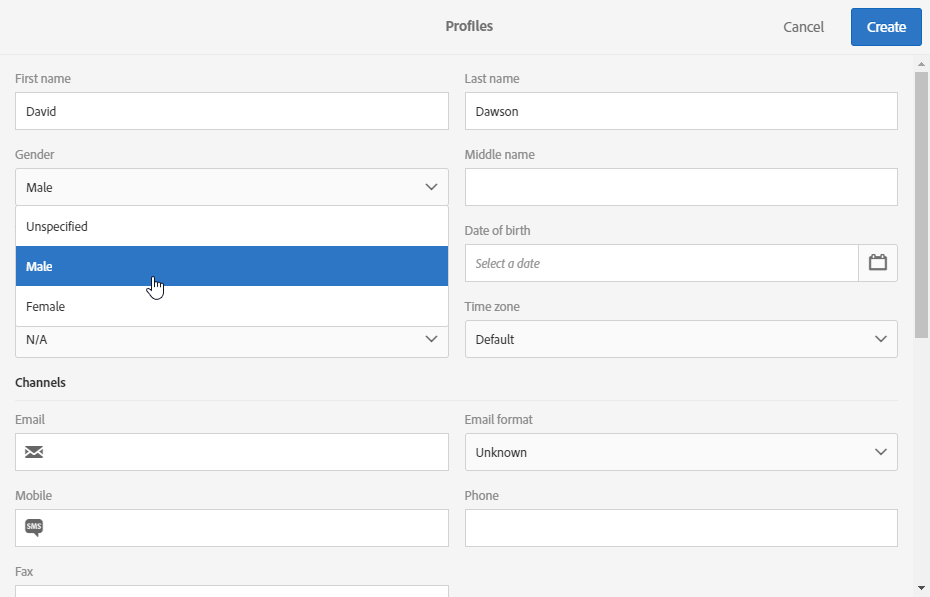

# Creating profiles{#creating-profiles}

En Adobe Campaign, los perfiles se utilizan de forma predeterminada para definir el objetivo principal de los mensajes.

Para crear o actualizar un perfil en Campaign, puede:

* Import a profile list from a file, via a [workflow](https://helpx.adobe.com/campaign/kt/acs/using/acs-importing-profiles-feature-video-using.html)
* Collect data online, via [landing pages](https://docs.campaign.adobe.com/doc/standard/getting_started/en/ACS_CreateLandingPage.html)
* Create bulk via [REST API](http://docs.campaign.adobe.com/doc/standard/en/api/ACS_API.html)
* Synchronize profiles from [Microsoft Dynamics](https://helpx.adobe.com/campaign/kb/acs-ms-dynamics.html)
* Introduzca los datos utilizando las pantallas de la interfaz gráfica, tal como se explica más abajo.

Como ejemplo, para crear un nuevo perfil directamente en la interfaz de usuario, siga los pasos a continuación:

1. From the Adobe Campaign home page, click the **Customer Profiles** card or the **Profiles** tab to access the list of profiles.

   

1. Then click **[!UICONTROL Create]**.

   

1. Introduzca los datos de perfil.

   

   * The contact information, such as first name, last name, gender, date of birth, photo, preferred language (for [multilingual emails](../../channels/using/creating-a-multilingual-email.md)) helps better personalize deliveries.
   * The profile's **[!UICONTROL Time zone]** is used to send deliveries at the profile's time zone. For more on this, refer to this [section](../../sending/using/sending-messages-at-the-recipient-s-time-zone.md).
   * **[!UICONTROL Channels]** La categoría, que contiene la dirección de correo electrónico, el número de teléfono móvil, la información de exclusión, le permite saber en qué canal se puede acceder al perfil.
   * The **[!UICONTROL No longer contact]** category is updated as soon as the profile unsubscribe to a channel.
   * The **[!UICONTROL Address]** category contains the postal address that needs to be filled along with the **[!UICONTROL Address specified]** option to send [direct mail](../../channels/using/about-direct-mail.md) to this profile. If the **[!UICONTROL Address specified]** option is not checked, this profile will be excluded from every direct mail delivery.
   * **[!UICONTROL Access authorization]** La categoría indica las unidades organizativas del perfil (para [administrar permisos](../../administration/using/about-access-management.md)). See also [Partitioning profiles](../../administration/using/organizational-units.md#partitioning-profiles).
   * The **[!UICONTROL Traceability]** category automatically updates with information concerning the user who created or modified the profile.

1. Click **[!UICONTROL Create]** to save the profile.

El perfil aparecerá ahora en la lista.

>[!NOTE]
>
>También es posible crear perfiles mediante la API de Adobe Campaign Standard. For more on this, refer to the [dedicated documentation](https://docs.campaign.adobe.com/doc/standard/en/api/ACS_API.html#creating-profiles) .

Los perfiles también pueden partirse según sus unidades organizativas. To add the organizational fields to your profiles, refer to the [Partitioning profiles](../../administration/using/organizational-units.md#partitioning-profiles) section.

>[!NOTE]
>
>El campo de idioma preferido se utiliza para seleccionar el idioma al enviar mensajes multilingües. For more information about the multilingual messages [refer to this page](../../channels/using/creating-a-multilingual-email.md).

**Temas relacionados:**

* [Creación de una guía](https://docs.campaign.adobe.com/doc/standard/getting_started/en/ACS_CreateLandingPage.html) paso a paso de página de aterrizaje
* [Importación de perfiles](https://helpx.adobe.com/campaign/kt/acs/using/acs-importing-profiles-feature-video-using.html)

