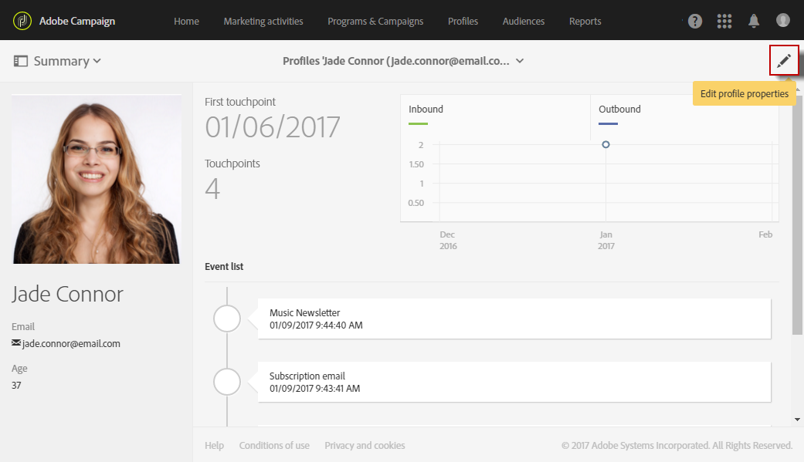

# Edición de perfiles{#editing-profiles}

## Acceso a las propiedades de perfil {#accessing-profile-properties}

Para editar un perfil existente y consultar los datos asociados a él, o modificarlo, siga estos pasos:

1. From the Adobe Campaign home page, click the **[!UICONTROL Customer profiles]** card or the **[!UICONTROL Profiles]** tab.
1. Seleccione un contacto.
1. Haga clic en el **[!UICONTROL Edit profile properties]** icono para acceder a la información detallada del perfil.

   

   La ventana de propiedades del perfil oferta varias fichas que proporcionan acceso a toda la información de perfil.

   También pueden aparecer otras fichas en función de los recursos personalizados que se hayan creado o ampliado en Adobe Campaign. Para obtener más información sobre los recursos personalizados, consulte [Acerca de los recursos](../../developing/using/data-model-concepts.md)personalizados.

   >[!NOTE]
   >
   >Sólo puede modificar la información de la **[!UICONTROL General]** ficha, excepto la **[!UICONTROL Traceability]** sección.

La edición de perfiles también es posible mediante la API de Adobe Campaign Standard. Para obtener más información, consulte la [documentación específica](../../api/using/updating-profiles.md).

Temas relacionados:

* [Integrated Customer Profile](../../audiences/using/integrated-customer-profile.md)
* [Enviar en el huso horario del destinatario](../../sending/using/sending-messages-at-the-recipient-s-time-zone.md)

## Datos generales de perfil {#general-profile-data}

La **[!UICONTROL General]** ficha agrupa la siguiente información sobre el perfil:

* Información de contacto, que contiene el nombre, apellidos, fecha de nacimiento, foto, idioma preferido (para correos electrónicos multilingües), etc. del destinatario.
* Canales en los que se puede contactar con el perfil, que contiene la dirección de correo electrónico del destinatario, el número de teléfono móvil y la información de exclusión.
* Dirección postal (para correo directo) y zona horaria del contacto (para [programar mensajes en su huso horario](../../sending/using/sending-messages-at-the-recipient-s-time-zone.md)).
* Autorización de acceso, que indica la unidad organizativa del destinatario (para [administrar permisos](../../administration/using/about-access-management.md)). Consulte también [Partición de perfiles](../../administration/using/organizational-units.md#partitioning-profiles).

## Sending and tracking logs {#sending-and-tracking-logs}

Las fichas **[!UICONTROL Sending logs]** y **[!UICONTROL Tracking logs]** agrupan la lista de envíos que se enviaron al perfil y todos los datos de seguimiento relacionados.

Para obtener más información sobre el envío y los registros de seguimiento, consulte las secciones [registros de envío](../../sending/using/monitoring-a-delivery.md#delivery-logs) y mensajes [de](../../sending/using/tracking-messages.md) seguimiento.

## Suscripciones {#subscriptions}

Las suscripciones del contacto se muestran en la ficha correspondiente. Para obtener más información sobre la suscripción a un servicio, consulte [esta sección](../../audiences/using/about-subscriptions.md).

La **[!UICONTROL Mobile App Subscriptions]** ficha hace referencia a las notificaciones push. Para obtener más información, consulte el canal de notificaciones  Push.
