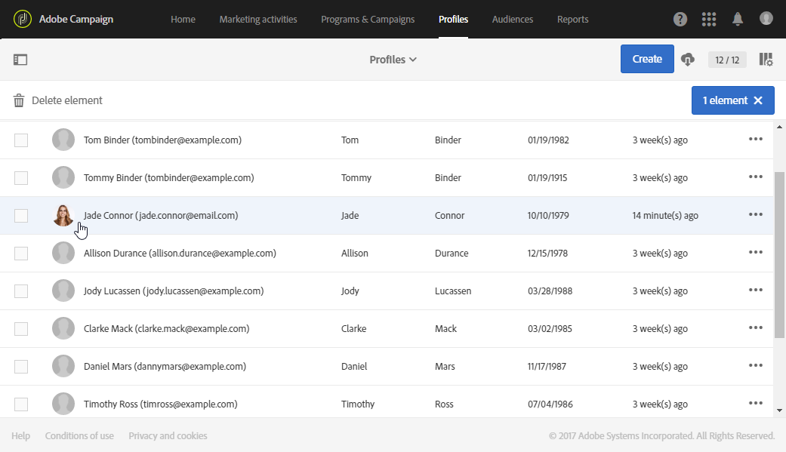

# Perfil de cliente integrado{#integrated-customer-profile}

Hay disponible un perfil de cliente integrado para cada contacto de la base de datos. Este historial de marketing combina toda la información de comercialización relevante relativa al contacto con un cliente en una sola vista. A continuación, puede acceder a todos los comportamientos digitales, transacciones en línea y sin conexión en una ubicación central: información de contacto, correos electrónicos recibidos, registros de seguimiento, suscripciones y cancelaciones de suscripciones, etc.

Para acceder al perfil integrado del cliente, siga estos pasos:

1. En la página de inicio de Adobe Campaign, haga clic en la tarjeta **[!UICONTROL Customer profiles]** o en la ficha **Perfiles** para mostrar la lista de perfiles.

1. Para buscar un perfil basado en un campo específico, abra el panel de búsqueda y, a continuación, seleccione el campo en el que desea realizar la búsqueda.

   

1. Especifique el valor que desea buscar y, a continuación, pulse Intro.

   >[!NOTE]
   >
   >Tenga en cuenta que las búsquedas se pueden realizar en función de los campos de correo electrónico, nombre y apellidos, así como de los campos personalizados que se han añadido al ampliar el recurso.
   >
   >Las búsquedas distinguen entre mayúsculas y minúsculas y solo se realizan en prefijos. Por ejemplo, no podrá buscar un perfil con las últimas letras de su apellido.

1. Seleccione un contacto para abrir su perfil.

   

Luego puede acceder al **historial de marketing** de este contacto.

La información clave sobre el perfil se recopila en esta página, así como la lista de eventos.

Haga clic en un evento de la lista para abrirlo: puede acceder a los mensajes que se han enviado o a los servicios a los que se ha suscrito el perfil.

>[!NOTE]
>
>También se puede acceder a historial de marketing mediante la API de Adobe Campaign Standard. Para obtener más información, consulte la [documentación específica](../../api/using/interacting-with-marketing-history.md).
