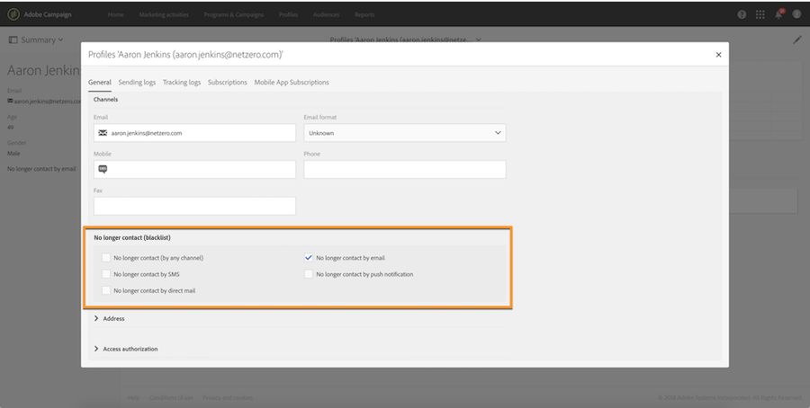
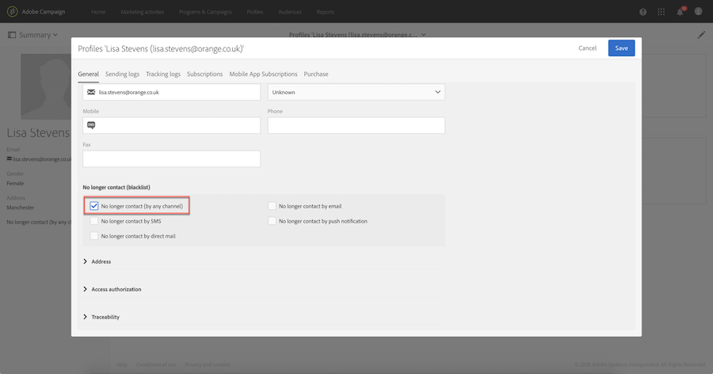

# Administración de la inclusión y la exclusión en Campaign{#managing-opt-in-and-opt-out-in-campaign}

## Administración de la inclusión y la exclusión desde un perfil {#managing-opt-in-and-opt-out-from-a-profile}

Un operador puede activar o desactivar usuarios directamente desde la ficha de perfil **[!UICONTROL General]**.

En la sección **[!UICONTROL No longer contact (on denylist)]**, las casillas de verificación seleccionadas corresponden a los canales en los que el usuario decidió excluirse. Seleccione los canales según las necesidades del usuario.

## Configuración de páginas de aterrizaje de inclusión y de exclusión {#setting-up-opt-in-and-opt-out-landing-pages}

Para permitir que los usuarios acepten su inclusión o exclusión, debe crear y publicar una página de aterrizaje de **[!UICONTROL Profile acquisition]**. A continuación, podrán seleccionar los canales según sus necesidades. Para realizar esto, siga los pasos a continuación.

También puede configurar una página de aterrizaje **[!UICONTROL Denylist]** que permita a los usuarios desactivar todas las entregas. Para obtener más información, consulte [Configuración de una página de aterrizaje para desactivar todas las entregas](#setting-up-a-landing-page-to-opt-out-from-all-deliveries).

>[!NOTE]
>
>Las páginas de aterrizaje también se pueden utilizar para habilitar la suscripción a servicios. Para obtener más información, consulte [esta página](../../channels/using/configuring-landing-page.md#linking-a-landing-page-to-a-service).

1. Crear una página de aterrizaje **[!UICONTROL Profile acquisition]** (vea [esta sección](../../channels/using/getting-started-with-landing-pages.md)).
1. Añada una casilla de verificación en el contenido de la página de aterrizaje para cada canal deseado y, a continuación, vincúlelo al campo correspondiente de la base de datos de Campaign.

   

1. Guarde la página de aterrizaje y publíquela.
1. En la página de aterrizaje, las casillas de verificación ya están seleccionadas según la pestaña del perfil **[!UICONTROL General]**. El usuario puede seleccionar o anular la selección de los canales según sus necesidades y enviar el formulario.

   

1. Una vez enviado el formulario, la ficha de perfil **[!UICONTROL General]** se actualiza según la selección del usuario.

   

### Configuración de una página de aterrizaje para desactivar todas las entregas {#setting-up-a-landing-page-to-opt-out-from-all-deliveries}

Para permitir que los usuarios se excluyan de todas las entregas, debe crear y publicar una página de aterrizaje de **[!UICONTROL Denylist]**. Para obtener más información sobre la creación de páginas de aterrizaje, consulte [esta página](../../channels/using/getting-started-with-landing-pages.md).

Una vez que un usuario hace clic en el vínculo de la página de aterrizaje, la opción **[!UICONTROL No longer contact (by any channel)]** del perfil se selecciona automáticamente.

