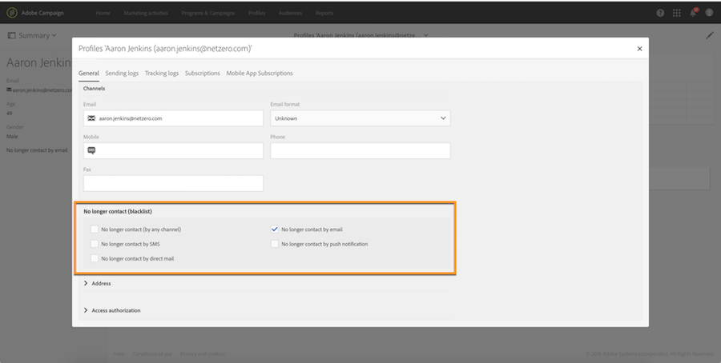

# Administración de la inclusión y la exclusión en Campaign{#managing-opt-in-and-opt-out-in-campaign}

## Administración de la inclusión y la exclusión de un perfil {#managing-opt-in-and-opt-out-from-a-profile}

Los usuarios pueden ser seleccionados por un operador directamente desde la ficha de perfil **[!UICONTROL General]** .

En la **[!UICONTROL No longer contact (blacklist)]** sección, las casillas de verificación seleccionadas corresponden a los canales de los que el usuario eligió desactivar la opción. Seleccione los canales según las necesidades del usuario.

## Configuración de páginas de aterrizaje de inclusión y exclusión {#setting-up-opt-in-and-opt-out-landing-pages}

Para que los usuarios puedan optar por la activación o la desactivación, debe crear y publicar una página **[!UICONTROL Profile acquisition]** de aterrizaje. Luego podrán seleccionar los canales según sus necesidades. Para realizar esto, siga los pasos a continuación.

También puede configurar una **[!UICONTROL BlackList]** página de aterrizaje que permita a los usuarios desactivar todas las entregas. Para obtener más información sobre esto, consulte [Configuración de una página de aterrizaje para desactivar todas las entregas](#setting-up-a-landing-page-to-opt-out-from-all-deliveries).

>[!NOTE]
>
>Las páginas de aterrizaje también se pueden utilizar para habilitar la suscripción a servicios. Para obtener más información, consulte [esta página](../../channels/using/designing-a-landing-page.md#linking-a-form-to-a-service).

1. Cree una **[!UICONTROL Profile acquisition]** página de aterrizaje (consulte [esta sección](../../channels/using/about-landing-pages.md)).
1. Agregue una casilla de verificación en el contenido de la página de aterrizaje para cada canal deseado y, a continuación, vincúlelo al campo correspondiente de la base de datos de Campaign.

   

1. Guarde la página de aterrizaje y publíquela.
1. En la página de aterrizaje, las casillas de verificación ya están seleccionadas según la ficha de perfil **[!UICONTROL General]** . El usuario puede seleccionar o anular la selección de los canales según sus necesidades y enviar el formulario.

   

1. Una vez enviado el formulario, la ficha de perfil **[!UICONTROL General]** se actualiza según la selección del usuario.

   

### Configuración de una página de aterrizaje para desactivar todas las entregas {#setting-up-a-landing-page-to-opt-out-from-all-deliveries}

Para que los usuarios puedan desactivar todas las entregas, debe crear y publicar una página **[!UICONTROL BlackList]** de aterrizaje. For more on landing pages creation, refer to [this page](../../channels/using/about-landing-pages.md).

Una vez que un usuario hace clic en el vínculo de la página de aterrizaje, la **[!UICONTROL No longer contact (by any channel)]** opción del perfil se selecciona automáticamente.

