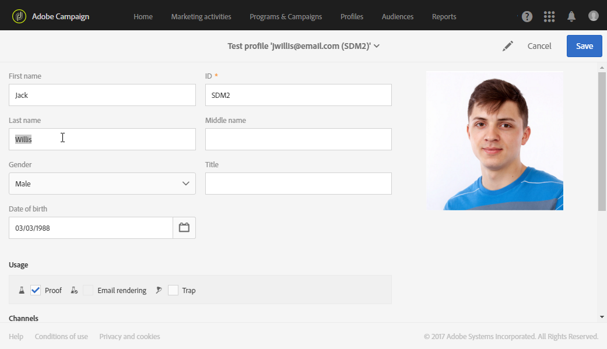

# Administración de perfiles de prueba {#managing-test-profiles}

## Acerca de los perfiles de prueba {#about-test-profiles}

Los perfiles de prueba permiten encontrar destinatarios adicionales que no coinciden con los criterios de objetivo definidos. Se añaden a la audiencia de un mensaje para detectar cualquier uso fraudulento de la base de datos de destinatario o para garantizar que los correos electrónicos llegan a las bandejas de entrada.

Puede administrar los perfiles de prueba desde el menú avanzado **[!UICONTROL Profiles & audiences > Test profiles]**.

Un perfil de prueba contiene información ficticia de contacto, o información de contacto controlada por el remitente, que puede utilizarse posteriormente en un mensaje en los siguientes contextos:

* Para enviar **pruebas**: una prueba es un mensaje específico que se utiliza para comprobar el mensaje antes de realizar el envío final a los destinatarios. Un perfil de prueba de una prueba se encarga de comprobar el envío en lo que respecta a su contenido y formato. Consulte [Envío de pruebas](../../sending/using/sending-proofs.md).
* Para el **procesamiento de correo electrónico**: un perfil de prueba de procesamiento de correo electrónico se utiliza para comprobar la forma en que se muestra un mensaje según la bandeja de entrada que lo recibe. Por ejemplo: webmail, servicio de mensajes, móvil, etc. Consulte [Procesamiento de correo electrónico](../../sending/using/email-rendering.md).

   El uso de **procesamiento de correo electrónico** es de solo lectura. Los perfiles de prueba con este uso solo están disponibles de forma predeterminada en Adobe Campaign.

* Como una **trampa**: el mensaje se envía al perfil de prueba tal como se envía al destinatario principal. Consulte [Uso de trampas](../../sending/using/using-traps.md).
* Para **obtener una vista previa** de los mensajes: se puede seleccionar un perfil de prueba al obtener una vista previa de un mensaje para probar los elementos de personalización. Consulte [Vista previa de mensajes](/help/sending/using/previewing-messages.md).

## Creación de perfiles de prueba {#creating-test-profiles}

1. En el menú avanzado, en el logotipo de Adobe Campaign, seleccione **Perfiles y audiencias > Perfiles de prueba** para acceder a la lista.

   

1. En el panel **[!UICONTROL Test profiles]**, haga clic en **Crear**.

   

1. Introduzca los datos del perfil.

   

1. Seleccione el uso que desee para el perfil de prueba.

   

1. Introduzca los canales de contacto **[!UICONTROL Email, Telephone, Mobile, Mobile app]**, así como la dirección del perfil de prueba si es necesario.

   >[!NOTE]
   >
   >Puede definir un formato de correo electrónico preferido: **[!UICONTROL Text]** o **[!UICONTROL HTML]**.

1. Especifique un tipo de evento y los datos de este si desea utilizar el perfil de prueba para probar la personalización de un mensaje transaccional.
1. Haga clic en **[!UICONTROL Create]** para guardar el perfil de prueba.

A continuación, el perfil de prueba se añade a la lista de perfiles.

**Temas relacionados:**

Vídeo de la [Creación de un perfil de prueba](https://docs.adobe.com/content/help/es-ES/campaign-standard-learn/tutorials/profiles-and-audiences/test-profiles.translate.html)

## Edición de perfiles de prueba {#editing-test-profiles}

Para editar un perfil de prueba y consultar los datos vinculados a él o modificarlo:

1. Seleccione el perfil de prueba que desea editar haciendo clic en su imagen.
1. Consulte o modifique los campos.

   

1. Haga clic en **[!UICONTROL Save]** si ha introducido los cambios o seleccione el nombre del perfil de prueba y, a continuación, en **[!UICONTROL Test profiles]** en la sección de la parte superior de la pantalla para volver al panel de perfiles de prueba.
