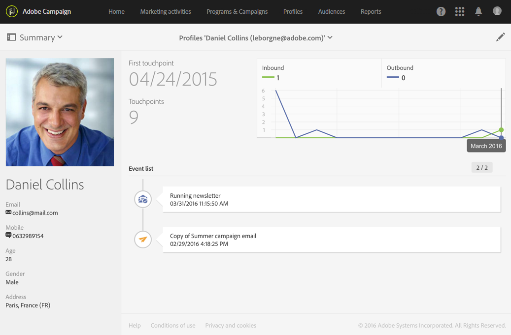

# Supervisión de suscripciones{#monitoring-subscriptions}

Utilice la interfaz de Adobe Campaign para realizar un seguimiento de los suscriptores y medir el éxito de los servicios.

Existen varias opciones para controlar las suscripciones y las bajas de suscripción:

* Vea la lista de personas suscritas actualmente a su servicio desde el panel de servicios. Consulte [Panel de servicio](#service-dashboard).
* Consulte el historial de suscripciones y bajas de suscripción de la ficha **Historial de suscripciones** en el panel de servicios. Ver [Historial de suscripciones](#subscription-history).
* Mostrar un informe que detalla la evolución de las suscripciones y las bajas de suscripción en el servicio **Informes**. Ver [Informes de servicio](#service-reports).
* Busque la lista de servicios a los que se ha suscrito una persona desde su **perfil**. Ver [Historial de eventos vinculados a un perfil](#history-of-events-linked-to-a-profile).

## Tablero de servicios {#service-dashboard}

Para ver la lista de personas suscritas a un servicio:

1. Vaya a la lista de servicios a través del menú avanzado **Perfiles y audiencias** > **Servicios**, al que se puede acceder desde el logotipo de Adobe Campaign.
1. Seleccione el servicio de su elección para mostrar el panel correspondiente.
1. La lista de personas suscritas al servicio se encuentra en la ficha **Suscripciones**.

## Historial de suscripciones {#subscription-history}

Para consultar el historial de suscripciones y bajas:

1. Vaya a la lista de servicios a través del menú avanzado **Perfiles y audiencias** > **Servicios**, al que se puede acceder desde el logotipo de Adobe Campaign.
1. Seleccione el servicio de su elección para mostrar el panel correspondiente.
1. Seleccione la ficha **Historial de suscripciones** para mostrar las fechas en las que cada persona se suscribió y canceló la suscripción.

## Informes de servicio {#service-reports}

Para mostrar un informe que detalle la evolución de las suscripciones y las bajas de suscripción:

1. Vaya a la lista de servicios a través del menú avanzado **Perfiles y audiencias** > **Servicios**, al que se puede acceder desde el logotipo de Adobe Campaign.
1. Seleccione el servicio de su elección para mostrar el panel correspondiente.
1. Haga clic en el botón **Informes** de la barra de acciones y luego en **Supervisión de suscripciones** en la pantalla de selección.

   

1. El informe **Resumen del servicio** presenta el número de suscripciones, la evolución general de las suscripciones y una curva que muestra el progreso a lo largo del tiempo.

## Historial de eventos vinculados a un perfil {#history-of-events-linked-to-a-profile}

Para consultar la lista de servicios a los que se ha suscrito un contacto, puede consultar su historial de marketing. Para obtener más información, consulte la sección [Perfil de cliente integrado](../../audiences/using/integrated-customer-profile.md).

