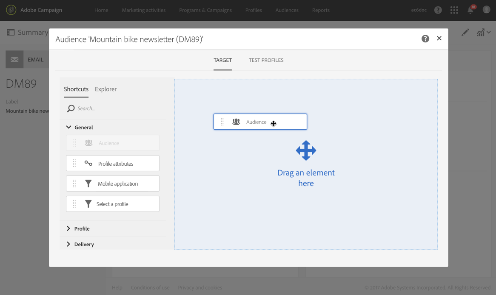

# Selección de un público en un mensaje{#selecting-an-audience-in-a-message}

Adobe Campaign permite configurar varios tipos de perfiles dentro del público de un mensaje.

Se pueden definir audiencias al crear el mensaje mediante el asistente de creación o desde el panel de control de mensajes si ya se ha creado el mensaje.

>[!NOTE]
>
>Si el público se ha creado en un flujo de trabajo y se ha enriquecido con datos adicionales, no puede utilizar estos datos para personalizar un envío independiente. Solo se pueden usar desde un envío ejecutado en un flujo de trabajo.

1. Desde el panel de control, vaya al bloque de audiencia para ejecutarla.

   

   Se abre la pantalla para definir los públicos. Tiene dos pestañas que le permiten definir por separado cada tipo de público que va a recibir el mensaje:

   * Destinatario
   * Perfiles de prueba

   

1. Defina el **[!UICONTROL Target]** principal del correo electrónico. Este es el público destinatario normal del correo electrónico.

   El destino se define en la ficha **[!UICONTROL Target]** y está formado por perfiles identificados de la base de datos. Puede establecer el destinatario principal mediante las funciones del [editor de consultas](../../automating/using/editing-queries.md#creating-queries).

   En esta pestaña, la paleta **[!UICONTROL Shortcuts]** solo contiene filtros predefinidos y públicos que se han definido en los perfiles identificados. La pestaña **[!UICONTROL Explorer]** le permite acceder a configuraciones adicionales.

   Por lo tanto, puede reutilizar y combinar públicos existentes, aplicarles filtros adicionales, etc.

   >[!NOTE]
   >
   >Al segmentar una audiencia, tenga en cuenta que no se hace referencia a la definición de la audiencia, sino que **se ha copiado** en la consulta. Si realiza cualquier cambio en la audiencia después de haberla segmentado en una consulta, asegúrese de volver a configurar la consulta para tener en cuenta la nueva definición.

1. Defina el **[!UICONTROL Test profiles]** que desee utilizar para el correo electrónico. Los perfiles de prueba recibirán las pruebas que puede enviar para probar el correo electrónico antes de enviarlo al destinatario principal.

   Para obtener más información sobre la configuración de perfiles de prueba, consulte la sección [Perfiles de prueba](../../audiences/using/managing-test-profiles.md).

1. Si es necesario, puede definir un grupo de control mediante la pestaña correspondiente. Esto le permite retirar algunos perfiles de sus destinatarios para que no reciban el mensaje. Para obtener más información, consulte [Agregar un grupo de control](../../sending/using/control-group.md).

1. También puede utilizar direcciones de sustitución para obtener una representación exacta del mensaje que recibirá el perfil.  Para obtener más información, consulte [Prueba de mensajes de correo electrónico con perfiles de destino](../../sending/using/testing-messages-using-target.md).

El bloque de públicos se actualiza y muestra los destinatarios y perfiles de prueba que se han seleccionado para el correo electrónico en cuestión.

