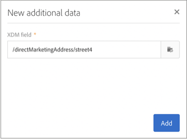

# Personalización de campañas con atributos de Adobe Experience Platform {#personalizing-campaigns-using-aep-attributes}

>[!IMPORTANT]
>
>El servicio Destinos de audiencia está actualmente en fase beta, que puede estar sujeto a frecuentes actualizaciones sin previo aviso. Se requiere que los clientes estén alojados en Azure (actualmente en versión beta solo para Norteamérica) para acceder a estas capacidades. Póngase en contacto con el Servicio de atención al cliente de Adobe si desea obtener acceso.
>
>**Los canales push** y **en la aplicación** aún no están disponibles para la personalización mediante datos contextuales de Adobe Experience Platform.

Una vez configurado el flujo de trabajo con una audiencia [de](../../audiences/using/aep-about-audience-destinations-service.md)Adobe Experience Platform, puede personalizar los mensajes con atributos de perfil que existan exclusivamente en el modelo de datos de experiencia (XDM).

Para ello, debe agregar estos atributos a la **[!UICONTROL Read audience]**actividad:

1. Open the **[!UICONTROL Read audience]**activity. En la**[!UICONTROL Additional data]** ficha, haga clic en el **[!UICONTROL Create element]**botón.

   Tenga en cuenta que la **[!UICONTROL Additional data]**ficha solo está disponible después de seleccionar una audiencia de Adobe Experience Platform.

   

   >[!NOTE]
   >
   >Esta función no admite los tipos de datos de matriz y asignación. Además, solo se mostrarán en el selector los datos del esquema de unión.

1. Seleccione el campo XDM deseado de la lista y haga clic en **[!UICONTROL Confirm]**.

   

1. Haga clic en el **[!UICONTROL Add]**botón para agregarlo a la lista de datos adicionales.

   

1. Repita estos pasos para cada campo XDM que desee agregar al flujo de trabajo.

   >[!NOTE]
   >
   >Puede agregar un máximo de 20 campos XDM en una **[!UICONTROL Read audience]**actividad.

1. Una vez agregados todos los campos, haga clic en el **[!UICONTROL Confirm]**botón para guardar los cambios. Ahora estarán disponibles para personalizar sus entregas.

Para obtener más información sobre cómo crear y personalizar entregas, consulte la documentación de Campaign Standard:

* [Descubrimiento de canales de comunicación](../../channels/using/discovering-communication-channels.md)
* [Acerca de las actividades de canal](../../automating/using/about-channel-activities.md)
* [Personalización de envíos](../../designing/using/personalization.md)
