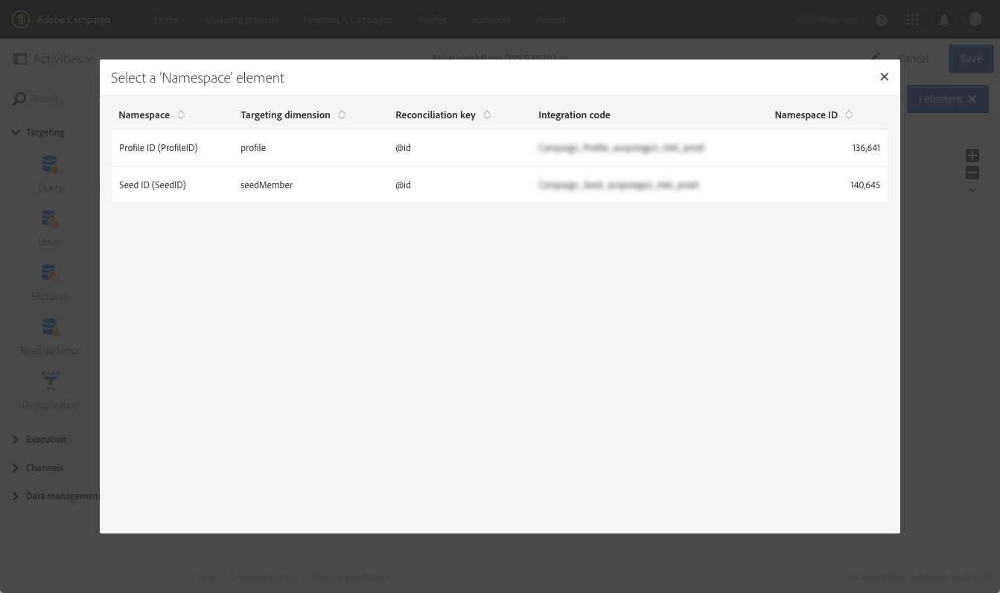

# Segmentación de las audiencias de Adobe Experience Platform {#targeting-aep-audiences}

>[!IMPORTANT]
>
>El servicio Destinos de audiencia está actualmente en fase beta, que puede estar sujeto a frecuentes actualizaciones sin previo aviso. Se requiere que los clientes estén alojados en Azure (actualmente en versión beta solo para Norteamérica) para acceder a estas capacidades. Si desea obtener acceso, póngase en contacto con el Servicio de atención al cliente de Adobe.

Una vez que haya creado una [audiencia de Adobe Experience Platform](../../audiences/using/aep-about-audience-destinations-service.md) mediante el Generador de segmentos, puede utilizarla del mismo modo que lo haría con una audiencia de Campaña dentro de flujos de trabajo para personalizar y enviar mensajes.

Para activar una audiencia de Adobe Experience Platform en sus flujos de trabajo, siga estos pasos:

1. Añada una actividad **[!UICONTROL Read audience]** en el flujo de trabajo y, a continuación, ábrala.

1. Seleccione la opción **[!UICONTROL Adobe Experience Platform]** en **[!UICONTROL Type of audience]** y luego agregue la audiencia deseada.

   

1. (Opcional) Una vez seleccionada la audiencia, puede hacer clic en el botón del ojo para revisar o editar la definición del segmento (asegúrese de guardar los cambios de nuevo).

   Al hacer clic en el botón del ojo simplemente se le dirigirá al Generador de segmentos (en otra ficha) asociado con la audiencia seleccionada dentro de la Campaña.

1. Seleccione un elemento **[!UICONTROL Platform data mapping]** para especificar la dimensión de segmentación deseada para la audiencia de Adobe Experience Platform seleccionada.

   De forma predeterminada, la clave principal (por ejemplo, la tabla iRecipientID para Perfil, la tabla iAppSubscriptionID para AppSubscription) utilizada para la reconciliación estará disponible automáticamente en la lista desplegable. Para destinatario fuera de la clave principal, debe crear una **Área de nombres** personalizada.

   >[!NOTE]
   >
   >Para destinatarios fuera de la clave principal, también debe crear una Asignación de destino personalizada que corresponda a la Área de nombres personalizada. Para obtener más información sobre la Asignación de destino, consulte [esta sección](../../administration/using/target-mappings-in-campaign.md).

   

   Esta lista contiene todas las asignaciones del Modelo de datos de experiencia (XDM) que se han configurado en la instancia. Para obtener más información sobre Adobe Experience Platform Data Connector, consulte [este documento dedicado](../../developing/using/aep-about-data-connector.md).

   

1. Una vez que la audiencia y las dimensiones de segmentación estén configuradas correctamente, haga clic en el botón **[!UICONTROL Confirm]** para guardar los cambios.

Ahora puede configurar el flujo de trabajo con otras actividades. Por ejemplo, puede vincular una actividad **[!UICONTROL Email delivery]** para enviar un correo electrónico a la audiencia seleccionada.

>[!NOTE]
>
>Campaign Standard le permite destinatario de audiencias de Adobe Experience Platform dentro de todos los canales de envío: Correos electrónicos, mensajes SMS, mensajes de Correo postal, notificaciones push y mensajes en la aplicación.
>
>*Nota: Para todos los mensajes push y en la aplicación, el Campaign Standard solo admite envíos para perfiles conocidos.

Para obtener más información sobre cómo utilizar flujos de trabajo y envíos, consulte estas secciones:

* [Descubrimiento de flujos de trabajo](../../automating/using/get-started-workflows.md)
* [Creación de un flujo de trabajo](../../automating/using/building-a-workflow.md)
* [Descubrimiento de canales de comunicación](../../channels/using/get-started-communication-channels.md)
* [Acerca de las actividades de canal](../../automating/using/about-channel-activities.md)
