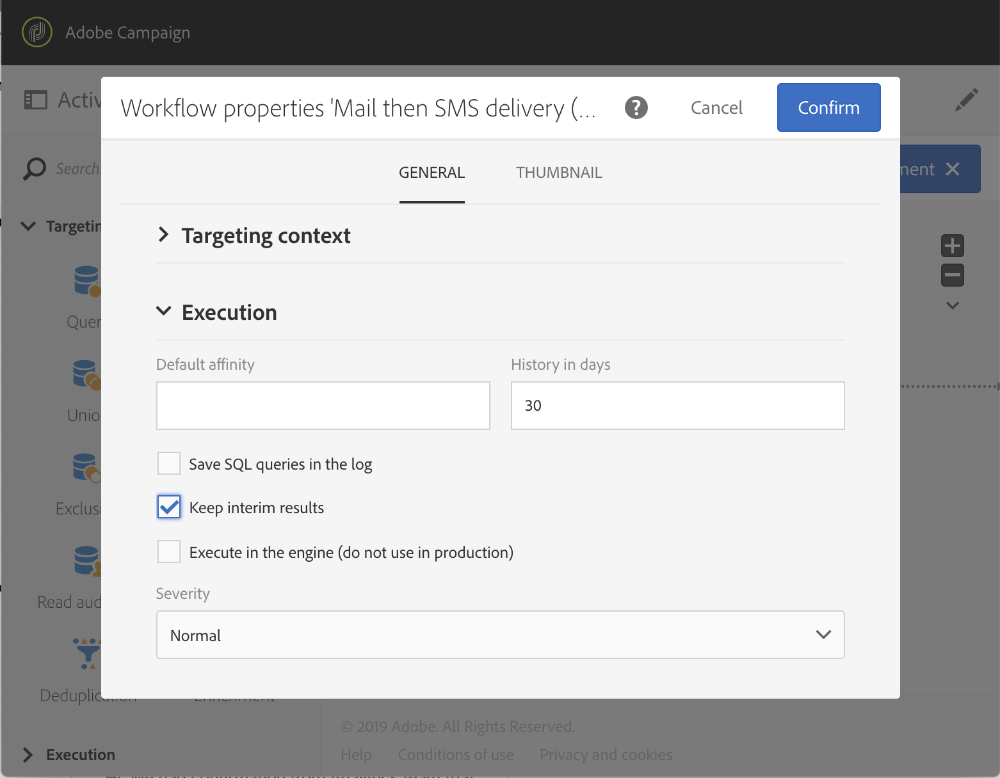

# Prácticas recomendadas con flujos de trabajo{#workflow-best-practices}

Con Adobe Campaign, puede configurar todos los tipos de flujo de trabajo para realizar una gran variedad de tareas. Sin embargo, cuando diseñe y ejecute sus flujos de trabajo, debe ser muy prudente, ya que una implementación incorrecta puede provocar un rendimiento incorrecto, errores y problemas de la plataforma. A continuación encontrará una lista de prácticas recomendadas y sugerencias para la resolución de problemas.

>[!NOTE]
>
>El diseño y la ejecución del flujo de trabajo deben ser realizados por un usuario avanzado de Adobe Campaign.

## Nombre{#naming}

Para facilitar la solución de problemas del flujo de trabajo, Adobe recomienda nombrar y etiquetar sus flujos de trabajo explícitamente. Rellene el campo de descripción del flujo de trabajo para resumir el proceso que se va a realizar de modo que el operador pueda entenderlo fácilmente.
Si el flujo de trabajo forma parte de un proceso que involucra varios flujos de trabajo, puede utilizar números al introducir una etiqueta para ordenarlos con claridad.

Por ejemplo:

* 001: Importación: Importar destinatarios
* 002: Importación: Importar ventas
* 003: Importación: Importar detalles de ventas
* 010: Exportación: Exportar registros de entrega
* 011: Exportación: Exportar “logs” de seguimiento

## Duplicación de flujos de trabajo{#duplicating-workflows}

Puede duplicar flujos de trabajo. En **[!UICONTROL Marketing Activities]**, pase el cursor sobre el flujo de trabajo y haga clic en **[!UICONTROL Duplicate element]**. Una vez duplicados, las modificaciones del flujo de trabajo no se transfieren a la copia del flujo de trabajo. La copia del flujo de trabajo se puede editar.

## Ejecución{#execution}

### Número de flujos de trabajo

De forma predeterminada, recomendamos **no ejecutar más de 20 ejecuciones de flujos de trabajo activos simultáneamente** (esto no se aplica a los flujos de trabajo que esperan una ejecución programada). Después de alcanzar ese límite, los flujos de trabajo se colocarán en la cola para no afectar al rendimiento.

En contextos específicos, es posible que necesite ejecutar más de 20 flujos de trabajo. Si es así, debe consultar los casos de uso con un experto de Campaign y ponerse en contacto con el Servicio de atención al cliente de Adobe para aumentar el límite.

>[!IMPORTANT]
>
>Incluso si no alcanza el umbral de 20 flujos de trabajo, Adobe recomienda **extienda la ejecución del flujo de trabajo con el tiempo**. Escalonar la ejecución de los flujos de trabajo garantizará un mejor rendimiento de la instancia.

Antes de iniciar un flujo de trabajo, [!DNL Campaign Standard] comprobará si hay suficiente memoria física del sistema para ejecutar el flujo de trabajo. Si no hay suficiente memoria disponible, un mensaje le informará de que la ejecución del flujo de trabajo se retrasará hasta que la carga en el servidor se reduzca y la memoria del sistema aumente.

### Frecuencia

Un flujo de trabajo no se puede ejecutar automáticamente más de una vez cada diez minutos.
La frecuencia de repetición de la actividad no puede ser inferior a 10 minutos. Si la frecuencia de repetición se establece en 0 (también el valor predeterminado), esta opción no se tiene en cuenta y el flujo de trabajo se ejecutará según la frecuencia de ejecución.

### Flujos de trabajo pausados

Los flujos de trabajo que han estado en pausa o en estado de error durante más de 7 días se detienen para consumir menos espacio en el disco. La tarea de limpieza se muestra en los registros del flujo de trabajo.

### Transiciones

Se puede ejecutar igualmente un flujo de trabajo que contenga transiciones no finalizadas: se generará un mensaje de advertencia y el flujo de trabajo se pausará una vez que llega a la transición, pero no generará un error. También puede iniciar un flujo de trabajo sin un diseño terminado y completarlo a medida que avanza.

Para obtener más información, consulte [Ejecución de flujos de trabajo](../../automating/using/about-workflow-execution.md).

### Zona horaria

Las propiedades del flujo de trabajo le permiten definir un huso horario específico que se utilizará de forma predeterminada en todas sus actividades. De forma predeterminada, el uso horario del flujo de trabajo es la definida para el operador de Campaign actual.

## Actividad{#activity}

### Número de actividades por flujo de trabajo {#number-activities}

Se recomienda utilizar hasta 100 actividades en un solo flujo de trabajo. Más de 100 actividades. Puede encontrar algunos problemas de rendimiento al diseñar y configurar el flujo de trabajo.

### Diseño del flujo de trabajo

Para asegurarse de que el flujo de trabajo termina correctamente, evite dejar la última transición de un flujo de trabajo sola mediante un **[!UICONTROL End activity]**.

Para acceder a la vista de detalles de las transiciones, marque la opción **[!UICONTROL Keep interim results]** en la sección Ejecución de las propiedades del flujo de trabajo.

>[!CAUTION]
>
>Esta opción consume mucho espacio en el disco y está diseñada para ayudarle a crear un flujo de trabajo y garantizar una configuración y un comportamiento adecuados. Deje sin marcar las instancias de producción.

### Etiquetado de actividades{#activity-labeling}

Durante el desarrollo del flujo de trabajo, se genera un nombre para cada actividad, como para todos los objetos de Adobe Campaign. Aunque la herramienta genera el nombre de una actividad y no se puede editar, se recomienda etiquetarla con un nombre explícito al configurarla.

### Duplicado de actividades{#activity-duplicating}

Para duplicar actividades existentes, puede utilizar copiar y pegar. De este modo, se conserva la configuración que se definió originalmente. Para obtener más información, consulte [Duplicado de actividades de flujo de trabajo](../../automating/using/workflow-interface.md).

### Actividad planificador{#acheduler-activity}

Al crear el flujo de trabajo, utilice solamente una **[!UICONTROL Scheduler activity]** por rama. Si la misma rama de un flujo de trabajo tiene varios planificadores (vinculados entre sí), el número de tareas que se van a ejecutar se multiplica exponencialmente, lo cual sobrecarga considerablemente la base de datos.

Puede previsualizar las siguientes diez ejecuciones de sus flujos de trabajo haciendo clic en **[!UICONTROL Preview next executions]**.

Para obtener más información, consulte [Actividad del planificador](../../automating/using/scheduler.md).

Al diseñar un flujo de trabajo programado que incluya varias actividades, debe asegurarse de que el flujo de trabajo no se vuelva a programar hasta que finalice. Para ello, debe configurar el flujo de trabajo para evitar su ejecución si una o más tareas de una ejecución anterior siguen pendientes. Para obtener más información, consulte [esta página](../../automating/using/scheduled-workflows-execution.md).

## Flujo de trabajo de llamada con parámetros{#workflow-with-parameters}

Asegúrese de que el nombre y el número de parámetros son idénticos a los definidos al invocar al flujo de trabajo (consulte [esta página](../../automating/using/defining-parameters-calling-workflow.md). Los tipos de parámetros también deben ser consistentes con los valores esperados.

Asegúrese de que todos los parámetros se han declarado en la **[!UICONTROL External signal activity]**. De lo contrario, se producirá un error al ejecutar la actividad.

Para obtener más información, consulte [Invocación de un flujo de trabajo con parámetros externos](../../automating/using/calling-a-workflow-with-external-parameters.md).

## Exportación de paquetes{#exporting-packages}

Para exportar paquetes, los recursos exportados no deben contener ID predeterminados. Por lo tanto, los ID de los recursos exportables deben cambiarse utilizando un nombre diferente de las plantillas proporcionadas como estándar por Adobe Campaign Standard.
Para obtener más información, consulte [Administración de paquetes](../../automating/using/managing-packages.md).

## Exportación de listas{#exporting-lists}

La opción de lista de exportación le permite exportar un máximo de 100 000 líneas de forma predeterminada y definida por la **opción Nms_ExportListLimit**. El administrador funcional puede administrar esta opción en **[!UICONTROL Administration]** > **[!UICONTROL Application settings]** > **[!UICONTROL Options]**.
Para obtener más información, consulte [Exportación de listas](../../automating/using/exporting-lists.md).

## Resolución de problemas{#workflow-troubleshooting}

Adobe Campaign ofrece varios registros para comprender mejor los problemas del flujo de trabajo.

### Uso de registros de flujo{#using-workflow-logs}

Puede acceder a los registros de flujo de trabajo para monitorizar la ejecución de sus actividades. Indexa las operaciones realizadas y los errores de ejecución por orden cronológico. La pestaña Registros consta del historial de ejecución de todas o algunas actividades seleccionadas.
La pestaña Tareas detalla la secuencia de ejecución de las actividades. Para obtener más información sobre una actividad, haga clic en una tarea.
Para obtener más información, consulte [Monitorización de la ejecución del flujo de trabajo](../../automating/using/monitoring-workflow-execution.md).

#### Solución de problemas de actividades de gestión de datos{#troubleshooting-data-management-activities}

Puede analizar consultas SQL en la pestaña Registro.

1. En el espacio de trabajo del flujo de trabajo, haga clic en **[!UICONTROL Edit properties]**.
1. En **[!UICONTROL General]** > **[!UICONTROL Execution]**, marque las opciones **[!UICONTROL Save SQL queries in the log]** y **[!UICONTROL Execute in the engine]** y haga clic en **[!UICONTROL Confirm]**.

**Para ver consultas SQL en Registro:**
1. Haga clic en **[!UICONTROL Log and Tasks]**.
1. En la pestaña **[!UICONTROL Logs]**, abra el panel **[!UICONTROL Search]**.
1. Marque **[!UICONTROL Display SQL logs only]**.

La consulta se muestra en la columna **[!UICONTROL Message]** de los registros.

### Uso de registros de envío{#using-delivery-logs}

Los registros de entrega permiten monitorizar el éxito de sus envíos. Los registros de exclusión devuelven mensajes excluidos durante la preparación del envío. El envío de registros proporciona el estado del envío para cada perfil.
Para obtener más información, consulte [Comprensión de los errores de entrega](../../sending/using/understanding-delivery-failures.md).

### Uso de alertas de envío{#delivery-alerting}

La función de alerta de entrega es un sistema de gestión de alertas que permite a un grupo de usuarios recibir automáticamente notificaciones que contengan información sobre la ejecución de sus entregas.
Para obtener más información, consulte [Alerta de entrega](../../sending/using/receiving-alerts-when-failures-happen.md).

**Temas relacionados:**

* [Administración de errores](../../automating/using/monitoring-workflow-execution.md)
