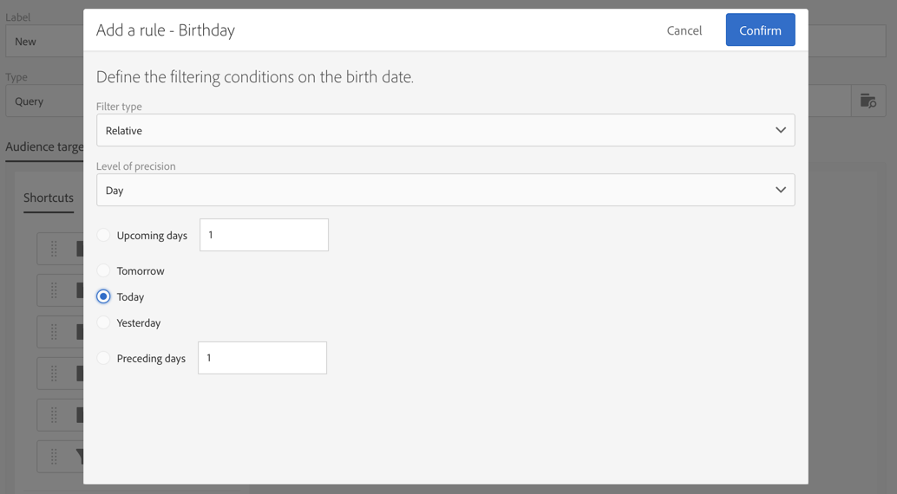

# Envío de cumpleaños {#birthday-delivery}

Este ejemplo es un flujo de trabajo de cumpleaños. Cada día se envía un correo electrónico a los perfiles cuyo cumpleaños es ese día.

Para generar el flujo de trabajo, siga estos pasos:

* The [Scheduler](../../automating/using/scheduler.md) allows you to start the workflow every day at 8am.

   

* The [Query](../../automating/using/query.md) activity allows you to calculate the profiles who have provided an email and whose birthday it is on the current day, every time the workflow is executed. El cálculo del cumpleaños se realiza mediante un filtro predefinido disponible en la paleta de la herramienta de edición de consultas.

   

* El envío [de](../../automating/using/email-delivery.md) correo electrónico se repite. Los envíos se acumulan por mes. Así que todos los correos electrónicos enviados en un mes se acumulan en una sola vista. En un año se ejecutan 365 envíos, pero se reagrupan en 12 vistas (también llamadas **ejecuciones recurrentes**) en la interfaz de Adobe Campaign. Los detalles del historial y del informe se muestran cada mes y no para cada envío.

   
