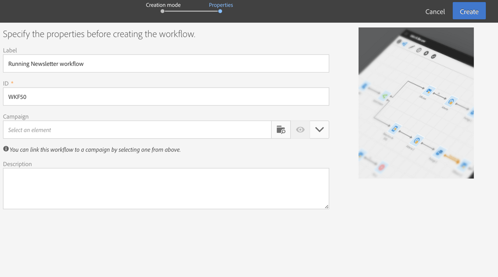

# Creación de un flujo de trabajo{#building-a-workflow}

Esta sección detalla los principios principales y las prácticas recomendadas para crear un nuevo flujo de trabajo:

* Creación de un flujo de trabajo.
* Adición y vinculación de actividades.
* Configuración de actividades.

## Creación de un flujo de trabajo {#creating-a-workflow}

Puede crear un flujo de trabajo a partir de un programa, una campaña o la lista de actividades de marketing.

La creación de una actividad de marketing se detalla en [la sección Crear actividades](../../start/using/marketing-activities.md#creating-a-marketing-activity) de mercadotecnia.

1. Una vez que haya comenzado a crear una actividad de marketing tipo de flujo de trabajo, seleccione la plantilla que desee utilizar.

   

   >[!NOTE]
   >
   >Cada actividad de mercadotecnia ofrece varios tipos de forma predeterminada. Permiten preconfigurar determinados parámetros según sus necesidades. Para obtener más información, consulte [la](../../start/using/about-templates.md) sección Administración de plantillas.

1. Introduzca las propiedades generales del flujo de trabajo.

   

   Puede introducir un nombre en el campo **Etiqueta** y modificar el ID. El nombre de la actividad y su ID aparecen en la interfaz, pero los destinatarios del mensaje los ven.

   >[!NOTE]
   >
   >Puede crear el flujo de trabajo dentro de una campaña principal desde la lista de actividades de marketing. Puede vincular este flujo de trabajo a una campaña seleccionando uno que ya se haya creado.

   Puede agregar una descripción que el usuario puede ver en el contenido de la campaña.

   Dado que facilita la búsqueda y resolución de problemas si no funcionan de las formas esperadas, Adobe recomienda dar a los flujos de trabajo nombres y etiquetas propios: complete el campo de descripción del flujo de trabajo para resumir el proceso que se realizará para que el operador pueda comprenderlo fácilmente.

1. Confirmar la creación de la actividad y el tablero para esa actividad se mostrarán. Para obtener más información sobre esto, consulte [la sección de interfaz](../../automating/using/workflow-interface.md) Flujo de trabajo.

**Tema relacionado:**

[Creación de](https://helpx.adobe.com/campaign/kt/acs/using/acs-create-workflow-feature-video-use.html) un vídeo de flujo de trabajo

## Adición y vinculación de actividades {#adding-and-linking-activities}

Ahora debe definir las diversas actividades y vincularlas en el diagrama.

>[!NOTE]
>
>Si no se muestra la paleta, haga clic en el primer botón de la barra de herramientas para mostrarlo.

Las actividades se agrupan por categoría dentro de las diferentes secciones de la paleta.

* La primera sección contiene actividades de segmentación.
* La segunda sección contiene las actividades de ejecución, que se utilizan principalmente para coordinar otras actividades.
* La tercera sección contiene actividades que pueden utilizarse para enviar mensajes en distintos canales. Las actividades de esta sección pueden variar según los canales que estén habilitados en la instancia.
* La cuarta sección contiene actividades de manipulación de archivos y administración de datos.

Para crear el diagrama:

1. Agregue una actividad arrastrándola desde la paleta y soltándola en el diagrama.

   Por ejemplo, agregue una **actividad de inicio** y luego una **actividad de envío** por correo electrónico en el diagrama.

1. Para vincular las actividades, arrastre la transición **de** actividad Iniciar y colóquela en la actividad de envío **** de correo electrónico.

   >[!NOTE]
   >
   >Puede vincular automáticamente una actividad a la anterior colocando la nueva actividad al final de la transición de la anterior.

1. Agregue las actividades que necesita y vincule las mismas para completar el flujo de trabajo.

   >[!NOTE]
   >
   >También puede duplicar actividades existentes copiándolas y pegándolas. De esta forma, mantiene la configuración definida originalmente. Para obtener más información, consulte [Duplicación de actividades de flujo de trabajo](../../automating/using/workflow-interface.md#duplicating-workflow-activities).

Una vez que las actividades de flujo de trabajo estén vinculadas, puede personalizar las transiciones entre ellas con **la etiqueta** que elija. Para ello, haga doble clic en la transición para acceder a sus propiedades.

Además, **[!UICONTROL Targeting]****[!UICONTROL Data management (ETL)]** las actividades le permiten definir los códigos **de segmentos** para sus transiciones salientes. Luego puede crear informes basados en estos códigos de segmento para medir la eficacia de sus campañas de inserción. For more on this, refer to [this section](../../reporting/using/creating-a-report-workflow-segment.md).

**Casos de uso del flujo de trabajo:**

* [Caso de uso: Crear una entrega de correo electrónico una sola semana](../../automating/using/workflow-weekly-offer.md)
* [Caso de uso: Creación de una entrega segmentada en la ubicación](../../automating/using/workflow-segmentation-location.md)
* [Caso de uso: Creación de entregas con un complemento](../../automating/using/workflow-created-query-with-complement.md)
* [Caso de uso: Volver a configurar el flujo de trabajo envío de una nueva entrega a no abiertos](../../automating/using/workflow-cross-channel-retargeting.md)

## Configuración de actividades {#configuring-activities}

De forma predeterminada, las actividades no se establecen y no procesarán los datos correctamente si no están configurados. Cada actividad contiene varias fichas para administrar configuraciones específicas y opciones de actividad genéricas como transiciones salientes, etiquetas, etc.

1. Asegúrese de que todas las actividades estén correctamente conectadas. Algunas actividades requieren detectar la estructura o naturaleza de los datos entrantes para ofrecer las opciones de configuración correctas.
1. Haga doble clic en una actividad o selecciónela y haga clic en la acción **[!UICONTROL Edit]** contextual para abrir su ventana de configuración.
1. Edite la etiqueta de la actividad.
1. Defina todas las opciones que necesite para procesar los datos. Consulte la sección específica de esta documentación para conocer las posibles opciones de cada actividad.
1. Guarde la actividad y repita estas operaciones para cada actividad del flujo de trabajo.
1. Guarde el flujo de trabajo.
