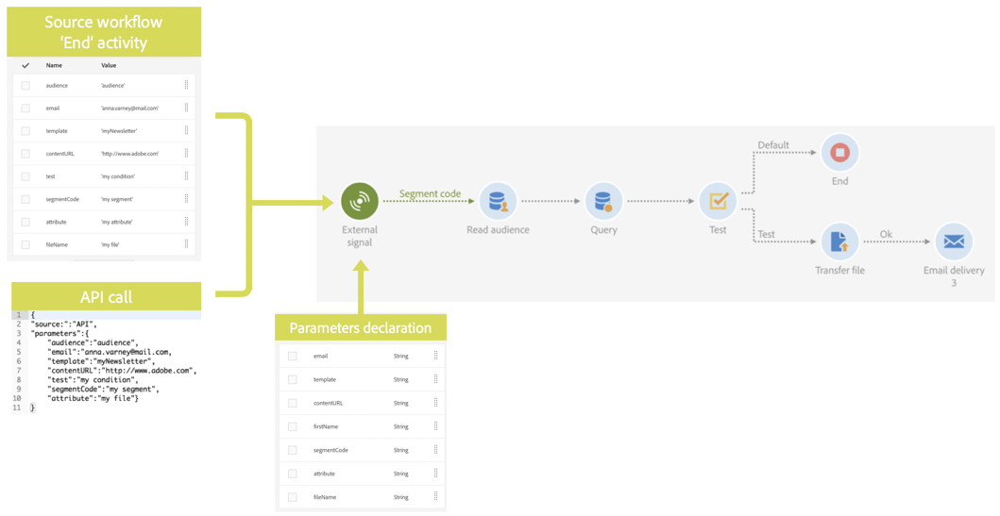

# Información general {#calling-a-workflow-with-external-parameters}

Campaign Standard permite llamar a un flujo de trabajo con parámetros (un nombre de audiencia para el destino, un nombre de archivo para importar, una parte del contenido del mensaje, etc.). De este modo, puede integrar fácilmente las automatizaciones de Campaign con su sistema externo.

Veamos el siguiente ejemplo, donde queremos enviar correos electrónicos directamente desde un CMS. En ese caso, puede configurar el sistema para que seleccione la audiencia y el contenido del correo electrónico en CMS. Al hacer clic en Enviar, se llama a un flujo de trabajo de Campaign con estos parámetros, lo que permite utilizarlos en el flujo de trabajo para definir la audiencia y el contenido de la URL que se utilizarán en la entrega.

El proceso para llamar a un flujo de trabajo con parámetros es el siguiente:

1. Declare los parámetros en la actividad **[!UICONTROL External signal]**. Vea [Declarar los parámetros en la actividad Señal externa](../../automating/using/declaring-parameters-external-signal.md).
1. Configure la actividad **[!UICONTROL End]** o la llamada de API para definir los parámetros y almacenar en déclencheur la actividad **[!UICONTROL External signal]** del flujo de trabajo. Ver [esta página](../../automating/using/defining-parameters-calling-workflow.md)
1. Una vez activado el flujo de trabajo, los parámetros se incorporan a las variables de eventos del flujo de trabajo y se pueden utilizar en él. Consulte [esta página](../../automating/using/customizing-workflow-external-parameters.md).

