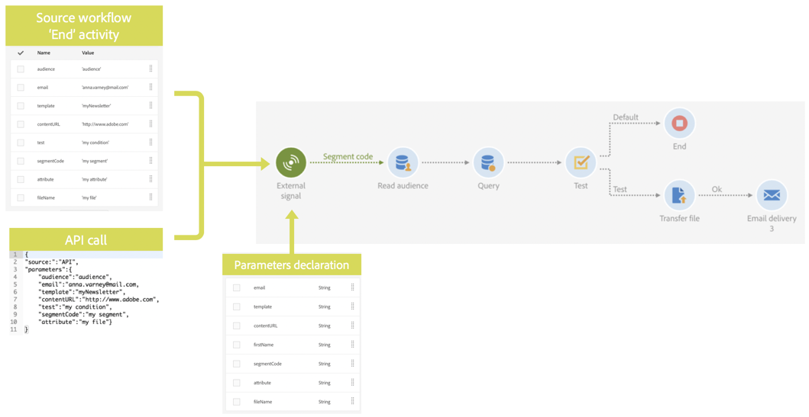

# Información general {#calling-a-workflow-with-external-parameters}

Campaign Standard le permite llamar a un flujo de trabajo con parámetros (un nombre de audiencia a destinatario, un nombre de archivo para importar, una parte del contenido del mensaje, etc.). De este modo, puede integrar fácilmente sus automatizaciones de Campaña con su sistema externo.

Veamos el siguiente ejemplo, donde queremos enviar correos electrónicos directamente desde un CMS. En ese caso, puede configurar el sistema para que seleccione la audiencia y el contenido del correo electrónico en el CMS. Al hacer clic en Enviar, se llamará a un flujo de trabajo de Campaña con estos parámetros, lo que le permitirá utilizarlos en el flujo de trabajo para definir la audiencia y el contenido URL que se utilizarán en el envío.

El proceso para llamar a un flujo de trabajo con parámetros es el siguiente:

1. Declare los parámetros en la **[!UICONTROL External signal]** actividad. See [Declaring the parameters in the External signal activity](../../automating/using/declaring-parameters-external-signal.md).
1. Configure la **[!UICONTROL End]** actividad o la llamada de API para definir los parámetros y activar la **[!UICONTROL External signal]** actividad de flujo de trabajo. Consulte [esta página](../../automating/using/defining-parameters-calling-workflow.md)
1. Una vez activado el flujo de trabajo, los parámetros se ingieren en las variables de eventos del flujo de trabajo y se pueden utilizar dentro del mismo. Consulte [esta página](../../automating/using/customizing-workflow-external-parameters.md).

