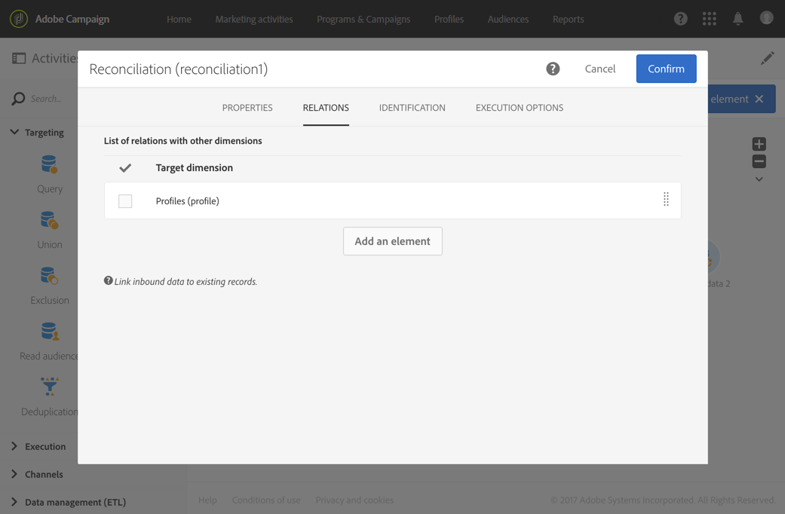
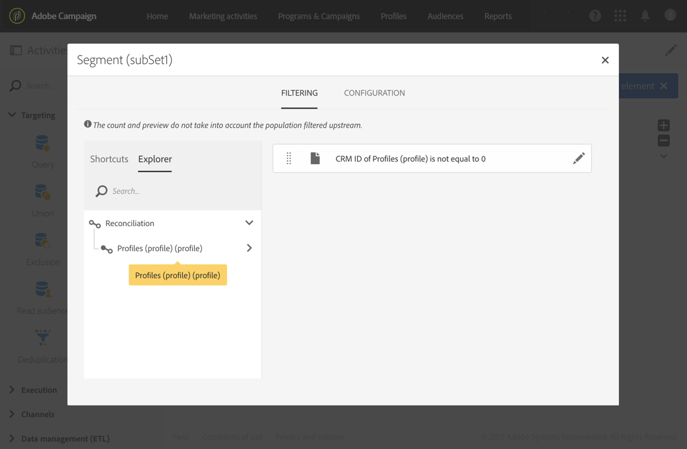
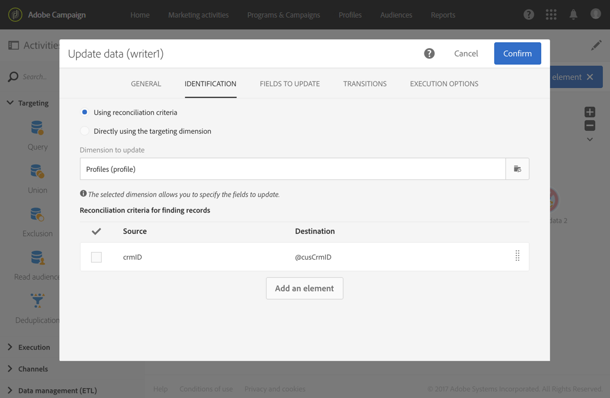

# Creación de plantillas de flujo de trabajo para importar datos {#import-workflow-template}

La utilización de una plantilla de importación es una práctica recomendada si necesita importar con regularidad archivos con la misma estructura.

Este ejemplo muestra cómo se puede predefinir un flujo de trabajo para reutilizarlo a la hora de importar perfiles provenientes de un CRM en la base de datos de Adobe Campaign.

1. Cree una nueva plantilla de flujo de trabajo desde **[!UICONTROL Resources > Templates > Workflow templates]**.
1. Añada las siguientes actividades:

   * **[!UICONTROL Load file]**: Defina la estructura esperada del archivo que contiene los datos que se van a importar.

     >[!NOTE]
     >
     >Solo se pueden importar datos de un solo archivo. Si el flujo de trabajo tiene varias actividades **[!UICONTROL Load file]**, se utilizará el mismo archivo cada vez.

   * **[!UICONTROL Reconciliation]**: Reconcilie los datos importados con los datos de la base de datos.
   * **[!UICONTROL Segmentation]**: Cree filtros para procesar registros de formas diferentes, dependiendo de si se podrían reconciliar o no.
   * **[!UICONTROL Deduplication]**: Deduplique los datos del archivo entrante antes de insertarlos en la base de datos.
   * **[!UICONTROL Update data]**: Actualice la base de datos con los perfiles importados.

   

1. Configure la actividad **[!UICONTROL Load file]**:

   * Cargue un archivo de muestra para definir la estructura que desee. El archivo de muestra debe contener tan solo unas pocas líneas, pero todas las columnas necesarias para la importación. Compruebe y edite el formato del archivo para asegurarse de que el tipo de cada columna está correctamente definido: texto, fecha, entero, etc. Por ejemplo:

     ```
     lastname;firstname;birthdate;email;crmID
     Smith;Hayden;23/05/1989;hayden.smith@mailtest.com;123456
     ```

   * En la sección **[!UICONTROL File to load]** , seleccione **[!UICONTROL Upload a new file from the local machine]** y deje el campo en blanco. Cada vez que cree un nuevo flujo de trabajo a partir de esta plantilla, puede especificar aquí el archivo que desee, siempre que se corresponda con la estructura definida.

     Puede utilizar cualquiera de las opciones, pero debe modificar la plantilla según corresponda. Por ejemplo, si selecciona **[!UICONTROL Use the file specified in the inbound transition]**, puede agregar una actividad **[!UICONTROL Transfer file]** antes de recuperar el archivo de importación de un servidor FTP/SFTP.

     Si desea que los usuarios puedan descargar un archivo que contenga errores producidos durante una importación, marque la opción **[!UICONTROL Keep the rejects in a file]** y especifique **[!UICONTROL File name]**.

     

1. Configure la actividad **[!UICONTROL Reconciliation]**. El objetivo de esta actividad en este contexto es identificar los datos entrantes.

   * En la ficha **[!UICONTROL Relations]**, seleccione **[!UICONTROL Create element]** y defina un vínculo entre los datos importados y la dimensión objetivo de los destinatarios (consulte [Dimensiones de segmentación y recursos](../../automating/using/query.md#targeting-dimensions-and-resources)). En este ejemplo, el campo personalizado **CRM ID** se utiliza para crear la condición de unión. Utilice el campo o la combinación de campos que necesite siempre que permita identificar registros únicos.
   * En la pestaña **[!UICONTROL Identification]** , deje la opción **[!UICONTROL Identify the document from the working data]** sin seleccionar.

   

1. Configure la actividad **[!UICONTROL Segmentation]** para recuperar los destinatarios reconciliados en una transición, y los destinatarios que no pudieron ser reconciliados, pero que tengan datos suficientes en una segunda transición.

   La transición con los destinatarios reconciliados se puede utilizar después para actualizar la base de datos. La transición con destinatarios desconocidos se puede utilizar para crear nuevas entradas de destinatario en la base de datos si en el archivo hay un conjunto mínimo de información disponible.

   Los destinatarios que no se pueden reconciliar y no tienen datos suficientes se seleccionan en una transición saliente de complemento y se pueden exportar en un archivo independiente, o sencillamente se ignoran.

   * En la ficha **[!UICONTROL General]** de la actividad, establezca **[!UICONTROL Resource type]** en **[!UICONTROL Temporary resource]** y seleccione **[!UICONTROL Reconciliation]** como conjunto de destino.
   * En la ficha **[!UICONTROL Advanced options]**, marque la opción **[!UICONTROL Generate complement]** para ver si algún registro no se puede insertar en la base de datos. Si lo necesita, puede seguir procesando los datos complementarios: exportación de archivo, actualización de lista, etc.
   * En el primer segmento de la pestaña **[!UICONTROL Segments]**, agregue una condición de filtrado a la población entrante para seleccionar solo los registros cuyo ID de CRM del perfil no sea igual a 0. De este modo, los datos del archivo que se reconcilien con los perfiles de la base de datos se seleccionan en ese subconjunto.

     

   * Agregue un segundo segmento que seleccione registros no reconciliados que tengan datos suficientes para poder insertarlos en la base de datos. Por ejemplo: dirección de correo electrónico, nombre y apellidos. Los registros no reconciliados tienen un valor de ID de CRM de perfil igual a 0.

     

   * Todos los registros que no están seleccionados en los dos primeros subconjuntos se seleccionan en la **[!UICONTROL Complement]**.

1. Configure la actividad **[!UICONTROL Update data]** ubicada después de la primera transición saliente de la actividad **[!UICONTROL Segmentation]** configurada anteriormente.

   * Seleccione **[!UICONTROL Update]** como **[!UICONTROL Operation type]**, ya que la transición de entrada solo contiene destinatarios ya presentes en la base de datos.
   * En la ficha **[!UICONTROL Identification]**, seleccione **[!UICONTROL Using reconciliation criteria]** y defina una clave entre **[!UICONTROL Dimension to update]** (Perfiles en este caso) y el vínculo creado en la actividad **[!UICONTROL Reconciliation]**. En este ejemplo, se utiliza el campo personalizado **CRM ID**.

     

   * En la pestaña **[!UICONTROL Fields to update]**, indique los campos de la dimensión Perfiles que desea actualizar con el valor de la columna correspondiente del archivo. Si los nombres de las columnas del archivo son idénticos o casi idénticos a los nombres de los campos de dimensión de los destinatarios, puede utilizar el botón de varita mágica para hacer coincidir automáticamente los diferentes campos.

     

     >[!NOTE]
     >
     >Si planea enviar correos postales a estos perfiles, asegúrese de incluir una dirección postal, ya que esta información es esencial para el proveedor de correo postal. Asegúrese también de que la casilla **[!UICONTROL Address specified]** de la información de sus perfiles esté marcada. Para actualizar esta opción desde un flujo de trabajo, simplemente agregue un elemento a los campos que desea actualizar y especifique **1** como **[!UICONTROL Source]** y seleccione el campo `postalAddress/@addrDefined` como **[!UICONTROL Destination]**. Para obtener más información sobre el correo postal y el uso de la opción **[!UICONTROL Address specified]**, consulte [este documento](../../channels/using/about-direct-mail.md#recommendations).

1. Configure la actividad **[!UICONTROL Deduplication]** ubicada después de la transición que contiene los perfiles no reconciliados:

   * En la ficha **[!UICONTROL Properties]**, establezca **[!UICONTROL Resource type]** en el recurso temporal generado a partir de la actividad **[!UICONTROL Reconciliation]** del flujo de trabajo.

     

   * En este ejemplo, el campo de correo electrónico se utiliza para buscar perfiles únicos. Puede utilizar cualquier campo que esté rellenado y que forme parte de una combinación única.
   * Elija un **[!UICONTROL Deduplication method]**. En este caso, la aplicación decide automáticamente qué registros se conservan en caso de duplicados.

   

1. Configure la actividad **[!UICONTROL Update data]** ubicada después de la actividad **[!UICONTROL Deduplication]** configurada anteriormente.

   * Seleccione **[!UICONTROL Insert only]** como **[!UICONTROL Operation type]**, ya que la transición entrante solo contiene perfiles que no están presentes en la base de datos.
   * En la ficha **[!UICONTROL Identification]**, seleccione **[!UICONTROL Using reconciliation criteria]** y defina una clave entre **[!UICONTROL Dimension to update]** (Perfiles en este caso) y el vínculo creado en la actividad **[!UICONTROL Reconciliation]**. En este ejemplo, se utiliza el campo personalizado **CRM ID**.

     

   * En la pestaña **[!UICONTROL Fields to update]**, indique los campos de la dimensión Perfiles que desea actualizar con el valor de la columna correspondiente del archivo. Si los nombres de las columnas del archivo son idénticos o casi idénticos a los nombres de los campos de dimensión de los destinatarios, puede utilizar el botón de varita mágica para hacer coincidir automáticamente los diferentes campos.

     

     >[!NOTE]
     >
     >Si planea enviar correos postales a estos perfiles, asegúrese de incluir una dirección postal, ya que esta información es esencial para el proveedor de correo postal. Asegúrese también de que la casilla **[!UICONTROL Address specified]** de la información de sus perfiles esté marcada. Para actualizar esta opción desde un flujo de trabajo, simplemente agregue un elemento a los campos que desea actualizar, especifique **1** como **[!UICONTROL Source]** y seleccione el campo **[postalAddress/@addrDefined]** como **[!UICONTROL Destination]**. Para obtener más información sobre el correo postal y el uso de la opción **[!UICONTROL Address specified]**, consulte [este documento](../../channels/using/about-direct-mail.md#recommendations).

1. Después de la tercera transición de la actividad **[!UICONTROL Segmentation]**, añada una actividad **[!UICONTROL Extract file]** y una actividad **[!UICONTROL Transfer file]** si desea realizar un seguimiento de los datos que no se insertan en la base de datos. Configure las actividades para exportar la columna que necesite y para transferir el archivo en un servidor FTP o SFTP desde donde pueda recuperarlo.
1. Añada una actividad **[!UICONTROL End]** y guarde la plantilla de flujo de trabajo.

Ahora la plantilla se puede utilizar y está disponible para cada nuevo flujo de trabajo. A continuación, es necesario especificar el archivo que contiene los datos que se van a importar en la actividad **[!UICONTROL Load file]** .


