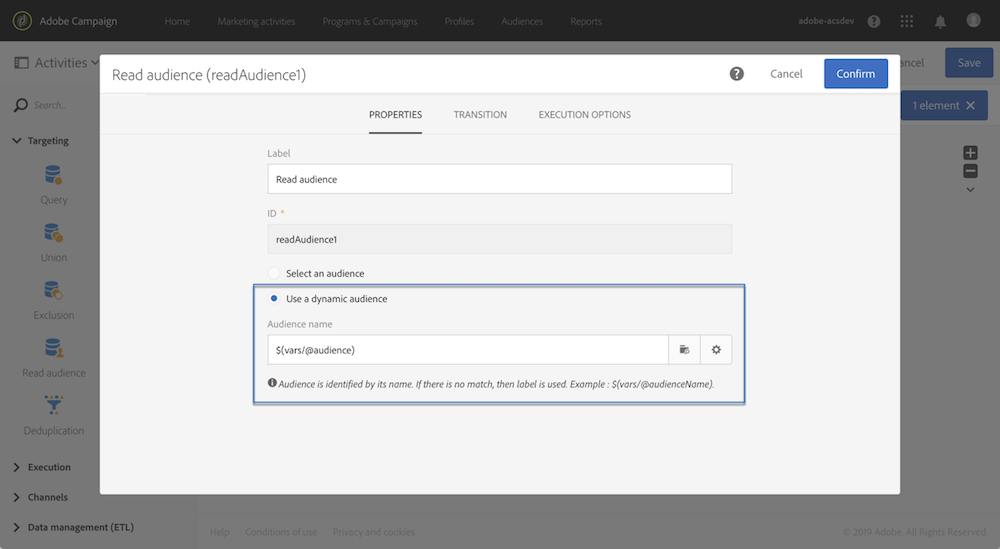

# Personalización de un flujo de trabajo con parámetros externos {#customizing-a-workflow-with-external-parameters}

Una vez activado el flujo de trabajo, los parámetros se incorporan a las variables de eventos y se pueden utilizar para personalizar las actividades del flujo de trabajo.

Se pueden utilizar, por ejemplo, para definir qué audiencia leer en la actividad **[!UICONTROL Read audience]**, el nombre del archivo que se va a transferir en la actividad **[!UICONTROL Transfer file]**, etc. (vea [esta página](../../automating/using/customizing-workflow-external-parameters.md)).

## Uso de variables de eventos {#using-events-variables}

Las variables de eventos se utilizan en una expresión que debe respetar la [sintaxis estándar](../../automating/using/advanced-expression-editing.md#standard-syntax).

La sintaxis para utilizar variables de eventos debe seguir el formato siguiente y utilizar el nombre del parámetro que se ha definido en la actividad **[!UICONTROL External signal]** (consulte [Declarar los parámetros en la actividad de señal externa](../../automating/using/declaring-parameters-external-signal.md)):

```
$(vars/@parameterName)
```

En esta sintaxis, la función **$** devuelve el tipo de datos **cadena**. Si desea especificar otro tipo de datos, utilice las funciones siguientes:

* **$long**: número entero.
* **$float**: número decimal.
* **$boolean**: true/false.
* **$datetime**: marca de tiempo.

Cuando se utiliza una variable en una actividad, la interfaz proporciona ayuda para llamarla.


* : seleccione la variable de eventos de entre todas las variables disponibles en el flujo de trabajo.

  

* : editar expresiones que combinan variables y funciones (consulte [esta página](../../automating/using/advanced-expression-editing.md)).

  

  Esta lista proporciona funciones que le permiten realizar filtros complejos. Estas funciones se detallan en [esta sección](../../automating/using/list-of-functions.md).

  Además, puede usar las funciones siguientes, que están disponibles en todas las actividades que le permiten usar variables de eventos después de llamar a un flujo de trabajo con parámetros externos (vea [esta sección](../../automating/using/customizing-workflow-external-parameters.md#customizing-activities-with-events-variables)):

  | Nombre | Descripción | Sintaxis |
  | ---------|----------|---------|
  | EndWith | Indica si una cadena (primer parámetro) termina con una cadena específica (segundo parámetro). | EndWith(&lt;String>,&lt;String>) |
  | startWith | Indica si una cadena (primer parámetro) comienza con una cadena específica (segundo parámetro). | startWith(&lt;cadena>,&lt;cadena>) |
  | Extract | Devuelve los primeros caracteres de una cadena utilizando un separador. | Extract(&lt;String>,&lt;Separator>) |
  | ExtractRight | Devuelve los últimos caracteres de una cadena utilizando un separador. | ExtractRight(&lt;String>,&lt;Separator>) |
  | DateFormat | Da formato a una fecha utilizando el formato especificado en el segundo parámetro (ejemplo: &#39;%4Y%2M%2D&#39;) | DateFormat(&lt;Date>,&lt;Format>) |
  | FileName | Devuelve el nombre de una ruta de archivo. | FileName(&lt;String>) |
  | FileExt | Devuelve la extensión de una ruta de archivo. | FileExt(&lt;String>) |
  | GetOption | Devuelve el valor de la función especificada. | GetOption(&lt;optionName>) |
  | IsNull | Indica si una cadena o una fecha es nula. | IsNull(&lt;String/date>) |
  | UrlUtf8Encode | Codifica una dirección URL en UTF8. | UrlUtf8Encode(&lt;String>) |

## Personalización de actividades con variables de eventos {#customizing-activities-with-events-variables}

Las variables de eventos se pueden utilizar para personalizar varias actividades, que se enumeran en la sección siguiente. Para obtener más información sobre cómo llamar a una variable desde una actividad, consulte [esta sección](../../automating/using/customizing-workflow-external-parameters.md#using-events-variables).

**[!UICONTROL Read audience]** actividad: definir la audiencia de destino según las variables de eventos. Para obtener más información sobre cómo usar la actividad, consulte [esta sección](../../automating/using/read-audience.md).



**[!UICONTROL Test]** actividad: generar condiciones basadas en variables de eventos. Para obtener más información sobre cómo usar la actividad, consulte [esta sección](../../automating/using/test.md).


**[!UICONTROL Transfer file]** actividad: personalizar el archivo para transferirlo en función de variables de eventos. Para obtener más información sobre cómo usar la actividad, consulte [esta sección](../../automating/using/transfer-file.md).


**[!UICONTROL Query]** actividad: se puede hacer referencia a los parámetros en una consulta mediante expresiones que combinan variables de eventos y funciones. Para ello, agregue una regla y haga clic en el vínculo **[!UICONTROL Advanced mode]** para acceder a la ventana de edición de expresiones (consulte [Edición avanzada de expresiones](../../automating/using/advanced-expression-editing.md)).

Para obtener más información sobre cómo usar la actividad, consulte [esta sección](../../automating/using/query.md).


**[!UICONTROL Channels]** actividades: personalizar envíos basados en variables de eventos.

>[!NOTE]
>
>Los valores de los parámetros de envío se recuperan cada vez que se prepara el envío.
>
>La preparación de los envíos recurrentes se basa en el envío **periodo de agregación**. Por ejemplo, si el periodo de acumulación es &quot;por día&quot;, la entrega se vuelve a preparar solo una vez al día. Si el valor de un parámetro de envío se modifica durante el día, no se actualiza en el envío, ya que ya se ha preparado una vez.
>
>Si planea llamar al flujo de trabajo varias veces al día, utilice la opción [!UICONTROL No aggregation] para que los parámetros de la entrega se actualicen cada vez. Para obtener más información sobre la configuración de envíos recurrentes, consulte [esta sección](/help/automating/using/email-delivery.md#configuration).

Para personalizar una entrega en función de variables de eventos, primero debe declarar en la actividad de entrega las variables que desea utilizar:

1. Seleccione la actividad y haga clic en el botón  para acceder a la configuración.
1. Seleccione la pestaña **[!UICONTROL General]** y luego agregue las variables de eventos que estarán disponibles como campos de personalización en la entrega.

   

1. Haga clic en el botón **[!UICONTROL Confirm]**.

Las variables de eventos declarados ya están disponibles en la lista de campos personalizados. Puede utilizarlos en la entrega para realizar las siguientes acciones:

* Defina el nombre de la plantilla que desea utilizar para la entrega.

  >[!NOTE]
  >
  >Esta acción solo está disponible para **envíos recurrentes**.

  

* Personalice la entrega: al seleccionar un campo de personalización para configurar una entrega, las variables de eventos están disponibles en el elemento **[!UICONTROL Workflow parameters]**. Puede utilizarlos como cualquier campo personalizado, por ejemplo para definir el asunto de la entrega, el remitente, etc.

  La personalización de la entrega se detalla en [esta sección](../../designing/using/personalization.md).

  

**Códigos de segmento**: defina el código de segmento en función de variables de eventos.

>[!NOTE]
>
>Esta acción se puede realizar desde cualquier actividad que le permita definir un código de segmento como, por ejemplo, **[!UICONTROL Query]** o **[!UICONTROL Segmentation]** actividades.


**Etiqueta de envío**: defina la etiqueta de envío en función de variables de eventos.


