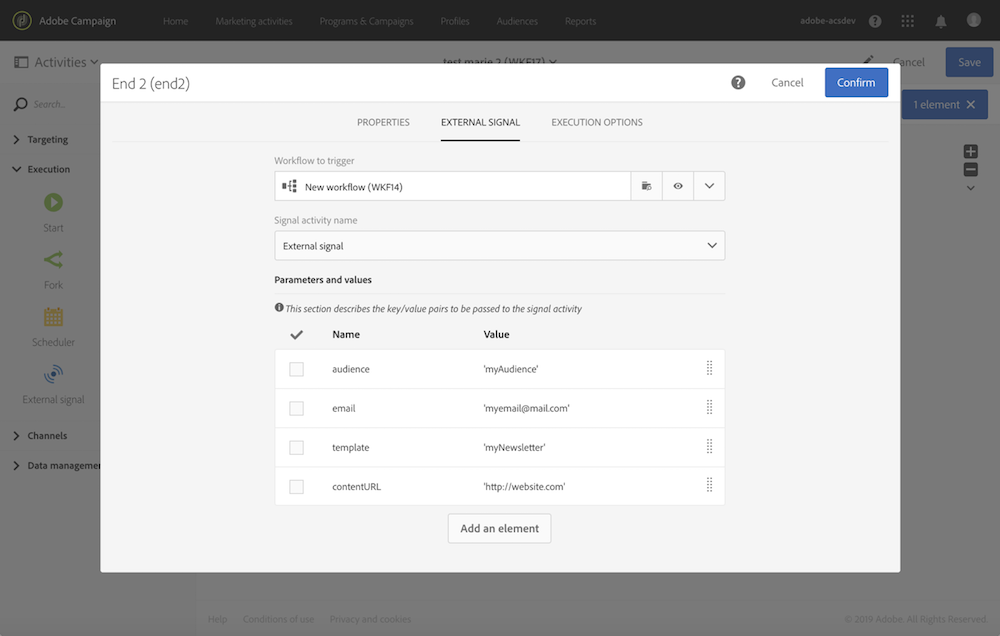

# Definición de los parámetros al invocar al flujo de trabajo {#defining-the-parameters-when-calling-the-workflow}

Esta sección detalla cómo definir parámetros al invocar a un flujo de trabajo. Para obtener más información sobre cómo realizar esta operación desde una llamada de API, consulte la [documentación de las API de REST](../../api/using/triggering-a-signal-activity.md).

Antes de definir los parámetros, asegúrese de que:

* Los parámetros se han declarado en la actividad **[!UICONTROL External Signal]**. Consulte [esta página](../../automating/using/declaring-parameters-external-signal.md).
* Se está ejecutando el flujo de trabajo que contiene la actividad de señal.

Para configurar la actividad **[!UICONTROL End]**, siga los pasos a continuación:

1. Abra la actividad **[!UICONTROL End]** y seleccione la pestaña **[!UICONTROL External signal]**.
1. Seleccione el flujo de trabajo y la actividad de señal externa a la que desee llamar.
1. Haga clic en el botón **[!UICONTROL Create element]** para agregar un parámetro y, a continuación, rellene su nombre y valor.

   * **[!UICONTROL Name]**: el nombre que se ha declarado en la actividad **[!UICONTROL External signal]** (consulte [esta página](../../automating/using/declaring-parameters-external-signal.md)).
   * **[!UICONTROL Value]**: el valor que desea asignar al parámetro. El valor debe seguir la **sintaxis estándar**, descrita en [esta sección](../../automating/using/advanced-expression-editing.md#standard-syntax).

   

   >[!CAUTION]
   >
   >Asegúrese de que todos los parámetros se han declarado en la actividad **[!UICONTROL External signal]**. De lo contrario, se producirá un error al ejecutar la actividad.

1. Una vez definidos los parámetros, confirme la actividad y guarde el flujo de trabajo.
