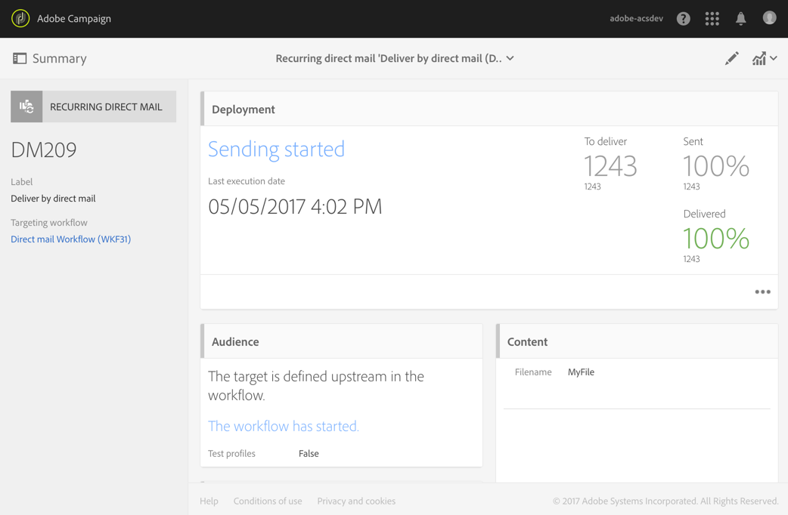

# Envío de correo directo{#direct-mail-delivery}

## Descripción {#description}

La actividad **[!UICONTROL Direct mail delivery]** le permite configurar y preparar un archivo que contenga datos de perfil que desee utilizar para una campaña de correo postal. Puede ser un correo postal que se utiliza una sola vez o uno recurrente.

* **Los mensajes de correo postal estándar se envían una vez.**
* **Los mensajes recurrentes le permiten enviar el mismo correo postal varias veces a diferentes destinatarios durante un periodo definido.** Puede acumular los envíos por periodo para obtener informes que se correspondan con sus necesidades.

## Contexto de uso {#context-of-use}

La actividad **[!UICONTROL Direct mail delivery]** se utiliza generalmente para automatizar la preparación de un archivo que contiene datos de perfil. Este archivo se puede enviar a un socio o proveedor a cargo del envío.

Cuando se vincula a un planificador, puede definir los correos postales recurrentes.

Los destinatarios del correo postal se definen antes de la actividad en el mismo flujo de trabajo, a través de actividades de segmentación como consultas, intersecciones, etc. Los perfiles cuya dirección postal no se haya especificado se excluyen automáticamente cuando se prepara el correo postal.

La preparación del mensaje se activa según los parámetros de ejecución del flujo de trabajo. En el panel de mensajes, puede seleccionar si desea solicitar o no una confirmación manual para enviar el mensaje (requerido de forma predeterminada). Puede realizar el inicio del flujo de trabajo manualmente o colocar una actividad de planificador en el flujo de trabajo para automatizar la ejecución.

**Temas relacionados:**

* [Caso de uso: Emparejamiento de envíos de correo electrónico y correo directo](../../automating/using/coupling-email-direct-mail.md)
* [Acerca del correo directo](../../channels/using/about-direct-mail.md)

## Configuración {#configuration}

1. Arrastre y suelte una actividad de **[!UICONTROL Direct mail delivery]** en el flujo de trabajo.
1. Seleccione la actividad y, a continuación, ábrala con el botón , en las acciones rápidas que aparecerán.

   >[!NOTE]
   >
   >Puede acceder a las propiedades generales y a las opciones avanzadas de la actividad (y no al propio envío) mediante el botón  de las acciones rápidas de la actividad. Este botón es específico de las actividades de canal. Se puede acceder a las propiedades del correo postal a través de la barra de acciones del panel de correo postal.

1. Seleccione el modo de envío del correo postal:

   * **[!UICONTROL Direct mail]**: el correo postal se envía una sola vez. Aquí puede especificar si desea o no añadir una transición de salida a la actividad. Los diferentes tipos de transición se detallan en el paso 7 del procedimiento.
   * **[!UICONTROL Recurring direct mail]**: el correo postal se envía varias veces, según la frecuencia definida en una actividad de **[!UICONTROL Scheduler]**. Seleccione el periodo de acumulación de los envíos. Esto le permite agrupar todos los envíos que se producen durante el periodo definido en un único correo postal que también se denomina **ejecución recurrente** y al que se puede acceder desde la lista de actividad de marketing de la aplicación.

      Por ejemplo, para un correo de cumpleaños recurrente, que se procesa diariamente, puede elegir acumular los envíos por mes. Esto le permite recibir informes sobre su envío mensualmente, aunque el correo se procese todos los días.

      >[!NOTE]
      >
      >En el caso de los correos postales recurrentes, se genera un nuevo archivo en cada ejecución del flujo de trabajo. El periodo de acumulación seleccionado no afecta a este comportamiento.

1. Seleccione un tipo de correo postal. Los tipos de correo postal proceden de plantillas definidas en el menú **[!UICONTROL Resources]** > **[!UICONTROL Templates]** > **[!UICONTROL Delivery templates]**.
1. Introduzca las propiedades generales del correo postal. También puede adjuntarlo a una campaña existente. La etiqueta de la actividad envío del flujo de trabajo se actualiza con la etiqueta de correo postal.
1. Definición del contenido de correo postal. Consulte la sección sobre [edición de contenido](../../designing/using/personalization.md).
1. De forma predeterminada, la actividad **[!UICONTROL Direct mail delivery]** no incluye ninguna transición de salida. Si desea añadir una transición de salida a la actividad **[!UICONTROL Direct mail delivery]**, vaya a la pestaña **[!UICONTROL General]** de las opciones de actividad avanzadas (botón  en las acciones rápidas de la actividad) y, a continuación, marque una de las siguientes opciones:

   * **[!UICONTROL Add outbound transition without the population]**: esto le permite generar una transición de salida que contiene exactamente la misma población que la transición de entrada. Esta transición contiene el archivo generado por la actividad de correo postal y la población sin procesar que ha recibido la actividad de correo postal.
   * **[!UICONTROL Add outbound transition with the population]**: esto le permite generar una transición de salida que contiene la población a la que se ha enviado el correo postal. Los miembros destinatarios excluidos durante la preparación del correo postal (cuarentena, dirección no válida, etc.) se excluyen de esta transición. La transición también contiene el archivo generado por el correo postal.

1. Confirme la configuración de la actividad y guarde el flujo de trabajo.

Cuando vuelva a abrir la actividad, le lleva directamente al panel de correo postal. Solo se puede editar su contenido.

De forma predeterminada, iniciar un flujo de trabajo de envío solo activa la preparación del mensaje. El envío de mensajes creados a partir de un flujo de trabajo aún debe confirmarse una vez iniciado el flujo de trabajo. Sin embargo, desde el panel del mensaje, y solo si el mensaje se ha creado a partir de un flujo de trabajo, puede desactivar la opción **[!UICONTROL Request confirmation before sending messages]**. Al desmarcar esta opción, los mensajes se envían sin previo aviso una vez que se ha realizado la preparación.

## Observaciones {#remarks}

Se puede acceder a los envíos creados dentro de un flujo de trabajo en la lista de actividad de marketing de la aplicación. Puede vista del estado de ejecución del flujo de trabajo mediante el panel. Los vínculos del panel de resumen de correo postal permiten acceder directamente a los elementos vinculados (flujo de trabajo, campaña o envío principal en caso de un correo postal recurrente).

Las ejecuciones de envíos recurrentes se enmascaran de forma predeterminada. Para verlos, marque la opción **[!UICONTROL Show recurring executions]** en el panel de búsqueda de las actividades de marketing.

En los envíos principales, a los que se puede acceder desde la lista de actividad de marketing o directamente a través de las ejecuciones recurrentes asociadas, se puede ver el número total de correos que se han procesado (según el periodo de acumulación especificado cuando se configuró la actividad **[!UICONTROL Direct mail delivery]**). Para ello, abra la vista de detalles del bloque del envío principal **[!UICONTROL Deployment]** seleccionando el botón .

