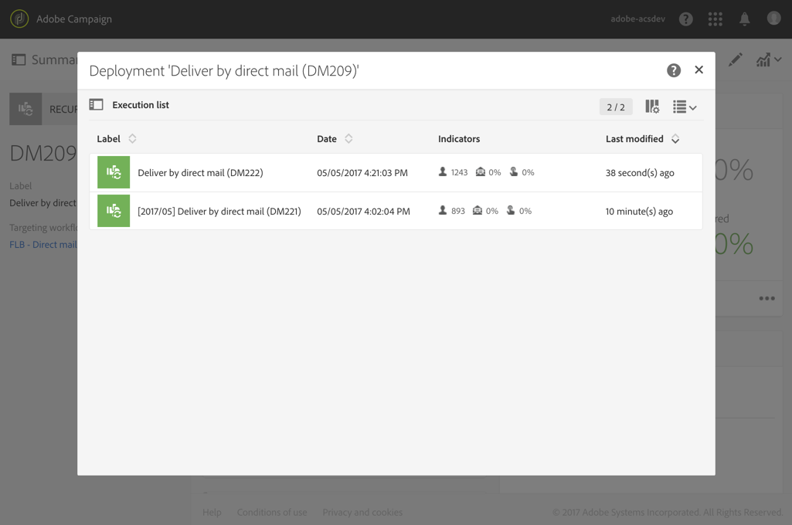

# Envío directo por correo{#direct-mail-delivery}

## Descripción {#description}

La **[!UICONTROL Direct mail delivery]** actividad le permite configurar y preparar un archivo que contenga los datos de perfil que desee utilizar para una campaña de correo directo. Puede ser un correo directo que se utiliza una sola vez o un correo directo **recurrente** .

Los correos directos estándar se envían una vez.

Los correos recurrentes permiten enviar el mismo correo directo varias veces a distintos destinos durante un período definido. Puede agregar los envíos por período para obtener informes que se correspondan con sus necesidades.

## Contexto de uso {#context-of-use}

La **[!UICONTROL Direct mail delivery]** actividad se utiliza generalmente para automatizar la preparación de un archivo que contiene datos de perfil. Este archivo se puede enviar a un socio o proveedor a cargo del envío.

Cuando se vincula a un programador, puede definir los correos directos recurrentes.

Los destinatarios de correo directo se definen antes de la actividad en el mismo flujo de trabajo, mediante actividades de segmentación como consultas, intersecciones, etc. Los perfiles cuya dirección postal no se haya especificado se excluyen automáticamente cuando se prepara el correo directo.

La preparación del mensaje se activa según los parámetros de ejecución del flujo de trabajo. En el panel de mensajes, puede seleccionar si desea solicitar o no una confirmación manual para enviar el mensaje (requerido de forma predeterminada). Puede iniciar el flujo de trabajo manualmente o colocar una actividad de programador en el flujo de trabajo para automatizar la ejecución.

## Configuración {#configuration}

1. Arrastre y suelte una **[!UICONTROL Direct mail delivery]** actividad en el flujo de trabajo.
1. Seleccione la actividad y, a continuación, ábrala con el  botón de las acciones rápidas que aparecen.

   >[!NOTE]
   >
   >Puede acceder a las propiedades generales y a las opciones avanzadas de la actividad (y no a la propia entrega) mediante el  botón de las acciones rápidas de la actividad. Este botón es específico de las actividades del canal. Se puede acceder a las propiedades del correo directo a través de la barra de acciones del panel de correo directo.

1. Seleccione el modo de envío directo de correo:

   * **[!UICONTROL Direct mail]**:: el correo directo se envía una sola vez. Aquí puede especificar si desea o no agregar una transición de salida a la actividad. Los diferentes tipos de transición se detallan en el paso 7 de este procedimiento.
   * **[!UICONTROL Recurring direct mail]**:: el correo directo se envía varias veces, según la frecuencia definida en una **[!UICONTROL Scheduler]** actividad. Seleccione el período de agregación de los envíos. Esto le permite agrupar todos los envíos que se producen durante el período definido en un único correo directo que también se denomina ejecución **** recurrente y al que se puede acceder desde la lista de actividades de marketing de la aplicación.

      Por ejemplo, para un correo de cumpleaños recurrente, que se procesa diariamente, puede elegir agregar los envíos por mes. Esto le permite recibir informes sobre su envío mensualmente aunque el correo se procese todos los días.

      >[!NOTE]
      >
      >En el caso de los correos directos recurrentes, se genera un nuevo archivo en cada ejecución del flujo de trabajo. El período de agregación seleccionado no afecta a este comportamiento.

1. Seleccione un tipo de correo directo. Los tipos de correo directo proceden de plantillas definidas en el menú **[!UICONTROL Resources]** &gt; **[!UICONTROL Templates]** &gt; **[!UICONTROL Delivery templates]** .
1. Introduzca las propiedades generales del correo directo. También puede adjuntarla a una campaña existente. La etiqueta de la actividad de entrega del flujo de trabajo se actualiza con la etiqueta de correo directo.
1. Defina el contenido del correo directo. Consulte la sección sobre edición [de](../../designing/using/personalization.md)contenido.
1. De forma predeterminada, la **[!UICONTROL Direct mail delivery]** actividad no incluye ninguna transición de salida. Si desea agregar una transición de salida a su **[!UICONTROL Direct mail delivery]** actividad, vaya a la **[!UICONTROL General]** ficha de las opciones de actividad avanzadas (botón  en las acciones rápidas de la actividad) y, a continuación, marque una de las siguientes opciones:

   * **[!UICONTROL Add outbound transition without the population]**:: esto le permite generar una transición de salida que contiene exactamente la misma población que la transición de entrada. Esta transición contiene el archivo generado por la actividad de correo directo y la población sin procesar que recibió la actividad de correo directo.
   * **[!UICONTROL Add outbound transition with the population]**:: esto le permite generar una transición de salida que contiene la población a la que se enviará el correo directo. Los miembros del objetivo excluidos durante la preparación directa del correo (cuarentena, dirección no válida, etc.) se excluyen de esta transición. La transición también contiene el archivo generado por el correo directo.

1. Confirme la configuración de la actividad y guarde el flujo de trabajo.

Cuando vuelve a abrir la actividad, se le redirige directamente al panel de correo directo. Solo se puede editar su contenido.

De forma predeterminada, iniciar un flujo de trabajo de entrega solo activa la preparación del mensaje. El envío de mensajes creados a partir de un flujo de trabajo aún debe confirmarse una vez iniciado el flujo de trabajo. Sin embargo, desde el tablero de mensajes y solo si el mensaje se creó a partir de un flujo de trabajo, puede desactivar la **[!UICONTROL Request confirmation before sending messages]** opción. Al desmarcar esta opción, los mensajes se envían sin previo aviso una vez que se ha realizado la preparación.

## Observaciones {#remarks}

Se puede acceder a las entregas creadas en un flujo de trabajo en la lista de actividades de marketing de la aplicación. Puede ver el estado de ejecución del flujo de trabajo mediante el tablero. Los vínculos del panel de resumen de correo directo le permiten acceder directamente a los elementos vinculados (flujo de trabajo, campaña, entrega principal en caso de un correo directo recurrente).

Las ejecuciones de entregas recurrentes se enmascaran de forma predeterminada. Para verlos, marque la **[!UICONTROL Show recurring executions]** opción en el panel de búsqueda de las actividades de marketing.

En las entregas principales, a las que se puede acceder desde la lista de actividades de marketing o directamente a través de las ejecuciones recurrentes asociadas, puede ver el número total de correos que se han procesado (según el período de agregación especificado cuando se configuró la **[!UICONTROL Direct mail delivery]** actividad). Para ello, abra la vista de detalles del **[!UICONTROL Deployment]** bloque de entrega principal seleccionando .

## Ejemplo {#example}

Hay un ejemplo de **[!UICONTROL Direct mail delivery]** disponible en el capítulo [Correo](../../channels/using/example-of-direct-mail-in-a-workflow.md) directo.
