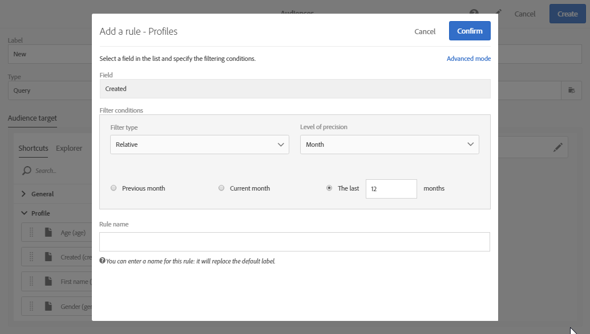

# Edición de consultas{#editing-queries}

## Acerca del editor de consultas {#about-query-editor}

El editor de consultas es un asistente que le permite filtrar los datos contenidos en la base de datos de Adobe Campaign.

Esta función permite crear una población para dirigirse mejor a los destinatarios gracias a los filtros y las reglas predefinidos.

Varias funcionalidades de la aplicación lo utilizan para:

* Crear **audiencias de tipo de consulta** **audiencias**
* Definir objetivos de **correo electrónico**
* Definir poblaciones en actividades **de flujo de trabajo**

## Interfaz del editor de consultas {#query-editor-interface}

El editor de consultas está formado por una **paleta** y un **espacio de trabajo**.

### Paleta {#palette}

La paleta, situada en la parte izquierda del editor, se divide en dos fichas, que contienen elementos divididos en bloques temáticos. Estas fichas son:

* Los **accesos directos**, disponibles de forma predeterminada, o creados por el administrador de la instancia. Aquí encontrará campos, nodos, agrupaciones, vínculos 1-1, vínculos 1-N y otros filtros predefinidos.
* El **Explorador** permite acceder a todos los campos disponibles en el recurso de destino: nodos, elementos de agrupación, vínculos (1-1 y 1-N).

Los elementos contenidos en las fichas deben moverse al espacio de trabajo para que se puedan configurar y tener en cuenta en la consulta. Según la dimensión de objetivo seleccionada (consulte [Segmentación de dimensiones y recursos](../../automating/using/query.md#targeting-dimensions-and-resources)), puede:

* Seleccionar audiencias o perfiles uno a uno
* Utilizar filtros predefinidos
* Defina reglas sencillas para los campos que elija
* Defina reglas avanzadas que le permitan aplicar funciones a determinados campos

### Espacio de trabajo {#workspace}

El espacio de trabajo es la zona central en la que puede configurar y combinar reglas, audiencias y filtros predefinidos agregados desde la paleta.

Al mover un elemento de la paleta al espacio de trabajo, se abre una nueva ventana y se puede iniciar la [creación de consultas](#creating-queries).

## Creación de consultas {#creating-queries}

El editor de consultas puede utilizarse para definir un perfil de audiencia o prueba en un mensaje, una población en un flujo de trabajo y crear una audiencia de tipo de consulta.

Las consultas se pueden definir en la **[!UICONTROL Audience]** ventana mientras se crea un envío o en una actividad de **consulta** al crear un flujo de trabajo.

1. Mueva un elemento de la paleta al espacio de trabajo. Se abre la ventana para editar la regla.

   * Para una cadena o **campo** numérico, especifique el operador de comparación y el valor.

      

   * Para un **campo** de fecha y hora, puede elegir definir una fecha específica, un intervalo entre dos fechas o un período relativo a la fecha de ejecución de la consulta.

      

   * Para un **campo** booleano, marque las casillas vinculadas a los valores posibles del campo.
   * Para un campo de **agrupación** , seleccione el campo de agrupación en el que desea crear la regla y, a continuación, defina la condición del mismo modo que para los demás campos.

      

   * Para un vínculo **1-1** con otro recurso de base de datos, seleccione un valor directamente en la tabla de destino.

      

   * Para un vínculo **1-N** con otro recurso de base de datos, puede definir una subconsulta en los campos de este segundo recurso.

      No es necesario especificar una subcondición.

      Por ejemplo, solo puede seleccionar el operador en los registros de seguimiento de perfil y aprobar la regla. **[!UICONTROL Exists]** La regla devolverá todos los perfiles para los que existen registros de seguimiento.

      

   * Para un filtro **** predefinido, introduzca o seleccione los elementos que desee según los criterios ofrecidos.

      Los administradores pueden crear filtros para facilitar consultas complejas y repetitivas. Aparecerán en el editor de consultas en forma de reglas preconfiguradas y limitarán el número de pasos que debe realizar el usuario.

      

1. Puede especificar un nombre para la regla. A continuación, se muestra como nombre de regla en el espacio de trabajo. Si a la regla no se le asigna un nombre, se muestra una descripción automática de las condiciones.
1. Para combinar los elementos del espacio de trabajo, interactívelos entre sí para crear diferentes grupos o niveles de grupo. A continuación, puede seleccionar un operador lógico para combinar elementos en el mismo nivel:

   * **[!UICONTROL AND]**:: una intersección de dos criterios. Sólo se tienen en cuenta los elementos que coinciden con cada criterio.
   * **[!UICONTROL OR]**:: una unión de dos criterios. Se tienen en cuenta los elementos que coinciden con al menos uno de los dos criterios.
   * **[!UICONTROL EXCEPT]**:: criterios de exclusión. Los elementos que coincidan con el primer criterio se tendrán en cuenta a menos que coincidan también con el segundo criterio.

1. Ahora puede calcular y obtener una vista previa del número de elementos objetivo de la consulta mediante los botones  y  de la barra de acciones.

   

Si desea modificar un elemento de la consulta, haga clic en el icono de edición. La regla se abre como se configuró anteriormente y puede realizar los ajustes necesarios.

Las consultas ahora se han creado y definido, lo que le permite crear una población para personalizar mejor los envíos.

**Temas relacionados:**

* [Funciones avanzadas](../../automating/using/advanced-expression-editing.md)
* [Definición de filtros](../../developing/using/configuring-filter-definition.md)
* [Caso de uso: Crear un envío de correo electrónico una vez a la semana](../../automating/using/workflow-weekly-offer.md)
* [Caso de uso: Creación de una entrega segmentada en una ubicación](../../automating/using/workflow-segmentation-location.md)
* [Caso de uso:Creación de entregas con un complemento](../../automating/using/workflow-created-query-with-complement.md)
* [Caso de uso: Flujo de trabajo de redireccionamiento que envía una nueva entrega a no abridores](../../automating/using/workflow-cross-channel-retargeting.md)
