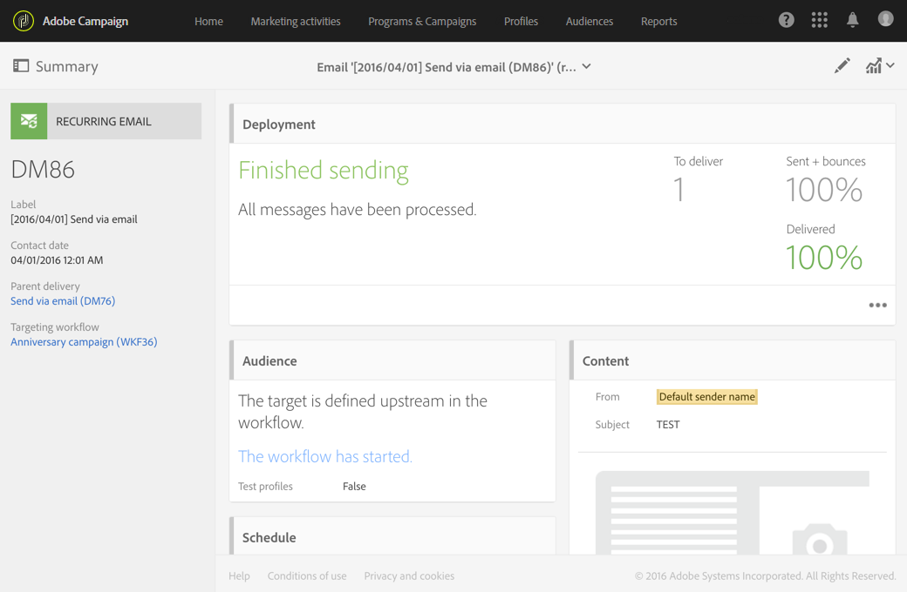

# Envío de correo electrónico{#email-delivery}

## Descripción {#description}

La actividad **[!UICONTROL Email delivery]** le permite configurar el envío de un correo electrónico en un flujo de trabajo. Puede ser un **único correo electrónico de envío**, y enviarlo una sola vez, o puede ser un correo electrónico **recurrente**.

Los correos electrónicos de envío único son mensajes de correo electrónico estándar que se envían una vez.

Los correos electrónicos recurrentes permiten enviar el mismo correo electrónico varias veces a diferentes destinatarios durante un periodo definido. Puede acumular los envíos por periodo para obtener informes que se correspondan con sus necesidades.

## Contexto de uso {#context-of-use}

La actividad **[!UICONTROL Email delivery]** se utiliza generalmente para automatizar el envío de un correo electrónico a un destinatario calculado en el mismo flujo de trabajo.

Cuando se vincula a un planificador, puede definir correos electrónicos recurrentes.

Los destinatarios del correo electrónico se definen antes de la actividad en el mismo flujo de trabajo, a través de actividades de segmentación como consultas, intersecciones, etc.

La preparación del mensaje se activa según los parámetros de ejecución del flujo de trabajo. En el panel de mensajes, puede seleccionar si desea solicitar o no una confirmación manual para enviar el mensaje (requerido de forma predeterminada). Puede realizar el inicio del flujo de trabajo manualmente o colocar una actividad de planificador en el flujo de trabajo para automatizar la ejecución.

**Temas relacionados:**

* [Caso de uso: Creación de una entrega de correo electrónico una vez a la semana](../../automating/using/workflow-weekly-offer.md)
* [Caso de uso: Creación de una entrega segmentada en una ubicación](../../automating/using/workflow-segmentation-location.md)
* [Caso de uso: Creación de entregas con un complemento](../../automating/using/workflow-created-query-with-complement.md)
* [Caso de uso: Flujo de trabajo de redireccionamiento que envía una nueva entrega a receptores que no abran el correo](../../automating/using/workflow-cross-channel-retargeting.md)
* [Caso de uso: Entrega de cumpleaños](../../automating/using/birthday-delivery.md)

## Configuración {#configuration}

1. Arrastre y suelte una actividad de **[!UICONTROL Email delivery]** en el flujo de trabajo.
1. Seleccione la actividad y, a continuación, ábrala con el botón , en las acciones rápidas que aparecerán.

   >[!NOTE]
   >
   >Puede acceder a las propiedades generales y a las opciones avanzadas de la actividad (y no al propio envío) mediante el botón  de las acciones rápidas de la actividad. Este botón es específico de la actividad **[!UICONTROL Email delivery]**. Se puede acceder a las propiedades del correo electrónico a través de la barra de acciones del panel de correo electrónico.

1. Seleccione el modo de envío de correo electrónico:

   * **[!UICONTROL Email]**: el correo electrónico se envía una sola vez. Aquí puede especificar si desea o no añadir una transición de salida a la actividad. Los diferentes tipos de transición se detallan en el paso 7 del procedimiento.
   * **[!UICONTROL Recurring email]**: el correo electrónico se envía varias veces, según la frecuencia definida en una actividad de **[!UICONTROL Scheduler]**. Seleccione el periodo de acumulación de los envíos. Esto le permite agrupar todos los envíos que se producen durante el periodo definido en un único mensaje de correo electrónico que también se denomina **ejecución recurrente** y al que se puede acceder desde la lista de actividad de marketing de la aplicación.

      Por ejemplo, para un correo electrónico de cumpleaños recurrente, que se envía diariamente, puede elegir acumular los envíos por mes. Esto le permite recibir informes sobre su envío mensualmente, aunque el correo electrónico se envíe todos los días.
   >[!NOTE]
   >
   >Las entregas recurrentes se preparan según el **período de acumulación**. Por ejemplo, si el periodo de acumulación es &quot;por día&quot;, la entrega se vuelve a preparar solo una vez al día. Si planea invocar este flujo de trabajo varias veces al día, utilice [!UICONTROL No aggregation].

1. Seleccione un tipo de correo electrónico. Los tipos de correo electrónico proceden de plantillas de correo electrónico definidas en el menú **[!UICONTROL Resources]** > **[!UICONTROL Templates]** > **[!UICONTROL Delivery templates]**.
1. Introduzca las propiedades generales del correo electrónico. También puede adjuntarlo a una campaña existente. La etiqueta de la actividad envío del flujo de trabajo se actualiza con la etiqueta de correo electrónico.
1. Defina el contenido del correo electrónico. Consulte la sección sobre [edición de contenido](../../designing/using/designing-content-in-adobe-campaign.md).
1. De forma predeterminada, la actividad **[!UICONTROL Email delivery]** no incluye ninguna transición de salida. Si desea añadir una transición de salida a la actividad **[!UICONTROL Email delivery]**, vaya a la pestaña **[!UICONTROL General]** de las opciones de actividad avanzadas (botón  en las acciones rápidas de la actividad) y, a continuación, marque una de las siguientes opciones:

   * **[!UICONTROL Add outbound transition without the population]**: esto le permite generar una transición de salida que contiene exactamente la misma población que la transición de entrada.
   * **[!UICONTROL Add outbound transition with the population]**: esto le permite generar una transición de salida que contiene la población a la que se ha enviado el correo electrónico. Los miembros destinatarios excluidos durante la preparación del envío (cuarentena, correo electrónico no válido, etc.) se excluyen de esta transición.

1. Confirme la configuración de la actividad y guarde el flujo de trabajo.

Cuando vuelva a abrir la actividad, le lleva directamente al panel de correo electrónico. Solo se puede editar su contenido.

De forma predeterminada, iniciar un flujo de trabajo de envío solo activa la preparación del mensaje. El envío de mensajes creados a partir de un flujo de trabajo aún debe confirmarse una vez iniciado el flujo de trabajo. Sin embargo, desde el panel del mensaje, y solo si el mensaje se ha creado a partir de un flujo de trabajo, puede desactivar la opción **[!UICONTROL Request confirmation before sending messages]**. Al desmarcar esta opción, los mensajes se envían sin previo aviso una vez que se ha realizado la preparación.

## Observaciones {#remarks}

Se puede acceder a los envíos creados dentro de un flujo de trabajo en la lista de actividad de marketing de la aplicación. Puede vista del estado de ejecución del flujo de trabajo mediante el panel. Los vínculos del panel de resumen de correo electrónico permiten acceder directamente a los elementos vinculados (flujo de trabajo, campaña, envío principal en caso de un correo electrónico recurrente).

Sin embargo, las ejecuciones de envíos recurrentes se enmascaran de forma predeterminada. Para verlos, marque la opción **[!UICONTROL Show recurring executions]** en el panel de búsqueda de las actividades de marketing.

En los envíos principales, a los que se puede acceder desde la lista de actividad de marketing o directamente a través de las ejecuciones recurrentes asociadas, se puede ver el número total de envíos que se han procesado (según el periodo de acumulación especificado cuando se configuró la actividad **[!UICONTROL Email delivery]**). Para ello, abra la vista de detalles del bloque del envío principal **[!UICONTROL Deployment]** seleccionando .

