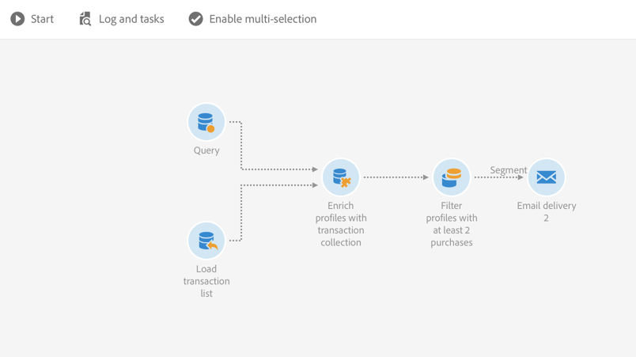

# Enriquecimiento de datos de perfil con datos contenidos en un archivo {#enriching-profile-data-with-data-contained-in-a-file}

Este ejemplo muestra cómo enriquecer datos de perfil con datos de compra incluidos en un archivo. Aquí consideramos que los datos de compra se almacenan en un sistema de terceros. Cada perfil puede tener varias compras almacenadas en el archivo. El objetivo final del flujo de trabajo es enviar un mensaje de correo electrónico a los perfiles de destinatario que han comprado al menos dos artículos para agradecerles su lealtad.

El flujo de trabajo se configura de la siguiente manera:



* actividad de [Consulta](../../automating/using/query.md) que destinatario a los perfiles que recibirán el mensaje.
* Una actividad [de archivo](../../automating/using/load-file.md) de carga que carga los datos de compra. Por ejemplo:

   ```
   tcode;tdate;customer;product;tamount
   aze123;21/05/2017;dannymars@example.com;TV;799
   aze124;28/05/2017;dannymars@example.com;Headphones;8
   aze125;31/07/2017;john.smith@example.com;Headphones;8
   aze126;14/12/2017;john.smith@example.com;Plastic Cover;4
   aze127;02/01/2018;dannymars@example.com;Case Cover;79
   aze128;04/03/2017;clara.smith@example.com;Phone;149
   ```

   Con este archivo de ejemplo, utilizaremos la dirección de correo electrónico para reconciliar los datos con los perfiles de la base de datos. También puede habilitar ID únicos como se describe en [este documento](../../developing/using/configuring-the-resource-s-data-structure.md#generating-a-unique-id-for-profiles-and-custom-resources).

* actividad de [Enriquecimiento](../../automating/using/enrichment.md) que crea un vínculo entre los datos de transacción cargados desde el archivo y los perfiles seleccionados en el **[!UICONTROL Query]**. El vínculo se define en la **[!UICONTROL Advanced relations]** ficha de la actividad. El vínculo se basa en la transición proveniente de la **[!UICONTROL Load file]** actividad. Utiliza el campo &quot;correo electrónico&quot; del recurso de perfil y la columna &quot;cliente&quot; del archivo importado como criterios de reconciliación.

   

   Una vez creado el vínculo, se agregan dos conjuntos de **[!UICONTROL Additional data]** :

   * Recopilación de dos líneas correspondientes a las dos últimas transacciones de cada perfil. Para esta colección, el nombre del producto, la fecha de transacción y el precio del producto se agregan como datos adicionales. Se aplica un orden descendente a los datos. Para crear la colección, en la **[!UICONTROL Additional data]** ficha:

      Seleccione el vínculo previamente definido en la **[!UICONTROL Advanced relations]** ficha de la actividad.

      

      Marque **[!UICONTROL Collection]** y especifique el número de líneas que desea recuperar (2 en este ejemplo). En esta pantalla, puede personalizar el **[!UICONTROL Alias]** y el **[!UICONTROL Label]** de la colección. Estos valores estarán visibles en las siguientes actividades del flujo de trabajo al hacer referencia a esta colección.

      

      Como **[!UICONTROL Data]** conservar para la colección, seleccione las columnas que se utilizarán en el envío final.

      

      Aplique un orden descendente en la fecha de transacción para asegurarse de recuperar las transacciones más recientes.

      

   * Un recuento acumulado del número total de transacciones para cada perfil. Este acumulado se utilizará más adelante para filtrar perfiles que tengan al menos dos transacciones registradas. Para crear el acumulado, en la **[!UICONTROL Additional data]** ficha:

      Seleccione el vínculo previamente definido en la **[!UICONTROL Advanced relations]** ficha de la actividad.

      

      Seleccione **[!UICONTROL Aggregate]**.

      

      Como **[!UICONTROL Data]** mantener, defina un **Contar todo** acumulado. Si es necesario, especifique un alias personalizado para buscarlo más rápido en las siguientes actividades.

      

* actividad [de segmentación](../../automating/using/segmentation.md) con un solo segmento, que recupera perfiles del destinatario inicial que tienen al menos dos transacciones registradas. Se excluyen los Perfiles con una sola transacción. Para ello, la consulta de la segmentación se realiza en el acumulado definido anteriormente.

   

* actividad de envío [de](../../automating/using/email-delivery.md) correo electrónico que utiliza los datos adicionales definidos en la para recuperar dinámicamente las dos últimas compras realizadas por el perfil **[!UICONTROL Enrichment]** . Los datos adicionales se pueden encontrar en el nodo Datos **adicionales (TargetData)** al agregar un campo de personalización.

   

**Temas relacionados:**

* [Enriquecer los perfiles de los clientes con datos externos](https://helpx.adobe.com/campaign/kb/simplify-campaign-management.html#Managedatatofuelengagingexperiences)
