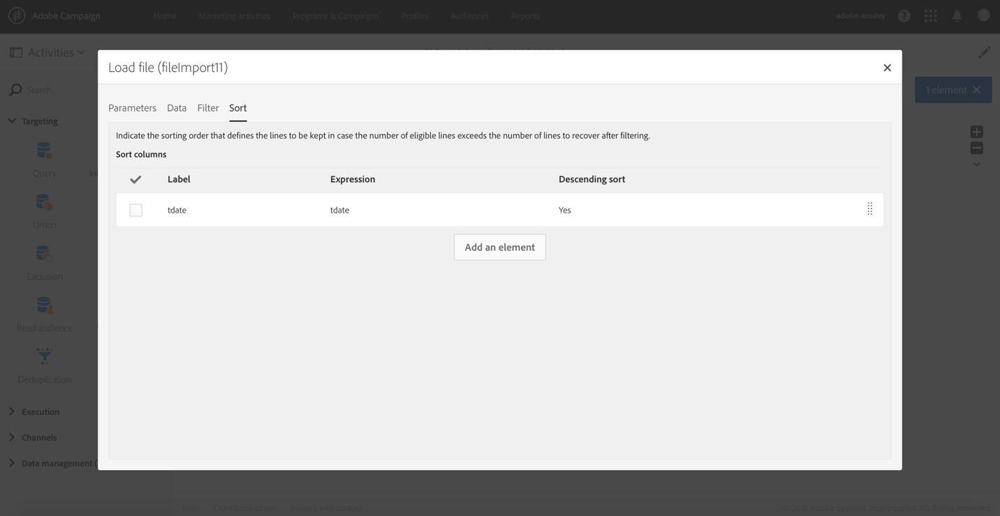
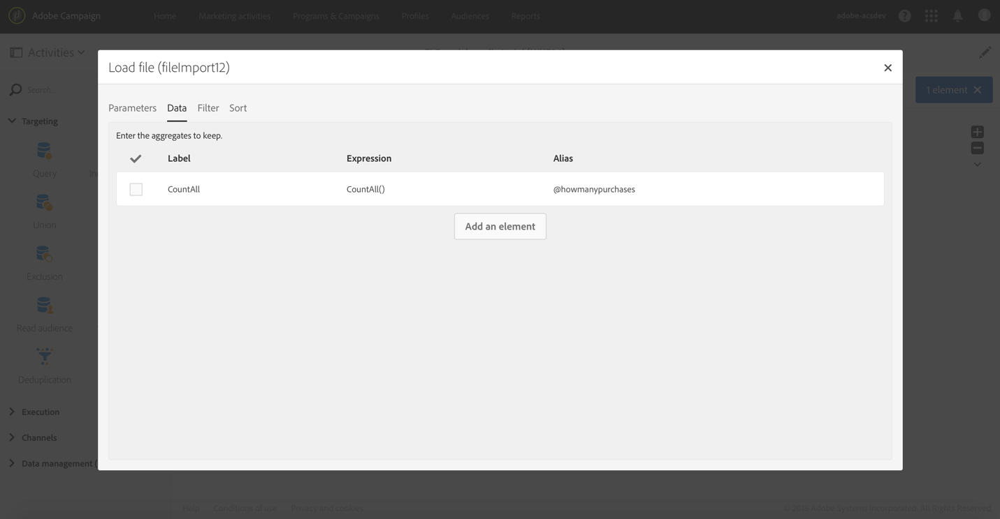

# Enriquecimiento{#enrichment}

## Descripción {#description}


La **[!UICONTROL Enrichment]** actividad es una actividad avanzada que le permite definir datos adicionales para procesar en el flujo de trabajo.

## Contexto de uso {#context-of-use}

La **[!UICONTROL Enrichment]** actividad se utiliza generalmente después de actividades de segmentación o después de importar un archivo y antes de las actividades que permiten el uso de datos segmentados.

Esta actividad contiene funciones de enriquecimiento más avanzadas que la **[!UICONTROL Query]** actividad. Algunos casos sencillos de enriquecimiento se pueden realizar directamente en la actividad [](../../automating/using/query.md#enriching-data)Consulta.

Con la **[!UICONTROL Enrichment]** actividad, puede aprovechar la transición de entrada y configurar la actividad para completar la transición de salida con datos adicionales. Permite combinar datos procedentes de varios conjuntos o crear vínculos a un recurso temporal.

## Configuración {#configuration}

Para configurar una **[!UICONTROL Enrichment]** actividad:

1. Arrastre y suelte una **[!UICONTROL Enrichment]** actividad en el flujo de trabajo.
1. Seleccione la actividad y, a continuación, ábrala con el  botón de las acciones rápidas que aparecen.
1. Si la actividad tiene varias transiciones de entrada, seleccione la **[!UICONTROL Primary set]**. Los datos adicionales configurados en esta actividad se agregarán a este conjunto principal en la transición de salida.

   Si el conjunto principal ya contiene datos adicionales, puede optar por conservarlos o eliminarlos. Si desmarca la **[!UICONTROL Keep all additional data from the main set]** opción, en la transición saliente solo se conservan los datos adicionales configurados en la **[!UICONTROL Enrichment]** .

1. Si hay varias transiciones de entrada, defina las relaciones entre el conjunto principal y los demás datos de entrada en la **[!UICONTROL Advanced Relations]** ficha de la actividad. Puede agregar varias relaciones con el **[!UICONTROL Add element]** botón.

   Al definir una nueva relación, seleccione el conjunto de datos entrantes que desea vincular al conjunto principal. A continuación, defina el tipo de relación. Existen varios tipos de relaciones disponibles, según los datos entrantes y el modelo de datos:

   * **[!UICONTROL 1 cardinality simple link]**:: cada registro de los datos entrantes se asocia a un registro del conjunto principal y solo a uno. Cada registro del conjunto principal tiene un registro asociado en los datos vinculados.
   * **[!UICONTROL N cardinality collection link]**:: 0, 1 o más registros (N) de los datos vinculados se pueden asociar a 1 registro del conjunto principal.
   * **[!UICONTROL 0 or 1 cardinality simple link]**:: los registros del conjunto principal pueden asociarse con un registro 0 o 1 de los datos vinculados, pero no más de uno.
   Una vez definido **[!UICONTROL Cardinality]** , defina un **[!UICONTROL Reconciliation criteria]**. El **[!UICONTROL Source expression]** de los criterios de reconciliación puede ser un campo del recurso de destino, una [expresión](../../automating/using/advanced-expression-editing.md) o directamente un valor especificado entre comillas.

   Defina un **[!UICONTROL Label]** y un **[!UICONTROL ID]** que sea fácil de identificar más adelante en el flujo de trabajo.

   >[!NOTE]
   >
   >Solo se pueden definir relaciones entre el conjunto principal y las demás transiciones de entrada conectadas a la **[!UICONTROL Enrichment]** actividad. Para casos más sencillos con el fin de definir relaciones con los recursos de la base de datos, utilice una actividad de [reconciliación](../../automating/using/reconciliation.md) .

1. Defina los datos adicionales desde la **[!UICONTROL Additional data]** ficha de la actividad. Puede definir datos adicionales (campos simples, agregados y colecciones) relacionados con la dimensión de objetivo del conjunto principal o basados en los vínculos creados en la **[!UICONTROL Advanced relations]** ficha de la **[!UICONTROL Enrichment]** actividad.

   Consulte la sección [Enriquecimiento de datos](../../automating/using/query.md#enriching-data) .

1. Confirme la configuración de la actividad y guarde el flujo de trabajo.

Los datos ahora están disponibles para utilizarse en las actividades conectadas después de la **[!UICONTROL Enrichment]**. Por ejemplo, puede encontrarlo en el **[!UICONTROL Additional data (targetData)]** vínculo del explorador de campos de personalización en un contenido de correo electrónico.

## Ejemplo: Enriquecimiento de datos de perfil con datos contenidos en un archivo {#example--enriching-profile-data-with-data-contained-in-a-file}

Este ejemplo muestra cómo enriquecer datos de perfil con datos de compra contenidos en un archivo. Aquí consideramos que los datos de compra se almacenan en un sistema de terceros. Cada perfil puede tener varias compras almacenadas en el archivo. El objetivo final del flujo de trabajo es enviar un mensaje de correo electrónico a los perfiles de destino que han adquirido al menos dos elementos para agradecerles su lealtad.

El flujo de trabajo se configura de la siguiente manera:


* Actividad **[!UICONTROL Query]** que segmenta los perfiles que recibirán el mensaje.
* Una **[!UICONTROL Load file]** actividad que carga los datos de la compra. Por ejemplo:

   ```
   tcode;tdate;customer;product;tamount
   aze123;21/05/2017;dannymars@example.com;TV;799
   aze124;28/05/2017;dannymars@example.com;Headphones;8
   aze125;31/07/2017;john.smith@example.com;Headphones;8
   aze126;14/12/2017;john.smith@example.com;Plastic Cover;4
   aze127;02/01/2018;dannymars@example.com;Case Cover;79
   aze128;04/03/2017;clara.smith@example.com;Phone;149
   ```

   Con este archivo de ejemplo, utilizaremos la dirección de correo electrónico para reconciliar los datos con los perfiles de base de datos. También puede habilitar ID únicos como se describe en [este documento](../../developing/using/configuring-the-resource-s-data-structure.md#generating-a-unique-id-for-profiles-and-custom-resources).

* Una **[!UICONTROL Enrichment]** actividad que crea un vínculo entre los datos de transacción cargados desde el archivo y los perfiles seleccionados en el **[!UICONTROL Query]**. El vínculo se define en la **[!UICONTROL Advanced relations]** ficha de la actividad. El vínculo se basa en la transición proveniente de la **[!UICONTROL Load file]** actividad. Utiliza el campo "correo electrónico" del recurso de perfil y la columna "cliente" del archivo importado como criterios de reconciliación.

   

   Una vez creado el vínculo, se agregan dos conjuntos de **[!UICONTROL Additional data]** :

   * Recopilación de dos líneas correspondientes a las dos últimas transacciones de cada perfil. Para esta colección, el nombre del producto, la fecha de transacción y el precio del producto se agregan como datos adicionales. Se aplica un orden descendente a los datos. Para crear la colección, en la **[!UICONTROL Additional data]** ficha:

      Seleccione el vínculo previamente definido en la **[!UICONTROL Advanced relations]** ficha de la actividad.

      

      Marque **[!UICONTROL Collection]** y especifique el número de líneas que desea recuperar (2 en este ejemplo). En esta pantalla, puede personalizar el **[!UICONTROL Alias]** y el **[!UICONTROL Label]** de la colección. Estos valores serán visibles en las siguientes actividades del flujo de trabajo al hacer referencia a esta colección.

      

      Para **[!UICONTROL Data]** conservar la colección, seleccione las columnas que se utilizarán en la entrega final.

      

      Aplique un orden descendente en la fecha de transacción para asegurarse de recuperar las transacciones más recientes.

      

   * Un agregado que cuenta el número total de transacciones para cada perfil. Este agregado se utilizará más adelante para filtrar perfiles que tengan al menos dos transacciones registradas. Para crear el agregado, en la **[!UICONTROL Additional data]** ficha:

      Seleccione el vínculo previamente definido en la **[!UICONTROL Advanced relations]** ficha de la actividad.

      

      Select **[!UICONTROL Aggregate]**.

      

      Como **[!UICONTROL Data]** mantener, defina un agregado **Contar todo** . Si es necesario, especifique un alias personalizado para buscarlo más rápido en las siguientes actividades.

      

* Actividad **[!UICONTROL Segmentation]** con un solo segmento que recupera perfiles del objetivo inicial que tienen al menos dos transacciones registradas. Se excluyen los perfiles con una sola transacción. Para ello, la consulta de la segmentación se realiza en el agregado definido anteriormente.

   

* Actividad **[!UICONTROL Email delivery]** que utiliza los datos adicionales definidos en la para recuperar dinámicamente las dos últimas compras realizadas por el perfil **[!UICONTROL Enrichment]** . Los datos adicionales se pueden encontrar en el nodo Datos **adicionales (TargetData)** al agregar un campo de personalización.

   

**Tema relacionado:**

* [Enriquecer los perfiles de los clientes con datos externos](https://helpx.adobe.com/campaign/kb/simplify-campaign-management.html#Managedatatofuelengagingexperiences)

