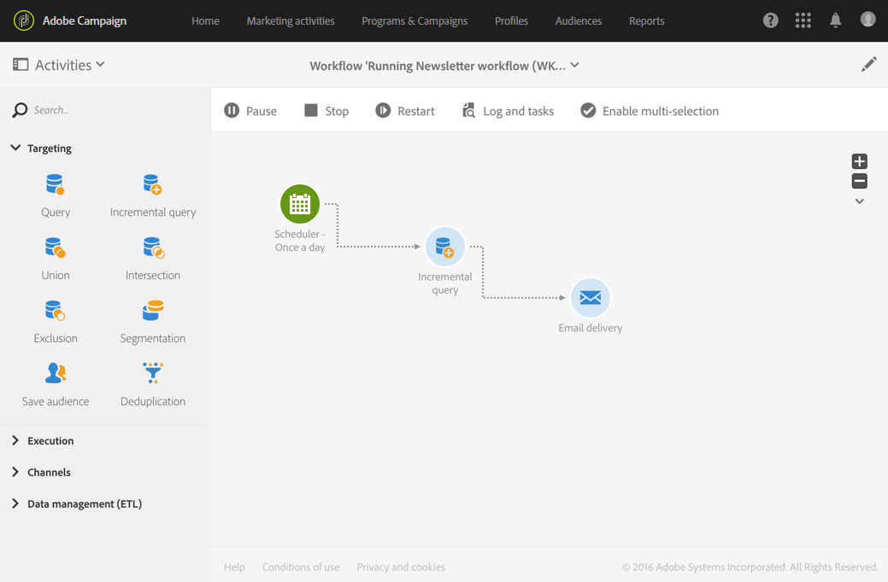

# Comandos de ejecución {#execution-commands}

Los iconos de la barra de acciones permiten iniciar, rastrear y modificar la ejecución de un flujo de trabajo. Ver [Barra de acciones](../../automating/using/workflow-interface.md#action-bar).

Las acciones disponibles son las siguientes:

**Start**

El botón  comienza a ejecutar un flujo de trabajo, que luego adquiere el estado **En curso** (azul). Si el flujo de trabajo estaba en pausa, se reanuda, pero de lo contrario se inicia y las actividades iniciales se activan.

>[!NOTE]
>
>El inicio es un proceso asíncrono: la solicitud se guarda y el motor de ejecución del flujo de trabajo la procesa lo antes posible.

**Pause**

El botón  pausa la ejecución. El flujo de trabajo adquiere el estado **Advertencia** (amarillo). No se activará ninguna actividad nueva hasta que se reanude, pero las operaciones en curso no se suspenden.

**Stop**

El botón  detiene un flujo de trabajo que se está ejecutando y que luego pasará al estado **Finalizado** (verde). Las operaciones en curso se interrumpen si es posible y las consultas SQL o de importación en curso se cancelan inmediatamente. No puede reanudar desde el flujo de trabajo desde el mismo lugar en el que se detuvo.

**Restart**

El botón  implica detener y reiniciar un flujo de trabajo. En la mayoría de los casos, esto le permite reiniciarse más rápido. También puede resultar útil automatizar el reinicio una vez que la detención lleva una cierta cantidad de tiempo, ya que el botón  solo está disponible cuando la detención es efectiva.

Cuando se seleccionan una o varias actividades en un flujo de trabajo, hay otras acciones que puede realizar, como las siguientes:

**Ejecución inmediata**

El botón  inicia cualquier actividad pendiente seleccionada lo antes posible.

**Ejecución normal**

El botón  reactiva cualquier actividad pausada o desactivada.

**Ejecución suspendida**

El botón  pausa el flujo de trabajo en la actividad seleccionada: esta tarea, así como todas las que la siguen (en la misma rama), no se ejecutan.

**Sin ejecución**

El botón  desactiva las actividades seleccionadas.

>[!NOTE]
>
>Las acciones rápidas permiten acceder a diferentes acciones relacionadas con una actividad concreta y aparecen cuando se selecciona una actividad.
