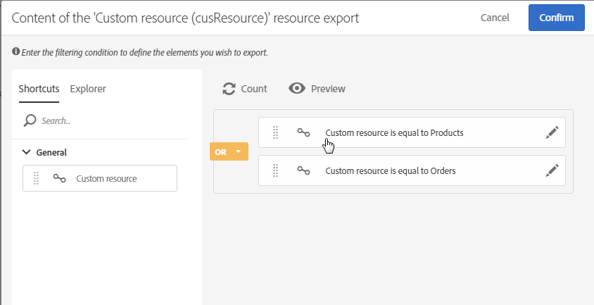
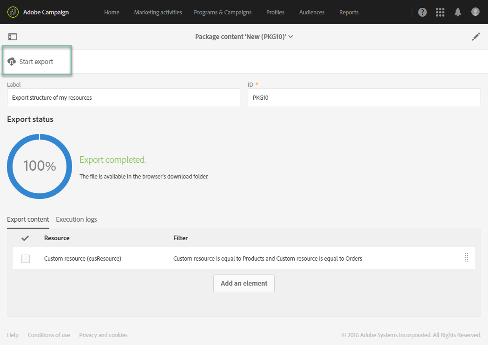

# Exportación e importación de recursos personalizados {#exporting-importing-custom-resources}

En este tutorial se explica cómo exportar e importar un paquete de recursos personalizados desde un entorno de desarrollo a un entorno de producción.

Este ejemplo está dirigido a administradores funcionales vinculados a Adobe Campaign.

Los requisitos previos son:

* **Uno o varios recursos personalizados** disponibles y publicados.

  Además, debe haber definido una clave única para estos recursos porque las claves principales automáticas no se exportan en los paquetes. Por lo tanto, el recurso puede tener una clave primaria y una clave única adicional para garantizar la exclusividad de los registros.
* **Los derechos necesarios** para crear y exportar un paquete.

Recursos adicionales:

* [Administración de paquetes](../../automating/using/managing-packages.md)
* [Implementación de paquetes: principio operativo](../../developing/using/data-model-concepts.md)
* [Adición o ampliación de un recurso](../../developing/using/key-steps-to-add-a-resource.md)

## Exportación de la estructura {#exporting-the-structure}

En esta sección, vamos a realizar una primera exportación de paquetes que detalla la estructura física de los datos de recursos personalizados.

Este ejemplo incluye dos recursos personalizados: **productos** y **pedidos**.

1. Vaya al menú **[!UICONTROL Administration]** / **[!UICONTROL Deployment]** / **[!UICONTROL Package exports]**.

   Vamos a crear un nuevo paquete para exportar el **[!UICONTROL Custom resource (cusResource)]** filtrado con los dos recursos personalizados, “productos” y “pedidos”.

1. En la página **[!UICONTROL Package exports]**, haga clic en **[!UICONTROL Create]** para crear un nuevo paquete.
1. Complete la etiqueta y haga clic en **[!UICONTROL Create element]**.

   

1. Busque y seleccione el **[!UICONTROL Custom resource (cusResource)]**.

   

1. Configure los detalles del **[!UICONTROL Custom resource]** seleccionando los dos recursos, **productos** y **pedidos**, en las condiciones de filtrado.

   Asegúrese de no olvidar cambiar el operador lógico. El valor debe establecerse en **o** para que la estructura del recurso de productos y del recurso de pedidos se integren en el paquete.

   

1. Confirme y guarde la definición del paquete.

Ahora puede hacer clic en **[!UICONTROL Start export]**.

El paquete generado está disponible en la carpeta de descargas. El nombre del archivo zip se genera aleatoriamente. Puede cambiarle el nombre.

## Exportación de datos {#exporting-the-data}

Esta segunda exportación nos permite exportar los datos desde los recursos personalizados de **productos** y **pedidos**.

En función del mismo tipo de exportación que la exportación de estructura, se crea un segundo paquete que contiene los datos.

1. En la página **[!UICONTROL Package exports]**, haga clic en **[!UICONTROL Create]** para crear un nuevo paquete.
1. Complete la etiqueta con **[!UICONTROL Export data of my resources]** y haga clic en **[!UICONTROL Create element]** en la pestaña **[!UICONTROL Export content]**.
1. Busque y seleccione el recurso **productos**.

   

1. Configure una **condición de filtrado** avanzada con **@Label IS NOT NULL**.

   

1. Compruebe el recuento.

   

1. Repita la misma operación para el recurso personalizado **pedidos**.

   

1. Confirme y guarde la definición del paquete.

Ahora puede hacer clic en **[!UICONTROL Start export]**.

El paquete generado está disponible en la carpeta de descargas. El nombre del archivo zip se genera aleatoriamente. Puede cambiarle el nombre.

## Importación de la estructura {#importing-the-structure}

### Importación del paquete {#importing-the-structure-package}

1. Conéctese a la **instancia de destino** en la que desea importar los paquetes que acaba de crear.
1. Vaya al menú **[!UICONTROL Administration]** / **[!UICONTROL Deployment]** / **[!UICONTROL Package imports]** para crear un nuevo paquete e importar el archivo desde la primera exportación.
1. Arrastre y suelte el **archivo de estructura** en la zona proporcionada para tal fin. Los formatos aceptados son ZIP o XML.

   

1. Modifique la etiqueta, por ejemplo **Importar estructura**, luego haga clic en **[!UICONTROL Save]**.
1. Haga clic en **[!UICONTROL Start import]**.

   

### Publicación {#publish-structure}

1. Vaya al menú **[!UICONTROL Administration]** / **[!UICONTROL Development]** / **[!UICONTROL Publication]**.
1. Haga clic en **[!UICONTROL Prepare publication]** y luego en **[!UICONTROL Publish]** para actualizar la instancia con los datos de los nuevos recursos personalizados.
1. Las entradas de menú correspondientes al paquete instalado se insertan en el menú **[!UICONTROL Client data]**.

   

## Importación de datos {#importing-the-data}

En esta sección, vamos a **importar los datos** vinculados al paquete instalado en la instancia en el paso anterior.

Del mismo modo que en el paso anterior, se divide en dos partes: importar el paquete y publicarlo.

### Importación del paquete {#importing-the-data-package}

1. Vaya al menú **[!UICONTROL Administration]** / **[!UICONTROL Deployment]** / **[!UICONTROL Package imports]** para crear un nuevo paquete e importar el archivo que contiene los datos.
1. Arrastre y suelte el archivo de datos en la zona proporcionada para tal fin. Los formatos aceptados son ZIP o XML.
1. Modifique la etiqueta, por ejemplo “Importar datos”, y luego haga clic en **[!UICONTROL Save]**.
1. Haga clic en **[!UICONTROL Start import]**.

   

### Publicación {#publish-data}

1. Vaya al menú **[!UICONTROL Administration]** / **[!UICONTROL Development]** / **[!UICONTROL Publication]**.
1. Haga clic en **[!UICONTROL Prepare publication]** y luego en **[!UICONTROL Publish]** para actualizar la instancia con los datos de los recursos personalizados.
