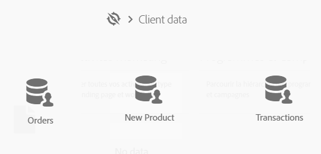

# Exportación e importación de recursos personalizados {#exporting-importing-custom-resources}

Este tutorial explica cómo exportar e importar un paquete de recursos personalizados desde un entorno de desarrollo a un entorno de producción.

Este ejemplo está dirigido a administradores funcionales vinculados a Adobe Campaign.

Los requisitos previos son:

* **Uno o varios recursos** personalizados disponibles y publicados.

   Además, debe haber definido una clave única para estos recursos porque las claves principales automáticas no se exportan en los paquetes. Por lo tanto, el recurso puede tener una clave principal y una clave única adicional para garantizar la exclusividad de los registros.
* **Los derechos** necesarios para crear y exportar un paquete.

Recursos adicionales:

* [Administración de paquetes](../../automating/using/managing-packages.md)
* [Implementación de paquetes: Principio de funcionamiento](../../developing/using/data-model-concepts.md)
* [Adición o ampliación de un recurso](../../developing/using/key-steps-to-add-a-resource.md)

##  Exportación de la estructura {#exporting-the-structure}

En esta sección, vamos a realizar una primera exportación de paquetes que detalla la estructura física de los datos de recursos personalizados.

Este ejemplo tiene dos recursos personalizados: **Productos** y **Pedidos**.

1. Vaya al menú **[!UICONTROL Administration]** / **[!UICONTROL Deployment]** / **[!UICONTROL Package exports]** .

   Vamos a crear un nuevo paquete para exportar el **[!UICONTROL Custom resource (cusResource)]** filtrado con los dos recursos personalizados, "Productos" y "Pedidos".

1. En la **[!UICONTROL Package exports]** página, haga clic en **[!UICONTROL Create]** para crear un nuevo paquete.
1. Complete la etiqueta y haga clic en **[!UICONTROL Create element]**.

   

1. Busque y seleccione el **[!UICONTROL Custom resource (cusResource)]**.

   

1. Configure los detalles del **[!UICONTROL Custom resource]** seleccionando los dos recursos, **Productos** y **Pedidos**, en las condiciones de filtrado.

   Asegúrese de no olvidar cambiar el operador lógico. El valor debe establecerse en **O** para que la estructura del recurso de productos y del recurso de pedidos se integren en el paquete.

   

1. Confirme y guarde la definición del paquete.

Ahora puede hacer clic en **[!UICONTROL Start export]**.

El paquete generado está disponible en la carpeta de descargas. El nombre del archivo zip se genera aleatoriamente. Puede cambiarle el nombre.

## Exportación de datos {#exporting-the-data}

Esta segunda exportación nos permitirá exportar los datos desde los recursos personalizados de **Productos** y **Pedidos** .

En función del mismo tipo de exportación que la exportación de estructura, creará un segundo paquete que contenga los datos.

1. En la **[!UICONTROL Package exports]** página, haga clic en **[!UICONTROL Create]** para crear un nuevo paquete.
1. Complete la etiqueta con **[!UICONTROL Export data of my resources]** y haga clic **[!UICONTROL Create element]** en la **[!UICONTROL Export content]** ficha.
1. Busque y seleccione el recurso **Productos** .

   

1. Configure una condición **de** filtrado avanzada con **@Label NO ES NULA**.

   

1. Compruebe el recuento.

   

1. Repita la misma operación para el recurso personalizado **Pedidos** .

   

1. Confirme y guarde la definición del paquete.

Ahora puede hacer clic en **[!UICONTROL Start export]**.

El paquete generado está disponible en la carpeta de descargas. El nombre del archivo zip se genera aleatoriamente. Puede cambiarle el nombre.

## Importación de la estructura {#importing-the-structure}

### Importación del paquete {#importing-the-structure-package}

1. Conéctese a la instancia **de** destino en la que desea importar los paquetes recién creados.
1. Vaya al menú **[!UICONTROL Administration]** / **[!UICONTROL Deployment]** / **[!UICONTROL Package imports]** para crear un nuevo paquete e importar el archivo desde la primera exportación.
1. Arrastre y suelte el archivo **de** estructura en la zona proporcionada para este fin. Los formatos aceptados son ZIP o XML.

   

1. Modifique la etiqueta, por ejemplo **Importar estructura**, luego haga clic en **[!UICONTROL Save]**.
1. Click **[!UICONTROL Start import]**.

   

### Publicar {#publish-structure}

1. Vaya al menú **[!UICONTROL Administration]** / **[!UICONTROL Development]** / **[!UICONTROL Publication]** .
1. Haga clic **[!UICONTROL Prepare publication]** y luego **[!UICONTROL Publish]** para actualizar la instancia con los datos de los nuevos recursos personalizados.
1. Las entradas de menú correspondientes al paquete instalado se van a insertar en el **[!UICONTROL Client data]** menú.

   

## Importación de datos {#importing-the-data}

En esta sección, vamos a **importar los datos** vinculados al paquete instalado en la instancia en el paso anterior.

Del mismo modo que en el paso anterior, se divide en dos partes: importar el paquete y publicar.

### Importación del paquete {#importing-the-data-package}

1. Vaya al menú **[!UICONTROL Administration]** / **[!UICONTROL Deployment]** / **[!UICONTROL Package imports]** para crear un nuevo paquete e importar el archivo que contiene los datos.
1. Arrastre y suelte el archivo de datos en la zona proporcionada para este fin. Los formatos aceptados son ZIP o XML.
1. Modifique la etiqueta, por ejemplo "Importar datos", luego haga clic en **[!UICONTROL Save]**.
1. Click **[!UICONTROL Start import]**.

   

### Publicar {#publish-data}

1. Vaya al menú **[!UICONTROL Administration]** / **[!UICONTROL Development]** / **[!UICONTROL Publication]** .
1. Haga clic **[!UICONTROL Prepare publication]** y luego **[!UICONTROL Publish]** para actualizar la instancia con los datos de los recursos personalizados.
