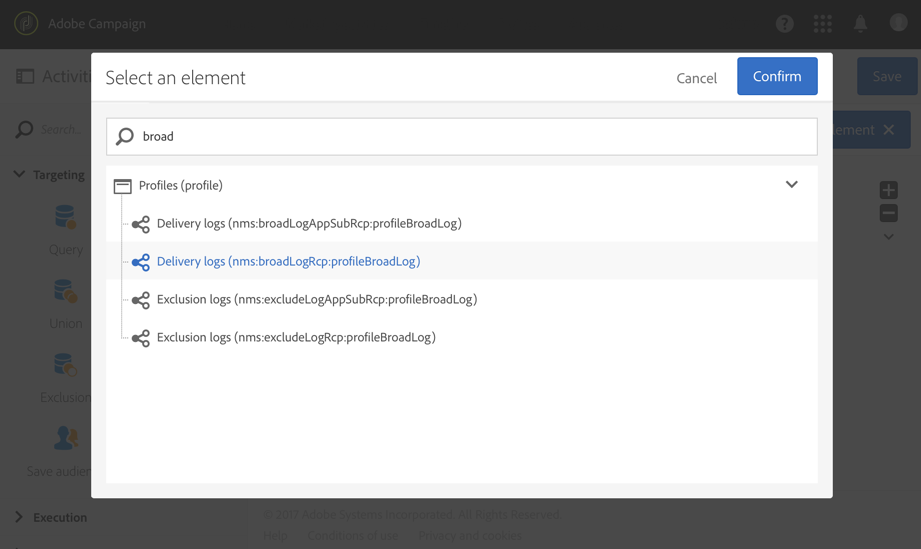

# Exportación de registros{#exporting-logs}

Los datos de registro, tanto si están relacionados con envíos como con suscripciones, se pueden exportar mediante un flujo de trabajo sencillo. Permite analizar los resultados de las campañas en su propia herramienta de creación de informes o BI.

>[!CAUTION]
>
>Solo funcional [administradores](../../administration/using/users-management.md#functional-administrators), con **[!UICONTROL Administration]** función y acceso a **Todo** las unidades pueden acceder a registros de envío, registros de mensajes, registros de seguimiento, registros de exclusión o de suscripción. Un usuario no administrador puede segmentar estos registros, pero comenzando en una tabla vinculada (perfiles, envío).

Mediante una **[!UICONTROL Incremental query]** que solo recupera nuevos registros cada vez que se ejecuta el flujo de trabajo y un **[!UICONTROL Extract file]** para definir las columnas de salida, puede obtener un archivo con el formato y todos los datos que necesite. A continuación, utilice un **[!UICONTROL Transfer file]** actividad para recuperar el archivo final. Cada ejecución del flujo de trabajo se planifica mediante un **[!UICONTROL Scheduler]**.

Los usuarios estándar pueden realizar la operación de registros de exportación. Recursos privados como: broadlogs, registros de seguimiento, registros de exclusión, registros de suscripción e registros del historial de suscripción en **Perfiles** solo puede ser administrado por un administrador funcional.

1. Cree un nuevo flujo de trabajo como se detalla en [esta sección](../../automating/using/building-a-workflow.md#creating-a-workflow).
1. Agregue un **[!UICONTROL Scheduler]** y configúrela según sus necesidades. A continuación se muestra un ejemplo de una ejecución mensual.

   

1. Agregue un **[!UICONTROL Incremental query]** y configúrela para que seleccione los registros que necesita. Por ejemplo, para seleccionar todos los broadlogs nuevos o actualizados (registros de envío de perfil):

   * En el **[!UICONTROL Properties]** , cambie el recurso de destino a **Registros de envío** (broadLogRcp).

      

   * En el **[!UICONTROL Target]** , establezca una condición para recuperar todos los registros de envío que correspondan a envíos realizados en 2016 o después. Para obtener más información, consulte [Edición de consultas](../../automating/using/editing-queries.md#creating-queries) para obtener más información.

      

   * En el **[!UICONTROL Processed data]** , seleccione **[!UICONTROL Use a date field]** y seleccione **lastModified** campo . En las próximas ejecuciones del flujo de trabajo, solo se recuperan los registros que se han modificado o creado después de la última ejecución.

      

      Después de la primera ejecución del flujo de trabajo, puede ver en esta pestaña la última fecha de ejecución que se utiliza en la siguiente ejecución. Se actualiza automáticamente cada vez que se ejecuta el flujo de trabajo. Todavía tiene la posibilidad de anular este valor introduciendo manualmente uno nuevo para que se ajuste a sus necesidades.

1. Agregue un **[!UICONTROL Extract file]** actividad que exportará los datos consultados en un archivo:

   * En el **[!UICONTROL Extraction]** , especifique el nombre del archivo.

      Si selecciona la opción **[!UICONTROL Add date and time to the file name]** , este nombre se completará automáticamente con la fecha de la exportación para garantizar que todos los archivos extraídos sean únicos. Seleccione las columnas que desee exportar en el archivo . Puede seleccionar aquí los datos procedentes de recursos relacionados, como información de perfil o envío.

      >[!NOTE]
      >
      >Para exportar un identificador único para cada registro, seleccione la opción **[!UICONTROL Delivery log ID]** elemento.

      Para organizar el archivo final, puede aplicar una ordenación. Por ejemplo, en la fecha de registro, como se muestra en el ejemplo siguiente.

      

   * En el **[!UICONTROL File structure]** , defina el formato del archivo de salida que coincida con sus necesidades.

      Marque la opción **[!UICONTROL Export labels instead of internal values of enumerations]** en caso de exportar valores de enumeración. Esta opción permite recuperar etiquetas más cortas, que son fáciles de entender, en lugar de identificadores.

1. Agregue un **[!UICONTROL Transfer file]** y configúrelo para transferir el archivo recién creado del servidor de Adobe Campaign a otra ubicación a la que pueda acceder, como un servidor SFTP.

   * En el **[!UICONTROL General]** , seleccione **[!UICONTROL File upload]** ya que el propósito es enviar el archivo de Adobe Campaign a otro servidor.
   * En el **[!UICONTROL Protocol]** , especifique los parámetros de transferencia y seleccione [cuenta externa](../../administration/using/external-accounts.md#creating-an-external-account) para usar.

1. Agregue un **[!UICONTROL End]** actividad para asegurarse de que termina correctamente y guarde el flujo de trabajo.

   

Ahora puede ejecutar el flujo de trabajo y recuperar el archivo de salida en el servidor externo.

**Temas relacionados:**

[Flujos de trabajo](../../automating/using/get-started-workflows.md)
